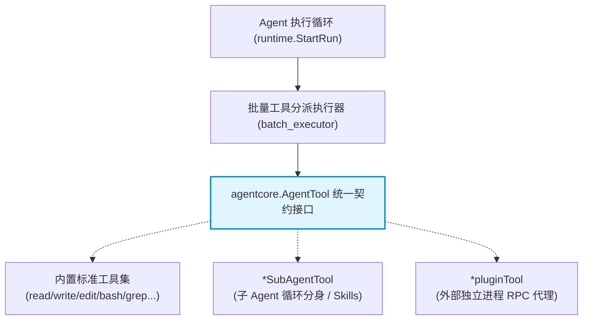

# AgentTool 工具契约与实现全景体系

本笔记系统性梳理 `pigo` 核心抽象层（`internal/agentcore`）中的工具契约——**`AgentTool` 接口**。深入解析其作为**开放接口（Open Interface）**的设计哲学、五大契约方法、**并行与串行调度机制（`ToolExecutionMode`）**，以及系统内所有实现该接口的工具全景（涵盖**内置文件/Shell/搜索工具**、**SubAgent 子 Agent 分身**与**跨进程 Plugin 插件代理**）。

---

## 目录
- [一、架构定位：开放接口与“万物皆工具”哲学](#一架构定位开放接口与万物皆工具哲学)
- [二、契约剖析：AgentTool 五大核心方法职责](#二契约剖析agenttool-五大核心方法职责)
- [三、调度机制：ToolExecutionMode 的并发与串行哲学](#三调度机制toolexecutionmode-的并发与串行哲学)
- [四、内置核心工具全景矩阵（internal/agenttool）](#四内置核心工具全景矩阵internalagenttool)
- [五、高级元工具（Meta Tools）：子 Agent 与进程插件的透明适配](#五高级元工具meta-tools子-agent-与进程插件的透明适配)
- [六、相关源码索引](#六相关源码索引)

---

## 一、架构定位：开放接口与“万物皆工具”哲学

在前文中，我们分析了消息（`Message`）、内容（`Content`）和事件（`AgentEvent`）的**密封接口（Sealed Interface）**——它们通过私有小写标记方法闭合变体集合，禁止外部注入未知类型。

然而，[`AgentTool`](file:///Users/yuqing/Documents/workspace/pigo/internal/agentcore/tool.go#L34-L44) 走向了完全相反的设计取向：**它是一个完全开放的公开接口（Open Interface）**。



### 为什么工具契约必须“完全敞开”？
在 Agent 系统中，数据模型（消息/事件）需要内敛封闭以保证协议稳定，而**能力层（工具）必须追求极致的可扩展性**：
* 无论是内置的原生读写函数；
* 还是启动一个全新完整循环的子 Agent（分身）；
* 亦或是跨进程通信的第三方多语言插件（RPC）；
在主循环眼里，它们都被抽象为统一的 `AgentTool`。主循环只需把它们注册到 `AgentContext.Tools []AgentTool`，即可享用完全一致的参数校验、并发调度与错误包装。

---

## 二、契约剖析：AgentTool 五大核心方法职责

在 [`internal/agentcore/tool.go`](file:///Users/yuqing/Documents/workspace/pigo/internal/agentcore/tool.go#L34-L44) 中，`AgentTool` 声明了 5 个核心方法，职责分工极其清晰：

```go
type AgentTool interface {
    Name() string
    Description() string
    Schema() json.RawMessage
    ExecutionMode() ToolExecutionMode
    Execute(ctx context.Context, id string, args json.RawMessage, onUpdate ToolUpdateFunc) (AgentToolResult, error)
}
```

1. **`Name() string`**：
   工具的唯一系统标识（如 `"read"`, `"bash"`, `"edit"`），大模型通过该名字发起函数调用（Function Calling）。
2. **`Description() string`**：
   工具的功能描述，大模型根据该提示理解工具的使用时机与注意事项。
3. **`Schema() json.RawMessage`**：
   工具参数的 JSON Schema 定义（定义输入参数的类型、必填项与描述）。发往大模型时被拼装进 OpenAI/Anthropic 的 Tool Definition。
4. **`ExecutionMode() ToolExecutionMode`**：
   声明该工具在批量调度时的并发策略（`parallel` 并行 或 `sequential` 串行）。
5. **`Execute(ctx, id, args, onUpdate) (AgentToolResult, error)`**：
   工具真正的业务执行体：
   * `args`: 经过校验的大模型原始参数；
   * `onUpdate`: 流式进度回调（`ToolUpdateFunc`），工具在长耗时运行（如大文件下载、编译构建）中可推送部分中间结果；
   * `AgentToolResult`: 结构化输出结果，包含内容块、错误标记（`IsError`）以及是否要求终止整个 Agent 轮次的决策（`Terminate`）。

---

## 三、调度机制：ToolExecutionMode 的并发与串行哲学

大模型经常在同一个回合中吐出**多个并行工具调用（Parallel Tool Calls）**（例如同时发起 5 个文件的读取）。如果全部串行执行会极大地拖慢交互响应；但如果盲目并行执行，并发修改同一个文件或并发跑 Shell 脚本又会造成**并发冲突与竞争条件（Race Conditions）**。

`pigo` 通过 `ToolExecutionMode` 实现了精巧的**读写分离调度**：

```go
const (
    ToolExecutionParallel   ToolExecutionMode = "parallel"
    ToolExecutionSequential ToolExecutionMode = "sequential"
)
```

在 [`internal/agenttool/batch_executor.go`](file:///Users/yuqing/Documents/workspace/pigo/internal/agenttool/batch_executor.go#L78-L86) 的调度器中：
* **只读工具（Safe/Read-only）**：如 `read`、`grep`、`find`、`web_search` 声明为 `parallel`。调度器会为这一批调用开辟并发 Goroutine 同时发起检索，效率最大化；
* **写操作与有副作用工具（Mutating/Side-effects）**：如 `write`、`edit`、`bash` 声明为 `sequential`。只要批次中出现任何一个串行工具，调度器就会对该调用实行**整批屏障等待（Barrier Sync）**，严格按时序单线程执行，彻底杜绝文件写穿和进程混乱。

---

## 四、内置核心工具全景矩阵（internal/agenttool）

`pigo` 内部默认实现 `AgentTool` 接口的结构体涵盖了现代编程 Agent 的完整能力库：

| 分类 | 核心结构体 | 注册名 | 调度模式 | 职责与实现特征 |
| :--- | :--- | :--- | :--- | :--- |
| **文件读写** | [`*ReadTool`](file:///Users/yuqing/Documents/workspace/pigo/internal/agenttool/read_tool.go) | `read` | `Parallel` | 读取文本文件（支持 offset、行号过滤，自动检测二进制文件） |
| | [`*WriteTool`](file:///Users/yuqing/Documents/workspace/pigo/internal/agenttool/write_tool.go) | `write` | `Sequential` | 全量写入/覆盖文件（有副作用，自动记录文件快照防丢失） |
| | [`*EditTool`](file:///Users/yuqing/Documents/workspace/pigo/internal/agenttool/edit_tool.go) | `edit` | `Sequential` | 精准单段/多段文本替换，生成统一 Unified Diff |
| **文件检索** | [`*GrepTool`](file:///Users/yuqing/Documents/workspace/pigo/internal/agenttool/search_tool.go) | `grep` | `Parallel` | 基于正则在文件树中高速并发检索文本 |
| | [`*FindTool`](file:///Users/yuqing/Documents/workspace/pigo/internal/agenttool/search_tool.go) | `find` | `Parallel` | 按 glob 规则递归检索匹配的文件路径 |
| | [`*LsTool`](file:///Users/yuqing/Documents/workspace/pigo/internal/agenttool/search_tool.go) | `ls` | `Parallel` | 展开目录结构并返回文件元数据 |
| **系统控制** | [`*BashTool`](file:///Users/yuqing/Documents/workspace/pigo/internal/agenttool/bash_tool.go) | `bash` | `Sequential` | 执行 Shell 脚本（支持前台执行，以及长耗时命令的后台挂起） |
| | [`*BashOutputTool`](file:///Users/yuqing/Documents/workspace/pigo/internal/agenttool/bash_control.go) | `bash_output`| `Parallel` | 轮询/提取后台常驻作业的实时增量输出与退出码 |
| | [`*BashKillTool`](file:///Users/yuqing/Documents/workspace/pigo/internal/agenttool/bash_control.go) | `bash_kill` | `Sequential` | 向后台作业发送 SIGKILL 终止执行 |
| **联网搜索** | [`*WebSearchTool`](file:///Users/yuqing/Documents/workspace/pigo/internal/agenttool/websearch_tool.go) | `web_search` | `Parallel` | 多后端联网检索（支持 Brave, Tavily, DuckDuckGo 等） |
| | [`*WebFetchTool`](file:///Users/yuqing/Documents/workspace/pigo/internal/agenttool/webfetch_tool.go) | `web_fetch` | `Parallel` | HTTP 抓取目标网页 HTML 并转为 Markdown 纯文本 |
| **记忆与任务** | [`*MemorySearchTool`](file:///Users/yuqing/Documents/workspace/pigo/internal/agenttool/memory_tool.go) | `memory_search`| `Parallel` | 检索项目长效记忆存储库中的索引知识 |
| | [`*TodoTool`](file:///Users/yuqing/Documents/workspace/pigo/internal/agenttool/todo_tool.go) | `todo` | `Sequential` | 动态维护与更新任务目标看板列表 |
| | `*scheduleCreateTool` | `schedule_create`| `Sequential` | 创建基于 Cron 或单次 Timer 的定时计划任务 |
| | `*scheduleListTool` | `schedule_list` | `Parallel` | 查询当前运行中的定时任务列表 |
| | `*scheduleDeleteTool` | `schedule_delete`| `Sequential` | 销毁或取消定时计划任务 |
| **目标模式** | [`*GoalCompleteTool`](file:///Users/yuqing/Documents/workspace/pigo/internal/agenttool/goal_tool.go) | `goal_complete` | `Sequential` | 自主目标模式下宣告全部任务达成，指示循环正常终结 |
| | [`*GoalBlockedTool`](file:///Users/yuqing/Documents/workspace/pigo/internal/agenttool/goal_tool.go) | `goal_blocked` | `Sequential` | 自主目标模式下宣告遭遇死锁/阻碍，退出并生成上报卡片 |

---

## 五、高级元工具（Meta Tools）：子 Agent 与进程插件的透明适配

除了以上具体的基础操作工具，`AgentTool` 抽象最大的威力体现在其能够将**复合系统透明伪装成一件单体工具**：

### 1. SubAgentTool：子 Agent 即工具
在 [`internal/runtime/subagent.go`](file:///Users/yuqing/Documents/workspace/pigo/internal/runtime/subagent.go#L125-L215) 中：
* 结构体 `SubAgentTool` 实现了 `AgentTool`；
* 它的 `Schema()` 只有一个参数：`{"prompt": "string"}`；
* 它的 `Execute()` 实际上是在背后**实例化了一个完全独立的子 `AgentContext`，并启动了一个全新的子 Agent 双层循环（甚至可以通过 fork 出独立的 `pigo --subagent-rpc` 进程执行隔离沙箱）**；
* 当子 Agent 执行完毕后，将其最终生成的响应文本打包成 `AgentToolResult` 返回给父循环。
* **技能（Skills）的本质**：第 10 章中的技能，正是通过预设专门的系统提示词（System Prompt），包装成 `SubAgentTool` 提供给父 Agent 调用的。

### 2. pluginTool：跨进程插件即工具
在 [`internal/plugin/plugin.go`](file:///Users/yuqing/Documents/workspace/pigo/internal/plugin/plugin.go#L156-L195) 中：
* `pigo` 允许外部使用 Python、Node.js、Rust 等任意语言编写独立进程插件；
* 主进程通过标准输入输出（stdio）与插件建立 JSON-RPC 2.0 通信；
* `*pluginTool` 作为本地代理实现了 `AgentTool`，在 `Execute()` 时把参数打包成 RPC `tools/call` 请求发给插件进程，并在发生超时或进程崩溃时自动降级为可控的错误结果（Fault Isolation）。

---

## 六、相关源码索引

* 工具核心契约与执行模式定义：[`internal/agentcore/tool.go`](file:///Users/yuqing/Documents/workspace/pigo/internal/agentcore/tool.go)
* 批量并行/串行工具调度器：[`internal/agenttool/batch_executor.go`](file:///Users/yuqing/Documents/workspace/pigo/internal/agenttool/batch_executor.go)
* 单个工具执行与重试编排器：[`internal/agenttool/tool_executor.go`](file:///Users/yuqing/Documents/workspace/pigo/internal/agenttool/tool_executor.go)
* 子 Agent 工具适配器：[`internal/runtime/subagent.go`](file:///Users/yuqing/Documents/workspace/pigo/internal/runtime/subagent.go)
* 外部独立进程插件 RPC 代理：[`internal/plugin/plugin.go`](file:///Users/yuqing/Documents/workspace/pigo/internal/plugin/plugin.go)
