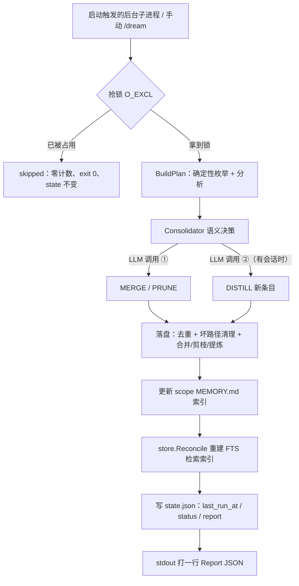

# Dream 记忆整合机制与后台触发设计

本笔记拆解 `internal/dream` 这个包：它实现的是 `/dream`（`pigo --dream`）**记忆整合（memory consolidation）** 能力——把开发者持久化的记忆库整理成一份「紧凑、无冗余、反映当前状态、可被检索」的集合，并在会话启动时按周期自动后台触发。

它服务于 [全屏 TUI 事件桥与 MVU 生命周期设计](./全屏TUI事件桥与MVU生命周期设计.md) 第二节的一个关键判断：**TUI 路径天然没有 `Dream`，是不做启动 consolidation 的主动架构抉择**——本文正是把这个被裁掉的东西讲清楚。

---

## 目录

- [一、术语：consolidation 到底指什么](#一术语consolidation-到底指什么)
- [二、一次 pass 的全景流程](#二一次-pass-的全景流程)
- [三、分工：确定性的一半与语义的一半](#三分工确定性的一半与语义的一半)
- [四、保守原则与路径安全边界](#四保守原则与路径安全边界)
- [五、触发、调度与单实例锁](#五触发调度与单实例锁)
- [六、一个完整例子](#六一个完整例子)
- [七、为什么 REPL 有它、TUI 没有它](#七为什么-repl-有它tui-没有它)
- [八、相关源码索引](#八相关源码索引)

---

## 一、术语：consolidation 到底指什么

`consolidation` 直译是「巩固、合并、压实」。它借用的是神经科学里的 **memory consolidation（记忆巩固）**：刚形成的记忆脆弱、零散、易丢，需要经过一段时间的整理与加固，才变成稳定、可长期调用的记忆——睡眠/做梦期间尤其活跃。

项目的 `Dream` 直接套用这个比喻：**不是「清理垃圾」，而是「把散落的记忆压实成一份稳定、当前有效的集合」**。所以中文最贴切的译法是 **「记忆整合 / 记忆固化」**，而非「清理」。

这也解释了为什么它是个**周期性后台任务**而不是每次写入都触发——「巩固」天然是低频、批量的动作。

## 二、一次 pass 的全景流程

一次 consolidation pass 的骨架写在 [`Runner.Run`](../internal/dream/runner.go#L117-L122) 的流程注释里：



入口分两种：手动 `/dream`，或启动时由调度器后台 spawn 一个 `pigo --dream` 子进程（见第五节）。子进程跑完在 stdout 打一行 `Report` JSON，父进程解析后按需渲染通知。

`Report`（[report.go](../internal/dream/report.go#L12-L28)）就是这批计数的结构化汇总：

| 字段                       | 含义                               | 由谁产生  |
| :------------------------- | :--------------------------------- | :-------- |
| `deduped`                  | 字节级完全重复被删掉的文件数       | Go 确定性 |
| `paths_cleaned`            | 正文里失效本地路径引用被抹掉的次数 | Go 确定性 |
| `merged`                   | 被语义合并掉的条目数               | LLM       |
| `pruned`                   | 被判过时/被推翻而删除的条目数      | LLM       |
| `distilled`                | 从会话记录里新提炼出的记忆条数     | LLM       |
| `bytes/files_before·after` | 前后体积，用于观察「压实」效果     | Go 确定性 |
| `reconciled`               | FTS 索引重建的 indexed / pruned 数 | Go 确定性 |

## 三、分工：确定性的一半与语义的一半

这个设计最核心的一点是**「Go 做机械判断，LLM 只做语义判断」**，两侧职责被切得很干净。

### 确定性的一半（纯 Go，不调模型）

由 [`BuildPlan`](../internal/dream/plan.go#L72-L114) 完成，产出一份纯数据的 `Plan`（无行为、无句柄，可跨进程序列化）：

- **精确去重**：按内容 sha256 分组，同哈希的留一份、删其余（[dedupeGroups](../internal/dream/plan.go#L173-L188)）。
- **死路径清理**：扫描正文中的本地路径引用，对已不存在的记录为 `InvalidPathRef`（[invalidPathRefs](../internal/dream/plan.go#L194-L217)）。URL、`mailto:` 等外部引用永不参与。
- **近似重复配对**：用归一化 token 的 Jaccard 相似度 ≥ `0.7`（[NearDupThreshold](../internal/dream/plan.go#L13-L19)）两两配对，**只给候选、不做合并**。这里是刻意保守的：误报只多花一次 LLM 比较，漏报则白白丢掉一次合并机会。

枚举范围也框死了：只扫 `global` 与当前项目的 `projects/<id>` 两个 scope（`<id>` 是项目绝对路径 sha256 的前 12 位十六进制，[projectID](../internal/dream/plan.go#L246-L253)），且跳过 layout 类型为 `checkpoint` 的目录——那是会话瞬态状态，不属于长期记忆。

### 语义的一半（LLM，即 `Consolidator`）

[`Consolidator`](../internal/dream/runner.go#L25-L27) 是个可注入接口，生产实现是 [`llmConsolidator`](../internal/dream/consolidator.go#L38-L41)，它跑**两次独立的模型调用**：

1. **Merge / Prune**（[dreamSystemPrompt](../internal/dream/prompt.go#L16-L49)）：把 `Plan` 渲染成 prompt（监听 scope、条目正文、近似重复候选对、死路径提示），要求模型回一个严格 JSON——`merges`（保留哪条、重写成什么、删哪些）与 `prunes`（删哪条、为什么）。
2. **Distill**（[dreamDistillSystemPrompt](../internal/dream/prompt.go#L58-L89)）：输入是最近若干次会话记录 + 已有记忆摘要，只负责**提炼还没有被记录过的持久事实**，分类为 `user / feedback / project / reference` 四型，并按 `project / global` 定 scope。注意它**只回 type/scope/title/body，绝不回文件路径**——落盘路径由 Go 侧生成并做边界校验。

两条调用是分开的：即使记忆库为空（没什么可合并），只要有会话记录，distill 依然会跑，可以让第一次使用就播种记忆。

### 落盘

回到 [`Runner.Run`](../internal/dream/runner.go#L216-L259) 的写路径，按顺序施加：

1. [`applyDedupe`](../internal/dream/runner.go#L398-L418)：删精确重复。
2. [`applyPathClean`](../internal/dream/runner.go#L426-L463)：把失效引用文字从仍存在的条目里抹掉。
3. [`applyConsolidation`](../internal/dream/runner.go#L469-L498)：写回合并后的正文、新建 distill 条目、执行删除。
4. [`updateScopeIndexes`](../internal/dream/runner.go#L250)：把被删文件的链接从各 scope 的 `MEMORY.md` 里摘掉，不留悬空引用。
5. `store.Reconcile`：重建 FTS 检索索引，保证被删内容搜不到、保留内容还能搜到。

所有写入都走 [`atomicWrite`](../internal/dream/runner.go#L503-L527)（同目录 temp + rename），崩溃也不会留下截断的记忆文件。

## 四、保守原则与路径安全边界

整套机制有两条贯穿始终的红线。

**红线一：宁可留冗余，也不丢记忆。** 系统提示里反复强调 `BE CONSERVATIVE`，Go 侧解析器也同样兜底：

- 模型回的东西 JSON 解析失败 → 不是错误，而是返回**空决策 + 一条说明**，等价于「全都保留」（[parseConsolidateResponse](../internal/dream/consolidator.go#L308-L316)）。
- 合并重写正文为空、prune 没给理由、路径不在允许集合里 → 一律丢弃该条决策，而不是照做（[consolidator.go](../internal/dream/consolidator.go#L336-L379)）。
- 模型不允许合并进 `MEMORY.md`（索引不是条目，[eligibleFiles](../internal/dream/consolidator.go#L158-L176) 提前把它排除）。
- 模型也**不允许编造事实**，合并正文只能复述已有条目里出现过的信息。

**红线二：LLM 产出的路径不能逃出记忆库。** [`withinScope`](../internal/dream/runner.go#L318-L346) 是所有写入/删除目标的总闸：目标必须落在 `<memoryRoot>/global` 或本次活动项目的 `projects/<id>` 之下，且比较前先做 symlink 解析（[resolveExisting](../internal/dream/runner.go#L355-L374)）并按路径边界做前缀匹配。这样即使模型幻觉出一个路径，也写不到源码或别的项目记忆里去。

## 五、触发、调度与单实例锁

### 配置默认值

[dream.Config](../internal/dream/config.go#L11-L24)：默认**开启**，`interval_days` 默认 **7 天**，distill 窗口 `recent_sessions` 默认 **20**。缺省 `[dream]` 表即全部走默认值，解析不报错。

### 是否到期

[`State.Due`](../internal/dream/state.go#L90-L98) 只看两件事，刻意廉价（零启动开销）：

- `enabled == false` → 不触发。
- 距今是否 ≥ `interval_days`。

特别注意：**`LastRunAt` 为零（从没跑过）时不自动触发**——第一次必须手动 `/dream`，避免新用户一上来就白付一次冷启动 token 账。

### 后台触发

[`Scheduler.Due / MaybeRunBackground`](../internal/dream/scheduler.go#L53-L94) 负责决策与 spawn：

- `Due` 先看 `enabled`（关了就完全不碰文件系统），否则读一次 `state.json` 判到期。
- 到期则**起一条 goroutine spawn 子进程后立即返回**，绝不阻塞首个交互响应。
- 子进程完成后，**只有真的产生了变更**（`reportHasChanges`）才回调 `OnReport` 弹一行通知；skip / 空跑 / 失败一律静默（[reportHasChanges](../internal/dream/scheduler.go#L99-L103)）。

REPL 这一侧的接线在 [`maybeStartBackgroundDream`](../internal/cli/repl/dream_startup.go#L38-L58)：把 `os.Stdout` 作为 `out` 传进去，完成后 `fmt.Fprintln` 一行暗色摘要（`RenderReportLine`）。

### 单实例锁

并发保护不靠调度器，而靠子进程的 [`AcquireLock`](../internal/dream/lock.go#L48-L85)：`O_EXCL` 原子创建 `<memoryRoot>/global/dream/dream.lock`。

- 抢不到锁（`ErrLocked`）**不是失败**：Runner 返回零计数 Report + nil error，调用方按 `skipped` 退出 0，`state.json` 保持不变。
- 锁超过 `30 分钟`（[DefaultStaleAfter](../internal/dream/lock.go#L19)）或文件损坏 → 视为陈旧可接管，防止崩溃后永久卡死。

## 六、一个完整例子

假设记忆库 `~/.pigo/memory/`（由 [ResolveMemoryRoot](../internal/dream/runner.go#L292-L302) 解析：`$PIGO_HOME/memory`，否则 `~/.pigo/memory`）下大致长这样：

```
global/user/stack.md
     前端用 React 18。参考 /Users/yuqing/old/npm-notes.md   ← 该文件已被删

projects/<id>/user/2026-08-01-pnpm.md
     用户偏好用 pnpm。

projects/<id>/user/2026-08-20-package-manager.md
     这个 pigo 项目用 pnpm，而不是 npm。

global/user/2026-06-01-toolchain.md
     包管理用 npm。                ← 已被上面的更新事实推翻
```

跑一遍 `pigo --dream`，五个动作依次发生：

1. **路径清理（确定）**：`/Users/yuqing/old/npm-notes.md` 不存在 → 从正文里抹掉那段引用。`paths_cleaned +1`。
2. **MERGE（LLM）**：后两条讲的是同一件事 → 合成一条、删掉重复的那条：
   ```
   用户偏好用 pnpm（本项目亦使用 pnpm，而非 npm）。
   ```
   `merged +1`，被合并掉的文件进入 `Deletions`。
3. **PRUNE（LLM）**：「用 npm」已被新条目推翻 → 删除，理由写进 `notes`。`pruned +1`。若模型拿不准，它会选择保留——这正是保守原则的体现。
4. **DISTILL（LLM）**：扫最近 20 次会话，发现你反复强调「测试一律用 `go test ./... -race`」且库里没有 → 新建一条 durable fact。`distilled +1`。若无可提炼，`notes` 里会记一句 `distill: 无新增`。
5. **收尾**：把被删文件的链接从 `MEMORY.md` 摘掉，`Reconcile` 重建 FTS 索引，最后把 `last_run_at` + `last_status: ok` + 本次 `Report` 写进 `state.json`。

跑完 stdout 输出一行 Report JSON，父进程解析；若真有变更，就在 REPL 主屏追加一行暗色摘要。

## 七、为什么 REPL 有它、TUI 没有它

这正是 [全屏 TUI 事件桥与 MVU 生命周期设计](./全屏TUI事件桥与MVU生命周期设计.md#L116-L120) 那段要解释的点。两个原因叠加：

1. **`Dream` 是 REPL 独有的装配字段。** TUI 与 REPL 的 `Options` 是两个不同的命名类型，Go 里不能直接互转，`dispatch` 里是逐字段复写；`Dream` 只出现在 REPL 那份（[main.go](../cmd/pigo/main.go#L458-L499)：TUI 的 `tui.Options{...}` 到 16 个字段为止，REPL 的 `repl.Options{...}` 末尾多一行 `Dream: opts.dreamCfg`）。所以 TUI 天然没有，**不是忘了传**。
2. **就算传了也没法用。** REPL 跑在终端主屏，后台协程往 `os.Stdout` 异步写一行摘要，会顺着 scrollback 自然滑过，无害。而全屏 TUI 跑在 alt-screen 上，每个字符位置由 Bubble Tea 的 MVU 全屏重绘严格控制，异步写 stdout 会破坏转义序列与光标布局，造成花屏撕裂。

若真要让 TUI 感知后台 consolidation，必须把结果包成 `tea.Msg`、经事件桥送进 channel、再在 UI 视口内渲染通知条。由于启动自动记忆整理并非交互刚需，TUI 直接在入口装配处裁掉了 `Dream` 配置，**从根源上避免异步写 stdout**。

手动 `/dream` 在两条路径下都不受影响——受限的只是「启动时的后台自动触发」。

## 八、相关源码索引

| 职责                                   | 位置                                                                               |
| :------------------------------------- | :--------------------------------------------------------------------------------- |
| 配置默认值与归一化                     | [`config.go`](../internal/dream/config.go)                                         |
| 运行状态与到期判断                     | [`state.go`](../internal/dream/state.go)                                           |
| 启动调度与后台 spawn 决策              | [`scheduler.go`](../internal/dream/scheduler.go)                                   |
| 单实例锁与陈旧接管                     | [`lock.go`](../internal/dream/lock.go)                                             |
| 确定性计划（去重 / 死路径 / 近似重复） | [`plan.go`](../internal/dream/plan.go)                                             |
| 一次 pass 的主流程与落盘               | [`runner.go`](../internal/dream/runner.go)                                         |
| LLM 语义步骤与严格 JSON 解析           | [`consolidator.go`](../internal/dream/consolidator.go)                             |
| distill 会话采集                       | [`distill.go`](../internal/dream/distill.go)                                       |
| 系统提示词与输出 Schema                | [`prompt.go`](../internal/dream/prompt.go)                                         |
| 变更报告结构                           | [`report.go`](../internal/dream/report.go)                                         |
| 子进程入口 `pigo --dream`              | [`main.go`](../cmd/pigo/main.go#L385-L386)、[`runDream`](../cmd/pigo/main.go#L546) |
| REPL 启动后台触发接线                  | [`dream_startup.go`](../internal/cli/repl/dream_startup.go)                        |
