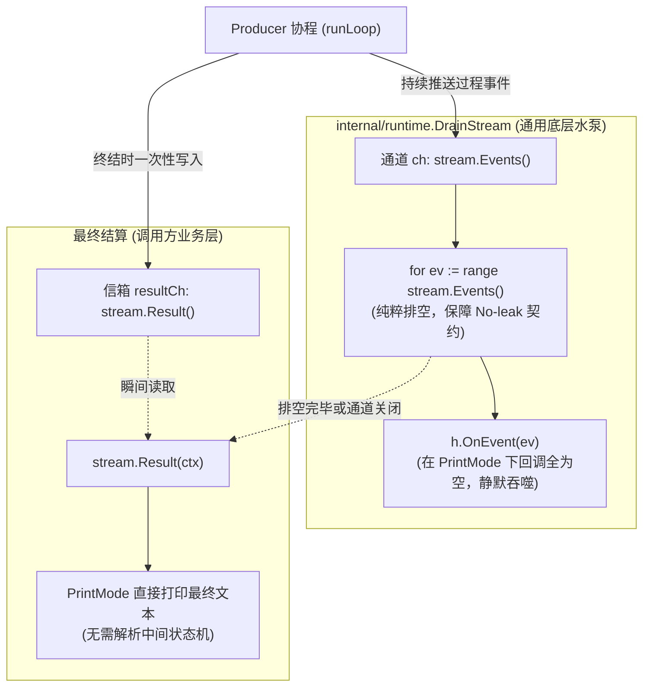

# EventStream 事件通道与结果信箱分离设计

本笔记深入剖析 `pigo` 核心并发流抽象 [`EventStream[T, R]`](file:///Users/yuqing/Documents/workspace/pigo/internal/agentcore/event_stream.go) 的架构考量。重点解答第 2 章思考题：**为什么最终结果 `R` 刻意不走事件通道 `ch`，而是使用独立的 `resultCh` + `sync.Once` 暴露？** 同时厘清 **“通道背压防泄漏（No-leak Contract）”** 与 **“`DrainStream` 排空与一键结算”** 的关注点分离哲学。

---

## 目录
- [一、思考题溯源：结果 R 为什么要脱离事件通道 ch？](#一思考题溯源结果-r-为什么要脱离事件通道-ch)
- [二、核心误区与直觉澄清：ch 必须被消费吗？](#二核心误区与直觉澄清ch-必须被消费吗)
- [三、深度对比：如果将结果合流进 ch 会引发什么麻烦？](#三深度对比如果将结果合流进-ch-会引发什么麻烦)
- [四、架构正解：DrainStream 抽水机与 Result 信箱分离](#四架构正解drainstream-抽水机与-result-信箱分离)
- [五、并发基石：sync.Once 决胜与广播唤醒机制](#五并发基石synconce-决胜与广播唤醒机制)
- [六、相关源码索引](#六相关源码索引)

---

## 一、思考题溯源：结果 R 为什么要脱离事件通道 ch？

在《全书解剖》第 2 章第 678 行提出了这样一个深层次的并发架构思考题：

> *“`EventStream` 的最终结果 `R` 刻意不走事件通道，而是用独立的 `resultCh` + `sync.Once` 暴露。如果把结果也当成一个特殊事件塞进 `ch`，第 1 章无头模式 `PrintMode` '忽略中间事件、只取最终文本' 的写法会遇到什么麻烦？”*

在 [`internal/agentcore/event_stream.go`](file:///Users/yuqing/Documents/workspace/pigo/internal/agentcore/event_stream.go#L25-L39) 中，流的结构体定义了两个完全解耦的出口：

```go
type EventStream[T any, R any] struct {
    ch         chan T        // 出口 1：流动过程事件（AgentEvent）
    resultOnce sync.Once
    result     R             // 最终结算结果（[]AgentMessage）
    resultErr  error
    resultCh   chan struct{} // 出口 2：结算通知信号
}
```

---

## 二、核心误区与直觉澄清：ch 必须被消费吗？

在探讨这个问题时，开发者往往会产生一个直觉疑问：
> *“既然结果不走 `ch`，那我可不可以完全不管 `ch`，只等着拿 `resultCh` 里的结果？”*

**答案是：不可以！`ch` 必须被持续消费，否则系统依然会卡死。**

* **Go 语言的无缓冲背压机制**：`NewEventStream(0)` 默认采用 0 缓冲，即完全同步的背压（对齐 `await emit(...)`）。如果外界完全没有人去 `<-ch`，生产者在发送第一个中间事件（如 `agent_start`）时，就会卡死在 `s.ch <- event` 上；
* **防泄漏契约（No-leak Contract）**：因此，不管上层业务关不关心中间事件，系统底层都**必须有一个抽水机制**将 `ch` 里的事件排空，保证生产者 Goroutine 顺利推进到终点。

**那么既然 `ch` 必须被消费，为什么还要大费周章独立出一个 `resultCh` 呢？**

---

## 三、深度对比：如果将结果合流进 ch 会引发什么麻烦？

如果系统采用“将最终结果包装为 `ResultEvent` 塞进 `ch` 尾端”的单轨通道设计，在无头模式（`PrintMode`）等只需要最终文本的场景下，会引发一系列灾难性的并发与架构问题：

### 1. 致命麻烦：直觉写法必然导致死锁（Deadlock）与协程泄漏
在无头模式下，开发者的诉求极其纯粹：“我只要最终输出的一段话，中间的打字机、工具调用我不关心”。
如果结果在 `ch` 里，开发者极易写出“等待结果”的直觉代码：
```go
// 设想的错误单轨设计
result := stream.WaitForResult() // 期望直接拿到队尾的结果
```
**死锁瞬间发生**：
1. 消费者没有开启循环去读 `ch`；
2. 循环协程吐出第 1 个事件（如 `agent_start`），阻塞在 `s.ch <- event`；
3. 生产者卡在起点，**永远没有机会执行到发送队尾 `ResultEvent` 的代码**；
4. 两端死等，后台协程永久泄漏。

### 2. 消费端状态机污染：“被迫充当人肉抽水机”
Go 的 Channel 是严格先进先出（FIFO）的管道，**任何人都无法跳过前面排队的几百个中间事件，直接抓取队尾的结果**。
如果结果合流在 `ch` 里，`PrintMode` 就算不想看中间过程，也**被迫在代码里写一个充斥着模式匹配的丑陋循环**：
```go
var finalResult string
// 被迫把所有中间事件全读出来扔掉
for ev := range stream.Events() {
    if res, ok := ev.(ResultEvent); ok {
        finalResult = res.Text
    }
    // 必须自己处理各种未知异常分支
}
```
这导致业务端代码与底层通道节奏深度耦合，无法做到“只关注结果”。

### 3. 取消与超时场景下的脱困失败（Cancellation Escape Hatch）
在长时间运行的 Agent 任务中，用户随时可能按下 `Ctrl+C` 或触发 Context 超时：
* 如果结果依赖 `ch`，当 Context 取消后，消费者往往已经退出；
* 独立 `resultCh` 提供了**带外的脱困通道（Escape Hatch）**：
  在 [`EventStream.Emit`](file:///Users/yuqing/Documents/workspace/pigo/internal/agentcore/event_stream.go#L67-L77) 中，生产者通过 `select` 感知到 `<-ctx.Done()`，放弃往 `ch` 发送，直接转向调用 `SetError(ctx.Err())` 触发 `close(resultCh)`；
* 外层等待者调用 `Result(ctx)` 依然能**立刻获知取消状态**，系统优雅收工，避免两头悬空。

### 4. 破坏性消费（Destructive Read）vs 广播幂等性
* **Channel 读取是破坏性的**：通道内的元素被某个协程 `<-ch` 取走后就不复存在了。如果存在并发监听者（如日志审计、会话持久化、CLI 打印），结果只能被一个人抢到，其他协程读空；
* **`resultCh` 的广播特性**：Go 语言中 `close(channel)` 会向所有正在监听该 channel 的协程广播就绪信号。无论有多少个协程在何时调用 `stream.Result(ctx)`，都能**无锁、幂等、安全地拿到同一份最终结果**。

### 5. 破坏类型系统与密封契约
* `T` 是过程心跳（密封接口 [`AgentEvent`](file:///Users/yuqing/Documents/workspace/pigo/internal/agentcore/event.go)）；
* `R` 是结算领域数据（如 `[]agentcore.Message` 消息切片）。
如果合流，要么必须把结算数据强塞进 `AgentEvent`（破坏事件语义），要么使通道类型退化为 `chan any`，彻底丢失编译期类型安全。

---

## 四、架构正解：DrainStream 抽水机与 Result 信箱分离

`pigo` 采用了一种极其漂亮的**关注点分离（Separation of Concerns）**模式：



在 [`internal/runtime/render.go`](file:///Users/yuqing/Documents/workspace/pigo/internal/runtime/render.go#L40-L86) 中，`DrainStream` 封装了所有脏活累活：
```go
func DrainStream(ctx context.Context, stream *LoopEventStream, h StreamHandler) (*agentcore.AssistantMessage, error) {
    // 1. 抽水机职责：把管道抽干，绝对不让生产者卡死
    for ev := range stream.Events() {
        if h.OnEvent != nil {
            h.OnEvent(ev)
        }
    }

    // 2. 结算职责：排空后一行代码向独立信箱拿结果
    msgs, resErr := stream.Result(ctx)
    return agentcore.LastAssistantOf(msgs), resErr
}
```

* **底层管水流通畅**（`for ev := range stream.Events()`）；
* **上层管数据结算**（`stream.Result(ctx)`）；
两层职责泾渭分明。

---

## 五、并发基石：sync.Once 决胜与广播唤醒机制

最终结果的沉淀依靠 `sync.Once` 构筑了一道不可逾越的并发防线：

```go
// internal/agentcore/event_stream.go
func (s *EventStream[T, R]) SetResult(result R) {
    s.resultOnce.Do(func() {
        s.result = result
        close(s.resultCh) // 广播唤醒所有等待者
    })
}

func (s *EventStream[T, R]) SetError(err error) {
    s.resultOnce.Do(func() {
        s.resultErr = err
        close(s.resultCh)
    })
}
```

* **先到先得（First-win）**：正常执行完毕的 `SetResult`、异常中断的 `SetError`，以及生产者异常退出时 `Close()` 触发的保底 `ErrStreamIncomplete`，三者通过 `sync.Once` 竞争，**永远只有第一个生效**；
* **零锁等待**：调用方在 `Result(ctx)` 中通过 `select` 监听 `<-s.resultCh`，在未完成前以极低开销挂起协程，一旦写入则通过通道关闭被瞬时唤醒。

---

## 六、相关源码索引

* 通用事件流与结果信箱定义：[`internal/agentcore/event_stream.go`](file:///Users/yuqing/Documents/workspace/pigo/internal/agentcore/event_stream.go)
* 流排空器与结果提取编排：[`internal/runtime/render.go`](file:///Users/yuqing/Documents/workspace/pigo/internal/runtime/render.go#L40-L86)
* 无头模式 PrintMode 消费端：[`internal/runtime/headless.go`](file:///Users/yuqing/Documents/workspace/pigo/internal/runtime/headless.go#L100-L144)
* 生产者循环收尾与 `finish()` 退出闭环：[`internal/runtime/loop.go`](file:///Users/yuqing/Documents/workspace/pigo/internal/runtime/loop.go#L236-L245)
