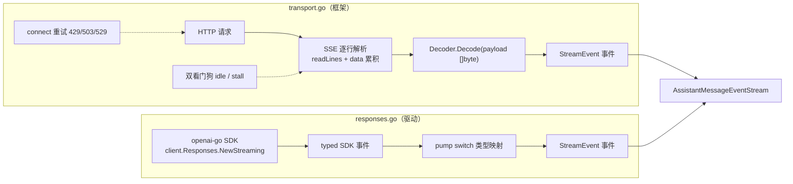
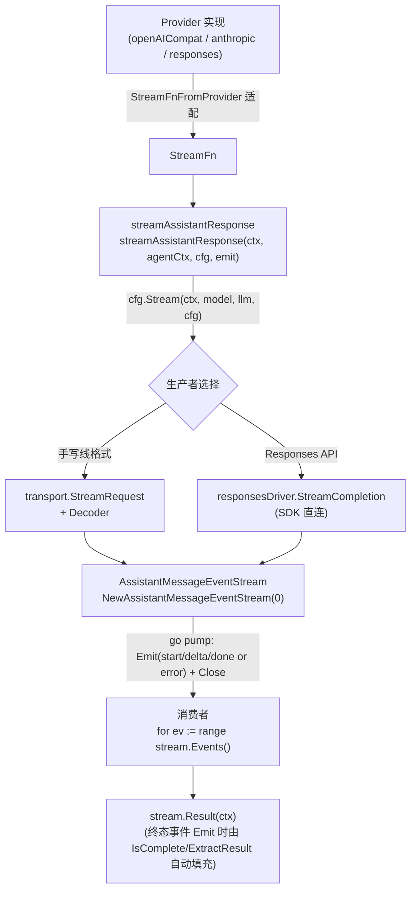

# Provider 流式抽象与传输层双驱动设计

本笔记梳理 `pigo` Provider 层的两个核心问题：

1. **[`NewAssistantMessageEventStream`](file:///Users/yuqing/Documents/workspace/pigo/internal/provider/provider.go#L80-L97) 具体是如何被使用的？** 它是泛型 [`EventStream[T, R]`](file:///Users/yuqing/Documents/workspace/pigo/internal/agentcore/event_stream.go) 的 **Provider 语义特化版**工厂，把「哪个事件是终点、终点里怎么取出最终消息」这两个 Provider 专属知识注入进去。
2. **[`transport.go`](file:///Users/yuqing/Documents/workspace/pigo/internal/provider/transport.go) 与 [`responses.go`](file:///Users/yuqing/Documents/workspace/pigo/internal/provider/responses.go) 的区别是什么？** 二者并非并列的驱动实现，而是**两个抽象层级**：一个是 provider-agnostic 的共享传输框架，一个是绕开该框架、直接对接官方 SDK 的具体驱动。

---

## 目录

- [一、AssistantMessageEventStream：泛型 EventStream 的 Provider 特化](#一assistantmessageeventstream泛型-eventstream-的-provider-特化)
- [二、Emit 自动捕获结果：生产者免写 SetResult 的关键机制](#二emit-自动捕获结果生产者免写-setresult-的关键机制)
- [三、生产者骨架：建流 → go pump → 立即返回](#三生产者骨架建流--go-pump--立即返回)
- [四、消费者两种范式](#四消费者两种范式)
- [五、生产者双实现对比：transport.go vs responses.go](#五生产者双实现对比transportgo-vs-responsesgo)
- [六、为什么两者可以互换：契约一致与 StreamFn 适配](#六为什么两者可以互换契约一致与-streamfn-适配)
- [七、完整接线链](#七完整接线链)
- [八、相关源码索引](#八相关源码索引)

---

## 一、AssistantMessageEventStream：泛型 EventStream 的 Provider 特化

[`provider.go`](file:///Users/yuqing/Documents/workspace/pigo/internal/provider/provider.go) 定义了一套密封（sealed）的流式增量事件集，以及承载它们的流类型：

```go
// AssistantMessageEventStream = EventStream[AssistantMessageEvent, AssistantMessage]
type AssistantMessageEventStream = agentcore.EventStream[AssistantMessageEvent, agentcore.AssistantMessage]

func NewAssistantMessageEventStream(buffer int) *AssistantMessageEventStream {
    s := agentcore.NewEventStream[AssistantMessageEvent, agentcore.AssistantMessage](buffer)
    s.IsComplete = func(e AssistantMessageEvent) bool {
        k := e.EventKind()
        return k == StreamEventDone || k == StreamEventError
    }
    s.ExtractResult = func(e AssistantMessageEvent) agentcore.AssistantMessage {
        switch ev := e.(type) {
        case StreamDoneEvent:
            return ev.Message
        case StreamErrorEvent:
            return ev.Message
        default:
            return agentcore.AssistantMessage{}
        }
    }
    return s
}
```

要点：

- **全项目从不直接 new 泛型基类**。所有生产路径一律调用这个工厂，因为它补齐了基类缺失的 Provider 语义。
- 事件集本身是密封接口（未导出方法 `isAssistantMessageEvent()`），判别符由 `EventKind()` 给出，共 6 种：`start` / `text` / `thinking` / `toolcall` / `done` / `error`，见 [`provider.go#L27-L71`](file:///Users/yuqing/Documents/workspace/pigo/internal/provider/provider.go#L27-L71)。
- `IsComplete` 只认 `done` 与 `error`；`ExtractResult` 从这两个终态事件里取 `Message`——注意 **error 事件同样携带一条完整的终态消息**（`StopReason=error/aborted` + `ErrorMessage`），这是 FR-13「双失败模型」的直接体现。

---

## 二、Emit 自动捕获结果：生产者免写 SetResult 的关键机制

这是整个设计最精妙的一环。基类 [`EventStream.Emit`](file:///Users/yuqing/Documents/workspace/pigo/internal/agentcore/event_stream.go#L67-L77)：

```go
func (s *EventStream[T, R]) Emit(ctx context.Context, event T) error {
    if s.IsComplete != nil && s.IsComplete(event) && s.ExtractResult != nil {
        s.SetResult(s.ExtractResult(event))  // ← 自动捕获最终结果
    }
    select {
    case s.ch <- event:                       // ← 终态事件仍然照常进通道
        return nil
    case <-ctx.Done():
        return ctx.Err()
    }
}
```

由此产生两条结论：

1. **生产者只需 `Emit` 一个 `StreamDoneEvent`/`StreamErrorEvent`，无需手动调用 `SetResult`**，`stream.Result(ctx)` 立刻由阻塞变为可返回。这正是 [`transport.go`](file:///Users/yuqing/Documents/workspace/pigo/internal/provider/transport.go) 与 [`responses.go`](file:///Users/yuqing/Documents/workspace/pigo/internal/provider/responses.go) 的 pump 里从头到尾看不到一次 `SetResult` 的原因。
2. **终态事件仍然会进入事件通道**（先捕获结果、后发送）。所以「循环里收到 done/error 就 return」和「循环外交给 `Result(ctx)` 结算」两条路都成立，互为保险。

若生产者异常收尾（只 `Close()` 未发终态事件），`Close()` 会以 `ErrStreamIncomplete` 兜底唤醒等待中的 `Result`，上层据此合成一条错误消息。

---

## 三、生产者骨架：建流 → go pump → 立即返回

两条真实的生产路径骨架完全一致：

```go
// internal/provider/transport.go#L118-L120
stream := NewAssistantMessageEventStream(0)
go pump(ctx, stream, resp, cfg.Decoder)
return stream, nil

// internal/provider/responses.go#L89-L91
stream := NewAssistantMessageEventStream(0)
go d.pump(ctx, stream, &client, params)
return stream, nil
```

三个共同点：

- **`buffer` 恒为 0**（生产代码全部如此）。呼应 [`NewEventStream`](file:///Users/yuqing/Documents/workspace/pigo/internal/agentcore/event_stream.go#L49-L57) 注释：0 缓冲 = 完全同步背压，每次 `Emit` 阻塞到消费者接收，对齐 pi 的 `await emit(...)` 顺序语义。只有个别测试传 2/4 制造多事件排队。
- **泵在独立 goroutine 中运行**，`defer stream.Close()` 保证通道一定关闭。
- **失败只在「连建流都建不起来」时返回 error**，运行期失败一律转化为流上的终态错误事件（FR-13）。

事件推进顺序：`start`（可选）→ 若干 `text`/`thinking`/`toolcall` 增量 → 终态 `done` 或 `error`。

---

## 四、消费者两种范式

### 范式 A：逐事件驱动 UI（主循环）

[`runtime/stream_response.go#L113-L160`](file:///Users/yuqing/Documents/workspace/pigo/internal/runtime/stream_response.go#L113-L160) 是最完整的消费者，对每个事件做三件事：回填上下文（backfill）、广播 UI 事件、终态返回。

```go
for ev := range stream.Events() {
    switch e := ev.(type) {
    case provider.StreamStartEvent:    // backfill + MessageStartEvent
    case provider.StreamTextEvent:     // backfill + MessageUpdateEvent（带原始增量）
    case provider.StreamThinkingEvent: // 同上
    case provider.StreamToolCallEvent: // 同上
    case provider.StreamDoneEvent:     // finalize + MessageEndEvent，return e.Message
    case provider.StreamErrorEvent:    // 同上，只是 StopReason=error/aborted
    }
}
// 兜底：通道已关闭却没收到 done/error，转向 Result 信箱
final, resErr := stream.Result(ctx)
```

### 范式 B：只要最终结果（静默排空）

[`compaction/summary.go#L349-L351`](file:///Users/yuqing/Documents/workspace/pigo/internal/compaction/summary.go#L349-L351) 与 [`dream/apply.go#L90-L104`](file:///Users/yuqing/Documents/workspace/pigo/internal/dream/apply.go#L90-L104) 关心的是「总结文本 / 记忆写入结果」，不关心中间打字机过程：

```go
for range s.Events() {   // 抽水机：必须排空，否则生产者卡死（0 缓冲背压）
}
final, resErr := s.Result(ctx)  // 一键结算
```

两种范式的差异与其同源基础（`EventStream` 的「事件通道 + 结果信箱」分离）已在 [EventStream 事件通道与结果信箱分离设计](./EventStream事件通道与结果信箱分离设计.md) 中详述，此处不再展开。

| 维度                                  | 范式 A（stream_response）  | 范式 B（summary/apply）          |
| ------------------------------------- | -------------------------- | -------------------------------- |
| 是否关心增量                          | 关心，用于实时渲染         | 不关心                           |
| 循环内是否匹配终态                    | 是（done/error 即 return） | 否，仅 `for range`               |
| 是否用 `Result`                       | 用作兜底                   | 作为主结算路径                   |
| `IsComplete/ExtractResult` 是否为必需 | 否（循环内已处理）         | **是**（否则需自己在循环里匹配） |

范式 B 正是「工厂必须把语义注入流里」的价值证明：调用方可以不认识事件类型，直接取结果。

---

## 五、生产者双实现对比：transport.go vs responses.go

### 一句话定位

|                 | [`transport.go`](file:///Users/yuqing/Documents/workspace/pigo/internal/provider/transport.go) | [`responses.go`](file:///Users/yuqing/Documents/workspace/pigo/internal/provider/responses.go) |
| --------------- | ---------------------------------------------------------------------------------------------- | ---------------------------------------------------------------------------------------------- |
| 定位            | **通用传输层（框架）**                                                                         | **具体协议驱动（一个 Provider 实现）**                                                         |
| 服务协议        | Chat Completions / Anthropic Messages（手写线格式）                                            | OpenAI Responses API（`--protocol openai/resp_api`）                                           |
| HTTP 请求       | 自己建：`NewRequest func(ctx)` 回调，每次连接新建请求防 body 重放                              | 交给 openai-go SDK：`client.Responses.NewStreaming(ctx, params)`                               |
| SSE 解析        | **自己手写**：`readLines` 逐行 → `data:` 累积 → 空行触发 `Decoder.Decode`                      | 完全交给 SDK，产出 typed 事件                                                                  |
| provider 差异点 | 退化成有状态的 `Decoder`（`Decode` / `Finish`）                                                | 无 Decoder，pump 里直接 `switch` SDK 事件类型                                                  |
| 连接重试        | 有：429/503/529 + Retry-After / 指数退避，`defaultMaxConnectRetries=2`                         | 无，交给 SDK / `http.Client`                                                                   |
| 看门狗          | 双看门狗：idle（默认 5min，`PIGO_STREAM_IDLE_TIMEOUT` 可配）+ content-stall（idle × 1.2）      | 无                                                                                             |
| 终态消息来源    | Decoder 累积 state，`finishDone()` 拼装                                                        | 优先用权威的 `ResponseCompletedEvent` → `mapResponse`，兜底才用累积 delta                      |

### 各自的使用者

**transport 服务的是「手写线格式」的两个驱动：**

```go
// internal/provider/providers.go#L107 —— openAICompatDriver（Chat Completions）
return StreamRequest(ctx, TransportConfig{NewRequest: newReq, Decoder: NewOpenAIDecoder()})

// internal/provider/providers.go#L319 —— anthropicDriver（Anthropic Messages）
return StreamRequest(ctx, TransportConfig{NewRequest: newReq, Decoder: NewAnthropicDecoder()})
```

这两个 provider 只提供「JSON body 编码器 + 一个 `Decoder`」，HTTP / SSE / 重试 / 看门狗全部由 transport 兜住。这正是 [`transport.go`](file:///Users/yuqing/Documents/workspace/pigo/internal/provider/transport.go#L1-L11) 文件头所说的：「每个 provider 退化成一个有状态的 `Decoder`」。`Decoder` 契约只有两个方法，见 [`transport.go#L34-L45`](file:///Users/yuqing/Documents/workspace/pigo/internal/provider/transport.go#L34-L45)：

```go
type Decoder interface {
    Decode(payload []byte) ([]StreamEvent, error) // 一个 SSE data 载荷 → 零或多个事件
    Finish() ([]StreamEvent, error)               // 流结束，冲刷缓冲的终态事件
}
```

**responses 是唯一不复用 transport 的驱动**，因为走官方 SDK 后 HTTP + SSE 已是 SDK 的职责，再套一层 `Decoder` 反而多余。它把 SDK 的 typed 事件直接映射成 pigo 事件，见 [`responses.go#L124-L160`](file:///Users/yuqing/Documents/workspace/pigo/internal/provider/responses.go#L124-L160)：

```go
case responses.ResponseTextDeltaEvent:                 // → StreamTextEvent
case responses.ResponseReasoningSummaryTextDeltaEvent:  // → StreamThinkingEvent（推理摘要）
case responses.ResponseOutputItemDoneEvent:            // → StreamToolCallEvent（function_call）
case responses.ResponseCompletedEvent:                 // 记下权威结果，供 mapResponse 使用
case responses.ResponseFailedEvent:                    // → emitError
case responses.ResponseErrorEvent:                     // → emitError
```

而 transport 侧对应的 [`OpenAIDecoder.Decode`](file:///Users/yuqing/Documents/workspace/pigo/internal/provider/openai.go#L102-L153) 拿到的是**原始 SSE 字符串载荷**，必须自己 `json.Unmarshal` 到 `openaiChunk`，并自行维护 `responseID` / `text` / `thinking` / `toolCalls` / `usage` 等状态：

```go
func (d *OpenAIDecoder) Decode(payload []byte) ([]StreamEvent, error) {
    var chunk openaiChunk
    if err := json.Unmarshal(payload, &chunk); err != nil { ... }
    if chunk.ID != ""    { d.responseID = chunk.ID }
    if chunk.Model != "" { d.responseModel = chunk.Model }
    ...
    for _, choice := range chunk.Choices {
        if r := choice.Delta.ReasoningContent; r != "" { ...d.thinking.WriteString(r) }
        if choice.Delta.Content != "" { d.text.WriteString(choice.Delta.Content) }
        for _, tc := range choice.Delta.ToolCalls { d.applyToolDelta(tc) }
        if choice.FinishReason != "" { d.stopReason = mapOpenAIFinishReason(choice.FinishReason) }
    }
    return events, nil
}
```

**同一层职责的两种实现方式**，对照如下：



### 为什么 responses 不复用 transport

- **SDK 已内聚了传输职责**：openai-go 自带 HTTP 客户端、SSE 解码与 typed 事件模型，硬塞进 `Decoder` 抽象属于重复劳动。
- **typed 事件优于字符串解析**：`ResponseTextDeltaEvent` 等类型由 SDK 保证，比手写 `json.Unmarshal` + 字段判空更稳。
- **代价是失去 transport 的增强能力**：responses 没有自己的连接重试与 idle/stall 看门狗，退化为依赖 SDK 与 `http.Client` 的默认行为。

### 一个需要留意的细节差异

- [`transport.connect()`](file:///Users/yuqing/Documents/workspace/pigo/internal/provider/transport.go#L158-L162) 把初始连接的 4xx/5xx 当作**返回的 error**；
- responses 把非 2xx 变成**流上的 error 事件**（其文件头注释如此声明）。

但对上层循环而言**观察行为一致**：返回 error 会被 [`stream_response.go#L96-L100`](file:///Users/yuqing/Documents/workspace/pigo/internal/runtime/stream_response.go#L96-L100) 合成为一条 `StopReason=error` 的终态消息，与收到 `StreamErrorEvent` 殊途同归。这也是 responses 注释里「matching the chat driver's observable behavior」的确切含义——**匹配的是循环层的可观察行为，而非错误传递路径本身**。

### start 事件是协议相关的

`start` 事件并非所有路径都发：

- **Anthropic**：在 `message_start` 上发出，见 [`anthropic.go#L166-L176`](file:///Users/yuqing/Documents/workspace/pigo/internal/provider/anthropic.go#L166-L176)；
- **OpenAI Chat Completions**：无显式起始事件（首块即带 role），`OpenAIDecoder` 不发 `start`；
- **Responses**：pump 开头主动补一个 `StreamStartEvent`，见 [`responses.go#L108`](file:///Users/yuqing/Documents/workspace/pigo/internal/provider/responses.go#L108)。

所以 `stream_response.go` 对 `StreamStartEvent` 的处理必须是「可选、幂等」的，而不能假定它一定到来。

---

## 六、为什么两者可以互换：契约一致与 StreamFn 适配

尽管实现天差地别，两者对上层是**同一个契约**，这正是 [`StreamFnFromProvider`](file:///Users/yuqing/Documents/workspace/pigo/internal/provider/provider_interface.go#L72-L78) 能统一适配的原因：

```go
func StreamFnFromProvider(p Provider) StreamFn {
    return func(ctx context.Context, model string, llm LlmContext, cfg StreamConfig) (*AssistantMessageEventStream, error) {
        return p.StreamCompletion(ctx, CompletionRequest{Model: model, Context: llm, Config: cfg})
    }
}
```

共同契约：

- 出口类型相同：`*AssistantMessageEventStream`；
- 事件集相同：`start` / `thinking` / `text` / `toolcall` / `done` / `error`；
- 生命周期相同：`go pump` 后立即返回，`defer Close()`；
- 失败模型相同（FR-13）：仅「最早的建流失败」返回 error，运行期失败一律走 `StreamErrorEvent`。

因此上层 [`streamAssistantResponse`](file:///Users/yuqing/Documents/workspace/pigo/internal/runtime/stream_response.go#L91-L148) 对两者**完全无感**，同一段 `for ev := range stream.Events()` 通吃所有协议。

---

## 七、完整接线链



---

## 八、相关源码索引

- Provider 事件集与流工厂：[`internal/provider/provider.go`](file:///Users/yuqing/Documents/workspace/pigo/internal/provider/provider.go)
- 泛型事件流与结果信箱：[`internal/agentcore/event_stream.go`](file:///Users/yuqing/Documents/workspace/pigo/internal/agentcore/event_stream.go)
- 通用传输层（HTTP + SSE + 重试 + 看门狗）：[`internal/provider/transport.go`](file:///Users/yuqing/Documents/workspace/pigo/internal/provider/transport.go)
- Responses API 驱动（SDK 直连）：[`internal/provider/responses.go`](file:///Users/yuqing/Documents/workspace/pigo/internal/provider/responses.go)
- Chat Completions / Anthropic 驱动接线：[`internal/provider/providers.go`](file:///Users/yuqing/Documents/workspace/pigo/internal/provider/providers.go#L107)
- 各协议 Decoder：[`internal/provider/openai.go`](file:///Users/yuqing/Documents/workspace/pigo/internal/provider/openai.go#L102-L153)、[`internal/provider/anthropic.go`](file:///Users/yuqing/Documents/workspace/pigo/internal/provider/anthropic.go#L116-L176)
- Provider ↔ StreamFn 适配：[`internal/provider/provider_interface.go`](file:///Users/yuqing/Documents/workspace/pigo/internal/provider/provider_interface.go#L63-L79)
- 主消费者（逐事件驱动 UI）：[`internal/runtime/stream_response.go`](file:///Users/yuqing/Documents/workspace/pigo/internal/runtime/stream_response.go#L113-L160)
- 静默排空消费者：[`internal/compaction/summary.go`](file:///Users/yuqing/Documents/workspace/pigo/internal/compaction/summary.go#L346-L360)、[`internal/dream/apply.go`](file:///Users/yuqing/Documents/workspace/pigo/internal/dream/apply.go#L85-L104)
- 协议选择与 Provider 解析：[`internal/provider/protocol.go`](file:///Users/yuqing/Documents/workspace/pigo/internal/provider/protocol.go)、[`internal/provider/resolve.go`](file:///Users/yuqing/Documents/workspace/pigo/internal/provider/resolve.go#L55-L74)
