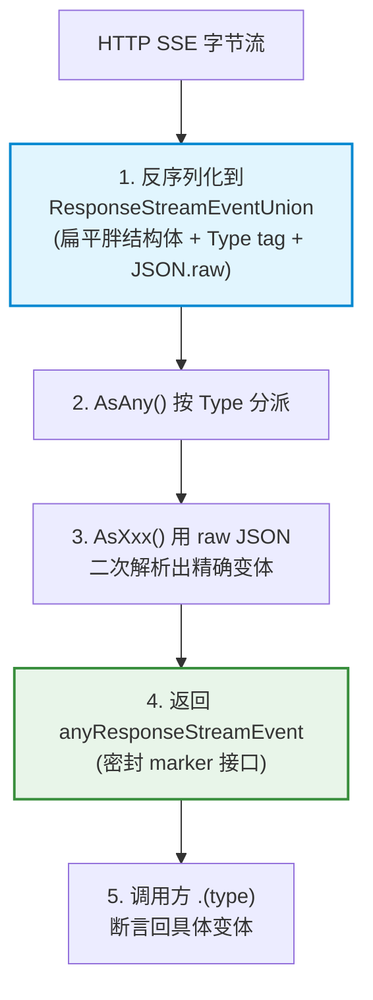

# SDK 联合类型实现机制与 As 访问器模式

本笔记记录**外部 SDK**（`github.com/openai/openai-go` v1.12.0）如何在 Go 中实现「判别联合（discriminated union / sum type）」，具体载体是 Responses API 的流式事件类型 `ResponseStreamEventUnion`。

它与 [密封接口设计与 JSON 多态反序列化](./密封接口设计与JSON多态反序列化.md) 构成一组**对照实现**：

|          | pigo 自有契约                                  | 外部 SDK                                                 |
| -------- | ---------------------------------------------- | -------------------------------------------------------- |
| 代表类型 | `agentcore.Content` / `Message` / `AgentEvent` | `responses.ResponseStreamEventUnion`                     |
| 做法     | 接口 + 未导出 marker + 手工两步解码            | 扁平联合体 + `Type` tag + `As` 访问器 + 密封 marker 接口 |
| 服务对象 | 自己完全掌控的封闭事件集                       | 会持续扩张的外部协议（40+ 变体）                         |

> 源码基线：`github.com/openai/openai-go@v1.12.0/responses/response.go`
> 下游调用方：`internal/provider/responses.go`（`--protocol openai/resp_api`）

---

## 目录

- [一、问题背景：Go 没有原生联合类型](#一问题背景go-没有原生联合类型)
- [二、五层实现机制](#二五层实现机制)
- [三、调用方视角：pigo 如何消费](#三调用方视角pigo-如何消费)
- [四、与 pigo 自有方案的对比](#四与-pigo-自有方案的对比)
- [五、权衡：什么时候用哪种](#五权衡什么时候用哪种)
- [六、相关源码索引](#六相关源码索引)

---

## 一、问题背景：Go 没有原生联合类型

代数数据类型中的 **sum type**（"值只能是 A 或 B 或 C 之一"）在 Go 里没有原生语法。落到「从 JSON 反序列化一个多态值」这个场景，工程上只有两条路：

1. **接口路线**：定义接口 `I`，各变体 struct 实现它；消费端 `type switch`。
   问题是 `encoding/json` **无法反序列化到接口类型**，必须手写「先探测判别字段 → 再二次解码到具体 struct」——即 pigo 的 `decodeContent` / `decodeMessage`。新增变体要同时改接口实现和派发代码。
2. **扁平结构体路线**：定义一个**吃掉所有变体字段**的结构体，外加一个判别字符串。
   它就是 SDK 的选择——因为 SDK 面对的是**外部协议**：变体有 40+ 个、`type` 取值会随 OpenAI 迭代增加，且这些代码由**代码生成器**批量产出（手写 40 份 `As` 访问器不现实）。

---

## 二、五层实现机制



### 2.1 第 1 层：扁平联合体（fat struct）

`ResponseStreamEventUnion` **不是接口，而是一个把全部变体字段取并集塞进去的 struct**：

```go
// Use the [ResponseStreamEventUnion.AsAny] method to switch on the variant.
// Use the methods beginning with 'As' to cast the union to one of its variants.
type ResponseStreamEventUnion struct {
    Delta          ResponseStreamEventUnionDelta `json:"delta"`
    SequenceNumber int64                         `json:"sequence_number"`
    Type           string                        `json:"type"`       // ← 判别式 (discriminant)
    ItemID         string                        `json:"item_id"`
    OutputIndex    int64                         `json:"output_index"`
    Code           string                        `json:"code"`
    // This field is from variant [ResponseCompletedEvent].
    Response       Response                      `json:"response"`
    // This field is from variant [ResponseErrorEvent].
    Message        string                        `json:"message"`
    Param          string                        `json:"param"`
    Item           ResponseOutputItemUnion       `json:"item"`
    ...
    JSON struct {
        Delta respjson.Field
        ...
        raw   string                             // ← 原始 JSON 字节，json:"-" 不参与 marshal
    } `json:"-"`
}
```

要点：

- 注释 `This field is from variant [X]` 就是设计线索——**一个 struct 承载所有变体的字段全集**，靠 `Type` 决定该信谁。这是把 sum type 编码成「product type（字段并集）+ tag」。
- 好处是**无需预知类型就能一次性吃下任意 JSON**，天然适配流式场景。
- `JSON.raw` 以 `json:"-"` 保存原始字节，为第 3 层的精确还原留后路。

### 2.2 第 2 层：反序列化时保留原始字节

```go
func (r *ResponseStreamEventUnion) UnmarshalJSON(data []byte) error {
    return apijson.UnmarshalRoot(data, r)
}
```

`apijson.UnmarshalRoot` 一次性完成两件事：填满扁平字段，并把 `r.JSON.raw` 记下。原始字节是后续「复活变体」的唯一权威来源。

### 2.3 第 3 层：`AsXxx()` 用 raw JSON 二次解析变体

```go
func (u ResponseStreamEventUnion) AsResponseCompleted() (v ResponseCompletedEvent) {
    apijson.UnmarshalRoot(json.RawMessage(u.JSON.raw), &v)
    return
}

func (u ResponseStreamEventUnion) AsError() (v ResponseErrorEvent) {
    apijson.UnmarshalRoot(json.RawMessage(u.JSON.raw), &v)
    return
}
```

**关键点：不是从扁平字段手动映射，而是拿原始字节重新 unmarshal。**

这样做的好处：

- 变体自身的**嵌套子联合**、`respjson.Field` 的 present/absent（字段是否真的出现过）信息都能精确还原；
- 省掉 40 份「字段搬运」代码，全部由生成器统一模板产出，不会手抖写错映射。

### 2.4 第 4 层：`AsAny()` 按 tag 总分派

```go
func (u ResponseStreamEventUnion) AsAny() anyResponseStreamEvent {
    switch u.Type {
    case "response.audio.delta":
        return u.AsResponseAudioDelta()
    case "response.completed":
        return u.AsResponseCompleted()
    case "response.output_item.done":
        return u.AsResponseOutputItemDone()
    case "error":
        return u.AsError()
    ...
    }
    return nil          // ← 未识别类型返回 nil，而不是 panic
}
```

两个细节：

- 分派键是**协议原样的事件名**（`response.completed` 等），与线格式一一对应。
- **未匹配返回 `nil`**，不是错误也不是 panic——这让 SDK 对新事件天然向前兼容。

### 2.5 第 5 层：密封 marker 接口锁定返回类型

```go
// anyResponseStreamEvent is implemented by each variant of
// [ResponseStreamEventUnion] to add type safety for the return type of AsAny.
type anyResponseStreamEvent interface {
    implResponseStreamEventUnion()          // ← 未导出 marker
}

func (ResponseCompletedEvent) implResponseStreamEventUnion() {}   // 每个变体都实现
```

因为 marker 方法**未导出**，包外类型无法实现它，所以 `anyResponseStreamEvent` 是**密封接口**，`AsAny()` 的返回值集合被精确封闭为「就是这些变体」，而不会退化成裸 `any`。

> 这与 pigo 的 `isContent()` / `isMessage()` / `isAgentEvent()` 是**同一个范式**——用未导出方法把实现者锁在自己包内。

### 2.6 递归：嵌套联合与未知字段容忍

联合体内部还嵌着子联合，形成递归结构：

- `Item ResponseOutputItemUnion` —— 输出条目本身也是联合（可能是 `message` / `function_call` / `reasoning` / `web_search_call`…），同样提供 `AsAny()` 与 `AsFunctionCall()` 等访问器；
- `Part ResponseStreamEventUnionPart`、`Delta ResponseStreamEventUnionDelta` —— 字段级子联合，仅为「便捷访问」而生成，SDK 注释里明确建议**优先直接使用具体变体**以获得类型安全。

未知字段则由每个变体的 `JSON.ExtraFields map[string]respjson.Field` 兜住，反序列化不丢信息、也不报错。

---

## 三、调用方视角：pigo 如何消费

`internal/provider/responses.go` 的 `pump` 里就是「第 5 层」的消费者：

```go
switch variant := sse.Current().AsAny().(type) {
case responses.ResponseTextDeltaEvent:
    text.WriteString(variant.Delta)
    ...
case responses.ResponseReasoningSummaryTextDeltaEvent:
    thinking.WriteString(variant.Delta)
    ...
case responses.ResponseOutputItemDoneEvent:
    if fc := variant.Item.AsFunctionCall(); fc.Type == "function_call" {
        toolCalls = append(toolCalls, toolCallContent(fc))
    }
case responses.ResponseCompletedEvent:
    r := variant.Response
    completed = &r
case responses.ResponseFailedEvent:
    d.emitError(stream, fmt.Errorf("response failed"))
case responses.ResponseErrorEvent:
    d.emitError(stream, fmt.Errorf("%s", variant.Message))
}
```

调用侧的三个观察点：

1. **`AsAny()` → `.(type)` 是「联合 → 精确变体」的还原**：每个 `case` 内 `variant` 都是强类型，可直接访问 `.Delta`，无需任何运行时字段查找。
2. **`case` 命中的是值类型**（非指针），与 SDK 生成的值接收者 `func (r ResponseTextDeltaEvent) RawJSON()` 一致。
3. **这个 switch 没有 `default`**，是刻意的白名单：Responses API 还会推 `response.created`、`response.content_part.added`、`response.output_text.done` 等大批事件，pigo 当前用不到就**静默忽略**。而第 4 层 `AsAny()` 对未知类型返回 `nil`，正好让这些未列出的类型安全落入「无 case 匹配」的分支——两层设计在这里咬合。

---

## 四、与 pigo 自有方案的对比

| 维度          | pigo 自有（接口 + marker）                                                  | SDK（扁平联合体 + As）                               |
| ------------- | --------------------------------------------------------------------------- | ---------------------------------------------------- |
| 类型建模      | `interface` + 未导出 marker                                                 | `struct`（字段并集）+ `Type string`                  |
| 实现者集合    | 编译期封闭（包内）                                                          | 生成期封闭（marker 接口同样不可外包实现）            |
| JSON 反序列化 | `encoding/json` **做不到**，需手写两步解码（peek `type`/`role` → 二次解码） | `UnmarshalJSON` 落到胖 struct，天然「能吃任意 JSON」 |
| 变体还原      | 派发代码里 `json.Unmarshal(raw, &Concrete{})`                               | `AsXxx()` 统一模板，用 `JSON.raw` 二次解析           |
| 新增变体成本  | 改接口实现 + 改派发函数（多处）                                             | 生成器重跑（改 0 处手写代码）                        |
| 内存/性能     | 无冗余字段，一次解析                                                        | 胖 struct 字段冗余 + **变体二次解析**开销            |
| 未知类型      | 需自行容错                                                                  | `AsAny()` 返回 `nil`；`ExtraFields` 存未知字段       |
| 适合场景      | 自有封闭集合、追求精简与显式                                                | 外部协议、变体多且会扩张、代码可生成                 |

---

## 五、权衡：什么时候用哪种

- **选择「接口 + marker」**：事件/类型集合由你定义、规模可控（十来个）、希望在编译期就获得穷尽性检查与零冗余内存。pigo 的 `Content`（4）/ `Message`（4）/ `AgentEvent`（14）/ `AssistantMessageEvent`（6）都属于这一类。
- **选择「扁平联合体 + As 访问器」**：你在对接**别人的协议**，变体数量大（40+）、`type` 取值会持续增加，且反序列化要能"先收后判"。代价是内存冗余与二次解析，换来的是**向前兼容 + 可由生成器维护**。
- **两者的共同内核**：都用**未导出 marker 方法**把所有实现者锁在自己的包内，从而让「`AsAny()` / `switch` 的返回值集合」在类型层面保持封闭。这也是本仓库 [接口契约全景地图](./接口契约全景地图.md) 中「密封判别联合」范式的第三种落地形态。

---

## 六、相关源码索引

### SDK 侧（`github.com/openai/openai-go@v1.12.0/responses/response.go`）

| 内容                                                            | 位置                                 |
| --------------------------------------------------------------- | ------------------------------------ |
| 扁平联合体定义 `ResponseStreamEventUnion`                       | `response.go:10042`                  |
| 判别字段 `Type string`                                          | `response.go:10076`                  |
| 密封接口 `anyResponseStreamEvent`                               | `response.go:10139`                  |
| marker 实现（各变体）                                           | `response.go:10152` 起               |
| `AsAny()` 总分派（未匹配 `return nil`）                         | `response.go:10252`，nil 在 `:10357` |
| `AsResponseCompleted()` 等访问器                                | `response.go:10405` 起               |
| `UnmarshalJSON` 保留 `JSON.raw`                                 | `response.go:10617`                  |
| 字段级子联合 `ResponseStreamEventUnionDelta`                    | `response.go:10621`                  |
| 嵌套联合 `ResponseOutputItemUnion.AsAny()` / `AsFunctionCall()` | `response.go:7966` / `:8006`         |

### pigo 侧

| 内容                                              | 位置                                                                                                                                                                                                                                                                                                   |
| ------------------------------------------------- | ------------------------------------------------------------------------------------------------------------------------------------------------------------------------------------------------------------------------------------------------------------------------------------------------------ |
| 消费联合体：`pump` 的 `type switch`               | [`internal/provider/responses.go:124`](file:///Users/yuqing/Documents/workspace/pigo/internal/provider/responses.go#L124-L160)                                                                                                                                                                         |
| 从 `Item` 子联合取函数调用                        | [`internal/provider/responses.go:144`](file:///Users/yuqing/Documents/workspace/pigo/internal/provider/responses.go#L144-L150)                                                                                                                                                                         |
| 累积增量缓冲（`text` / `thinking` / `toolCalls`） | [`internal/provider/responses.go:115`](file:///Users/yuqing/Documents/workspace/pigo/internal/provider/responses.go#L115-L118)                                                                                                                                                                         |
| pigo 自有的密封接口（对照）                       | [`internal/agentcore/content.go`](file:///Users/yuqing/Documents/workspace/pigo/internal/agentcore/content.go) / [`message.go`](file:///Users/yuqing/Documents/workspace/pigo/internal/agentcore/message.go) / [`event.go`](file:///Users/yuqing/Documents/workspace/pigo/internal/agentcore/event.go) |
