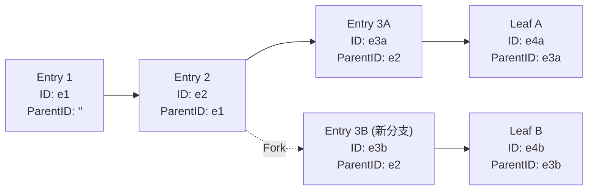
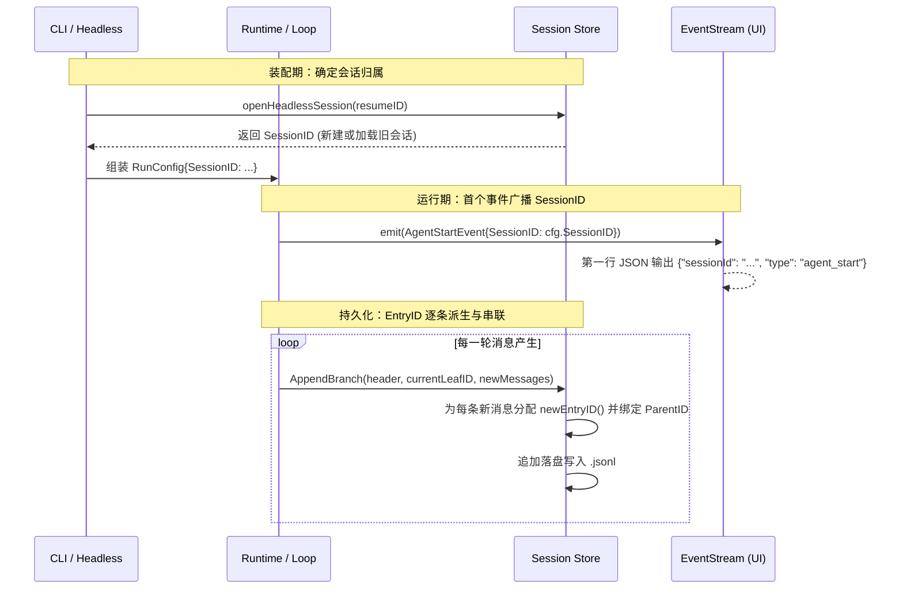

# SessionID 与 EntryID 架构区分与树状会话模型

在 `pigo` 的持久化与运行时体系中，**`SessionID`** 与 **`EntryID`（条目 ID / 消息 ID）** 分布在不同的抽象层级，分别解决**全局会话生命周期管理**与**会话内部因果树拓扑重构**两个维度的核心诉求。

---

## 目录
- [一、架构定位与设计哲学：宏观会话 vs 微观节点](#一架构定位与设计哲学宏观会话-vs-微观节点)
- [二、物理存储与 JSONL 布局：第一行 Header vs 消息条目包装](#二物理存储与-jsonl-布局第一行-header-vs-消息条目包装)
- [三、ID 生成算法与特征对比](#三id-生成算法与特征对比)
- [四、树状因果链：从线性会话演进到 DAG](#四树状因果链从线性会话演进到-dag)
- [五、生命周期与运行时数据流转](#五生命周期与运行时数据流转)
- [六、分支与派生机制：会话级 Fork vs 节点级分叉](#六分支与派生机制会话级-fork-vs-节点级分叉)
- [七、全景维度对比速查表](#七全景维度对比速查表)
- [八、相关源码索引](#八相关源码索引)

---

## 一、架构定位与设计哲学：宏观会话 vs 微观节点

| 标识符 | 抽象层级 | 归属实体 | 核心职责 |
|---|---|---|---|
| **`SessionID`** | 宏观 / 粗粒度 | 整个会话（文件级） | 标识用户与 Agent 的一整轮交互生命周期；作为文件系统定位凭证与运行期上下文锚点。 |
| **`EntryID`** | 微观 / 细粒度 | 单个消息条目（节点级） | 标识会话内部单条已持久化的消息节点；作为构建树状历史链路的拓扑指针。 |

* **`SessionID` 回答的问题**：“这次对话是哪一次？保存在哪里？从哪里恢复？”
* **`EntryID` 回答的问题**：“这条消息是谁？它的前置消息是谁？当前上下文沿哪条路径生长？”

---

## 二、物理存储与 JSONL 布局：第一行 Header vs 消息条目包装

`pigo` 采用 Append-only 的单文件 JSONL 作为会话存储格式（保存在 `~/.pigo/sessions/`），两者的落盘位置有严格的物理边界：

```text
~/.pigo/sessions/<SessionID>.jsonl
├── Line 1: SessionHeader {"id": "<SessionID>", "version": 3, "model": "...", ...}
├── Line 2: Entry         {"id": "<EntryID_1>", "parentId": "", "message": {...}}
├── Line 3: Entry         {"id": "<EntryID_2>", "parentId": "<EntryID_1>", "message": {...}}
└── Line N: Entry         {"id": "<EntryID_N>", "parentId": "<EntryID_N-1>", "message": {...}}
```

### 1. 第一行：`SessionHeader` 托管 `SessionID`
第一行严格固定为 [`SessionHeader`](file:///Users/yuqing/Documents/workspace/pigo/internal/session/session.go#L64-L94)：
* 其 `ID` 字段即为 `SessionID`，同时直接作为文件名（`${SessionID}.jsonl`）。
* 允许在无需扫描/反序列化庞大消息体的前提下，仅读取首行即可完成会话列表展示（`pigo sessions`）、元数据筛选（`Model`/`Provider`/`Cwd`）与版本校验。

### 2. 第二行及后续行：`Entry` 包装体托管 `EntryID`
在 Schema v3 规范下，每条消息不再裸写，而是由包装结构体 [`Entry`](file:///Users/yuqing/Documents/workspace/pigo/internal/session/session.go#L102-L111) 承载：
```go
type Entry struct {
    ID        string             // EntryID：当前条目的文件内唯一 ID
    ParentID  string             // 父条目 ID，树形结构的溯源指针（根节点为空）
    Timestamp time.Time          // 持久化时间戳
    Message   agentcore.Message  // 具体的底层消息（User / Assistant / ToolResult 等）
}
```

磁盘序列化由 [`entryWire`](file:///Users/yuqing/Documents/workspace/pigo/internal/session/session.go#L116-L121) 代理，将 `Message` 保留为 `json.RawMessage` 以配合密封接口多态解码。

---

## 三、ID 生成算法与特征对比

### 1. `SessionID`：时间序字典排序
由 [`session.NewID`](file:///Users/yuqing/Documents/workspace/pigo/internal/session/session.go#L335-L337) 生成：
```go
func NewID(now time.Time) string {
    return fmt.Sprintf("%s-%06d", now.UTC().Format("20060102-150405"), now.UTC().Nanosecond()/1000%1_000_000)
}
```
* **特征**：形如 `20260710-142530-412306`。
* **设计意图**：前缀为 UTC 格式化时间戳，保证了在文件系统和字符串层面上**字典序天然等价于时间序**，方便直接按名称对会话排序并快速定位最近会话；后缀微秒级数字消除同一秒内并发建会的碰撞冲突。

### 2. `EntryID`：轻量级防碰撞短哈希
由 [`session.newEntryID`](file:///Users/yuqing/Documents/workspace/pigo/internal/session/session.go#L162-L170) 生成：
```go
func newEntryID() string {
    var b [4]byte
    if _, err := rand.Read(b[:]); err != nil {
        return fmt.Sprintf("%08x", time.Now().UnixNano()&0xffffffff)
    }
    return hex.EncodeToString(b[:])
}
```
* **特征**：8 位十六进制随机字符串（4 字节安全随机数，例如 `a1b2c3d4`）。
* **设计意图**：`EntryID` 的唯一性作用域仅限于**单个文件内部**。4 字节随机空间（$2^{32} \approx 42.9$ 亿）对于单会话内通常几千条的消息规模而言，碰撞概率极低，且显著缩减了在 JSONL 中高频出现的空间冗余。

---

## 四、树状因果链：从线性会话演进到 DAG

`EntryID` 的引入是 `pigo` 从 Schema v1/v2 演进到 Schema v3 的核心动机（支撑 `/fork`、`/clone` 与分支导航）：



### 核心重构算法：`PathToLeaf`
当向大模型发起调用时，大模型 API 必须接收严格线性的消息数组。运行时通过 [`PathToLeaf`](file:///Users/yuqing/Documents/workspace/pigo/internal/session/session.go#L178-L202) 沿 `ParentID` 从指定叶子节点向前倒查：
```go
func PathToLeaf(entries []Entry, leafID string) []Entry {
    // 1. 构建 ID -> Entry 哈希表
    // 2. 从 leafID 开始沿 ParentID 回溯到根节点（ParentID == ""）
    // 3. 将 leaf->root 倒序翻转为 root->leaf 的线性会话切片
}
```
* **单链线性退化**：在没有分支的常规对话中，每个条目的 `ParentID` 指向上一条的 `ID`，退化为一条简单的线性单向链表。
* **容错性（Fail-Soft）**：若发现缺失父节点或形成闭环，`PathToLeaf` 提前阻断在最后一个有效祖先，保证损坏文件依然能够回放最大前缀。

---

## 五、生命周期与运行时数据流转



1. **`SessionID` 的生命周期**：
   * 在会话装配期（`openHeadlessSession`）即被确定。
   * 被写入 `RunConfig.SessionID` 与 `HookDeps.SessionID`，透传给所有切面与扩展。
   * 在任何网络请求前，随循环的第一个事件 `agentcore.AgentStartEvent` 原样发出，成为消费端捕获的首行信息。
2. **`EntryID` 的生命周期**：
   * 仅在会话产生新消息需要落盘时（`AppendBranch` / `SaveEntries`）动态派生。
   * 随着单条消息写入后便永久固化为不可变节点（Immutable Record）。

---

## 六、分支与派生机制：会话级 Fork vs 节点级分叉

在对话分叉场景下，两者的协作方式如下：

1. **会话级分叉（独立新文件）**：
   当用户执行克隆或从另一会话分叉时（调用 [`Store.Fork`](file:///Users/yuqing/Documents/workspace/pigo/internal/session/session.go#L386-L440)）：
   * 系统会分配一个**全新的 `SessionID`**，创建新的 `.jsonl` 物理文件。
   * 在新文件的 `SessionHeader.ParentSession` 字段中记下**原会话的 `SessionID`**，建立宏观血缘关系。
2. **节点级分叉（历史截断点）**：
   * `Fork` 操作接收一个 `leafID` 参数（即分叉起点对应的 **`EntryID`**）。
   * 系统通过 `PathToLeaf(srcEntries, leafID)` 截取到该条目为止的所有前置历史，原样复制到新会话中作为基础前缀；后续的新消息将以该条目的 `EntryID` 作为 `ParentID` 派生新分支。

---

## 七、全景维度对比速查表

| 维度 | `SessionID` | `EntryID`（条目 ID） |
|---|---|---|
| **命名规范** | `SessionID` / `sessionId` | `ID` / `entryId` / `parentId` |
| **所属结构体** | [`SessionHeader.ID`](file:///Users/yuqing/Documents/workspace/pigo/internal/session/session.go#L64) | [`Entry.ID`](file:///Users/yuqing/Documents/workspace/pigo/internal/session/session.go#L104) |
| **生成时机** | 会话初始化建会时（一次性） | 消息执行完成持久化落盘时（逐条生成） |
| **算法实现** | UTC 时间戳 + 微秒后缀（22 字符） | 加密随机数 4 字节十六进制（8 字符） |
| **全局唯一性** | 全局唯一（按时间戳排序） | 文件内唯一（配合 `ParentID` 构树） |
| **磁盘存储映射** | JSONL 第 1 行，且直接作为文件名 | JSONL 第 2 行起每一行的条目外壳字段 |
| **CLI / 用户可见性**| 用户显式感知（`--resume <id>`、`sessions`） | 系统底层内部机制，用户通常透明无感 |
| **核心算法参与** | 会话检索、Hook 运行注入、落盘路径派生 | `PathToLeaf` 回溯、分支拓扑重构、Fork 截断 |

---

## 八、相关源码索引

* [`internal/session/session.go`](file:///Users/yuqing/Documents/workspace/pigo/internal/session/session.go)：
  * [`SessionHeader`](file:///Users/yuqing/Documents/workspace/pigo/internal/session/session.go#L64-L94)：会话元信息与 `SessionID`
  * [`Entry`](file:///Users/yuqing/Documents/workspace/pigo/internal/session/session.go#L102-L111)：消息条目与 `EntryID`、`ParentID`
  * [`newEntryID()`](file:///Users/yuqing/Documents/workspace/pigo/internal/session/session.go#L162-L170)：条目短 ID 生成器
  * [`PathToLeaf()`](file:///Users/yuqing/Documents/workspace/pigo/internal/session/session.go#L178-L202)：基于节点 ID 链重构线性历史
  * [`NewID()`](file:///Users/yuqing/Documents/workspace/pigo/internal/session/session.go#L335-L337)：会话时间序 ID 生成器
* [`internal/cli/headless/session.go`](file:///Users/yuqing/Documents/workspace/pigo/internal/cli/headless/session.go)：
  * [`openHeadlessSession()`](file:///Users/yuqing/Documents/workspace/pigo/internal/cli/headless/session.go#L105-L143)：会话加载与 ID 注入时序
* [`internal/runtime/loop.go`](file:///Users/yuqing/Documents/workspace/pigo/internal/runtime/loop.go)：
  * `runLoop` 首发 `AgentStartEvent{SessionID: cfg.SessionID}`
