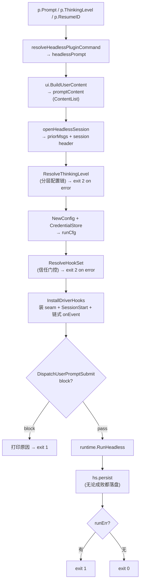
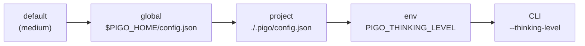

# headless 驱动与 Hook 装配生命周期设计

本笔记以 [`headless.Run`](file:///Users/yuqing/Documents/workspace/pigo/internal/cli/headless/headless.go#L43-L141) 为主线，记录 headless（`--print` / `stream-json`）单轮运行驱动的完整装配链路：prompt 的三段式变换、分层配置链解析、Hook 的「解析 → 装配 → 触发」三阶段，以及目录可信（Trust）门控。

---

## 目录

- [一、Run 生命周期全景](#一run-生命周期全景)
- [二、Prompt 三段式变换](#二prompt-三段式变换)
- [三、插件斜杠命令解析与两种兜底语义](#三插件斜杠命令解析与两种兜底语义)
- [四、分层配置链解析思考强度](#四分层配置链解析思考强度)
- [五、Hook 生命周期三阶段](#五hook-生命周期三阶段)
- [六、UserPromptSubmit：阻断与上下文注入](#六userpromptsubmit阻断与上下文注入)
- [七、目录可信（Trust）门控](#七目录可信trust门控)
- [八、退出码语义速查](#八退出码语义速查)
- [九、相关源码索引](#九相关源码索引)

---

## 一、Run 生命周期全景

`Run` 的职责是「把已解析的输入装配成一次运行」：`Mode` 与 `Env` 由调用方（dispatch）解析后传入，其余生命周期归 `Run` 所有。



关键顺序约束：**prompt 解析在最前，Hook 触发在最后且必须在 `RunHeadless` 之前**——因为 `additionalContext` 是直接写入 `runCfg.Reminders` 的，而 `runCfg` 在随后才被塞进 `HeadlessConfig` 交给循环。

---

## 二、Prompt 三段式变换

同一个 prompt 在 `Run` 内有三种形态，逐级变换，不可混淆：

| 形态             | 位置                                                                                       | 类型                    | 含义                                   |
| ---------------- | ------------------------------------------------------------------------------------------ | ----------------------- | -------------------------------------- |
| `p.Prompt`       | 入参                                                                                       | `string`                | 用户原始输入（`--print` 文本 / stdin） |
| `headlessPrompt` | [L51](file:///Users/yuqing/Documents/workspace/pigo/internal/cli/headless/headless.go#L51) | `string`                | 插件斜杠命令展开后的**文本** prompt    |
| `promptContent`  | [L52](file:///Users/yuqing/Documents/workspace/pigo/internal/cli/headless/headless.go#L52) | `agentcore.ContentList` | 消息内容块（文本块 + 图片块）          |

- [`ui.BuildUserContent`](file:///Users/yuqing/Documents/workspace/pigo/internal/cli/ui/imageref.go#L36-L66) 负责第三段：扫描 Markdown `` 与 `@path` 图片引用，拆成图片内容块，其余文本按空白裁剪后成为文本块；无引用时退化为单个文本块。
- `headlessPrompt` 同时被用于两处：构建消息内容（L52）与触发 `UserPromptSubmit`（L117）。后者意味着 **Hook 看到的是最终将要执行的 prompt**，而不是用户敲的原始字符串。

---

## 三、插件斜杠命令解析与两种兜底语义

[`resolveHeadlessPluginCommand`](file:///Users/yuqing/Documents/workspace/pigo/internal/cli/headless/headless.go#L156-L192) 是 best-effort 的宿主侧斜杠命令支持：headless 没有「把结果注入下一轮」的 turn-injection 循环，所以「注入返回的 prompt」被降级为「**把返回的 prompt 当作本轮唯一的输入**」（设计依据见 [extension-host-design.md#L232-L234](file:///Users/yuqing/Documents/workspace/pigo/docs/superpowers/specs/2026-07-24-pi-extension-host-design.md#L232-L234) 与 [L153-L155](file:///Users/yuqing/Documents/workspace/pigo/internal/cli/headless/headless.go#L153-L155)）。

### 解析步骤

1. **前置守卫**（[L157](file:///Users/yuqing/Documents/workspace/pigo/internal/cli/headless/headless.go#L157)）：`mgr == nil`（无插件）或不是 `/` 开头 → 原样返回。
2. **拆名与参数**（[L160-L166](file:///Users/yuqing/Documents/workspace/pigo/internal/cli/headless/headless.go#L160-L166)）：`name` 取第一个空白前，`args` 取其后并 `TrimSpace`。
3. **参数编码**（[L173](file:///Users/yuqing/Documents/workspace/pigo/internal/cli/headless/headless.go#L173)）：`json.Marshal(args)` 把原始文本编码为 JSON **字符串**（永不为 `null`），对齐宿主 [`CommandCallParams.Args`](file:///Users/yuqing/Documents/workspace/pigo/internal/plugin/manifest.go#L76-L84) 契约。
4. **调用与通知**（[L174-L185](file:///Users/yuqing/Documents/workspace/pigo/internal/cli/headless/headless.go#L174-L185)）：`CallCommand` 走 `commands/call`；返回的 notifications 逐条打到 `errOut`，带 `Type` 时渲染为 `[type] message`。
5. **结果选择**（[L186-L189](file:///Users/yuqing/Documents/workspace/pigo/internal/cli/headless/headless.go#L186-L189)）：`res.Prompt` 非空则用它，否则回落 `args`。

### 两种兜底的语义差异（关键）

| 分支                                                                                                                  | 返回          | 命令是否被消费 | 设计意图                                   |
| --------------------------------------------------------------------------------------------------------------------- | ------------- | -------------- | ------------------------------------------ |
| 未命中 / 调用出错（[L177](file:///Users/yuqing/Documents/workspace/pigo/internal/cli/headless/headless.go#L177)）     | `prompt` 原样 | **否**         | 这不是「我的命令」，整行当普通文本交给模型 |
| 命中且成功但无 prompt（[L189](file:///Users/yuqing/Documents/workspace/pigo/internal/cli/headless/headless.go#L189)） | `args`        | **是**         | 命令名已无意义，只保留承载用户意图的参数   |

为什么成功分支不返回 `prompt`：`/hello` 是 pigo 内部的斜杠语法，**模型对它一无所知**，把已消费的命令行原样回喂等于向模型泄漏宿主概念。为什么也不返回空串：headless 是单次运行，空 prompt 等于这一轮白跑，用户得重敲一遍——这就是注释所说的 "still runs something sensible rather than an empty prompt"。

**已知边界**：若参数为空（裸 `/hello`）且插件未返回 prompt，`args == ""`，最终仍是空串；注释中的说法仅在带参数时成立。

---

## 四、分层配置链解析思考强度

[`ResolveThinkingLevel`](file:///Users/yuqing/Documents/workspace/pigo/internal/cli/run/run.go#L512-L542) 解析本次运行生效的推理强度，优先级由低到高：



### 设计要点

- **指针字段区分「未设置」与「零值」**：[`ConfigLayer`](file:///Users/yuqing/Documents/workspace/pigo/internal/runtime/config.go#L48-L59) 的字段均为指针，nil 表示本层未设、不参与覆盖；[`ResolveConfig`](file:///Users/yuqing/Documents/workspace/pigo/internal/runtime/config.go#L99-L129) 按顺序做**字段级替换**（而非深合并）。
- **缺失文件不是错误**：[`LoadConfigLayer`](file:///Users/yuqing/Documents/workspace/pigo/internal/runtime/config.go#L79-L92) 在文件不存在时返回 `nil, nil`，nil 层被 `ResolveConfig` 跳过；只有「存在但 JSON 损坏」才是硬错误。
- **CLI 层空白即未设置**：`strings.TrimSpace(cliLevel) != ""` 才追加该层，避免纯空白被当作合法值。
- **合法性校验**：[`validate()`](file:///Users/yuqing/Documents/workspace/pigo/internal/runtime/config.go#L171-L184) 限定 7 个枚举值（`off/minimal/low/medium/high/xhigh/max`），非法即报错，调用方映射为**退出码 2**（配置错误，区别于运行失败的 1）。
- **复用代价**：该函数实际解析了整份 `Config`（含 model/credentials/hooks）却只返回 `ThinkingLevel`，是复用同一套解析逻辑的取舍；`ResolveHookSet` 走同款模式，仅多了信任门控。

---

## 五、Hook 生命周期三阶段

Hook 的完整链路分三步，切勿把「装配」误认为「加载」：

| 阶段   | 位置                                                                                                                                          | 动作                                                   |
| ------ | --------------------------------------------------------------------------------------------------------------------------------------------- | ------------------------------------------------------ |
| ① 解析 | [headless.go#L100](file:///Users/yuqing/Documents/workspace/pigo/internal/cli/headless/headless.go#L100) `ResolveHookSet`                     | 按配置层 + 信任门控读出 hook set（损坏 → exit 2）      |
| ② 装配 | [headless.go#L105-L113](file:///Users/yuqing/Documents/workspace/pigo/internal/cli/headless/headless.go#L105-L113) `InstallDriverHooks`       | 构造依赖、安装 seam、触发 SessionStart、串联事件通知器 |
| ③ 触发 | [headless.go#L116-L121](file:///Users/yuqing/Documents/workspace/pigo/internal/cli/headless/headless.go#L116-L121) `DispatchUserPromptSubmit` | prompt 入口拦截点                                      |

### 装配阶段的三个要素

1. [`HookDeps`](file:///Users/yuqing/Documents/workspace/pigo/internal/cli/run/hooks_install.go#L28-L32)：只携带**运行期上下文**（`SessionID` / `ProjectDir` / `WarnLog`），不含 hook 定义本身。
2. [`plugin.NewEventNotifier`](file:///Users/yuqing/Documents/workspace/pigo/internal/plugin/events.go#L29-L34)：**插件**生命周期事件转发器，与 hook 无关；无插件订阅时返回 nil，`baseOnEvent` 保持 nil，零开销。
3. [`InstallDriverHooks`](file:///Users/yuqing/Documents/workspace/pigo/internal/cli/run/hooks_driver.go#L40-L48) 做四件事：
   - 建 `Dispatcher` 并安装 **PreToolUse / PostToolUse / Stop** seam；
   - `DispatchSessionStart` 立即触发一次（注入的 context 作为一次性 reminder 落到第一轮）；
   - 建 `HookNotifier`，把 **SessionEnd / PreCompact** 观察者链到 `onEvent`；
   - 返回 `(dispatcher, onEvent)`——`onEvent` 是「插件通知器 + hook 通知器」串联后的最终回调。

### 空集零成本

`set` 为空时 `NewDispatcher` 返回 nil，`InstallDriverHooks` 直接 `return nil, onEvent`（[hooks_driver.go#L41-L44](file:///Users/yuqing/Documents/workspace/pigo/internal/cli/run/hooks_driver.go#L41-L44)），一个 seam 都不装，行为与「不存在 hook 系统」完全一致（FR-18）。同一接缝被 6 个驱动（repl/goal/btw/tui/headless/subagent_rpc）共用，避免某个模式悄悄漏装 hook 点。

---

## 六、UserPromptSubmit：阻断与上下文注入

[`DispatchUserPromptSubmit`](file:///Users/yuqing/Documents/workspace/pigo/internal/cli/run/hooks_prompt.go#L35-L54) 只**报告**结果，不自己中断（不同驱动的呈现方式不同：REPL 回到输入态并提示，headless 打印原因后 exit 1）。

### 两种效果（block 优先）

| 效果                  | 触发条件                                 | 落地方式                                                                                                                                                                              |
| --------------------- | ---------------------------------------- | ------------------------------------------------------------------------------------------------------------------------------------------------------------------------------------- |
| **block**             | `dec.Block == true`                      | 返回 `(true, reason)`，调用方不得提交 prompt                                                                                                                                          |
| **additionalContext** | `dec.AdditionalContext != ""` 且未 block | 注册为 [`NewOneShotReminder`](file:///Users/yuqing/Documents/workspace/pigo/internal/cli/run/hooks_prompt.go#L48-L53)，经 `TransformContext` 注入**本轮**上下文，**不写入持久化历史** |

block 与注入同时存在时，block 胜出，注入被丢弃。

### Hook 如何表态为 block

依据 Claude Code 语义（[protocol.go#L6-L8](file:///Users/yuqing/Documents/workspace/pigo/internal/hooks/protocol.go#L6-L8)、[runner.go#L101-L118](file:///Users/yuqing/Documents/workspace/pigo/internal/hooks/runner.go#L101-L118)）：

- **退出码 2**：阻断，`stderr` 作为 reason（若 stdout 同时是合法 JSON，则优先取其中的 `reason`）；
- **退出码 0 + stdout JSON**：`{"decision":"block"}`、`{"continue":false}` 均视为阻断（[`HookOutput.blocks()`](file:///Users/yuqing/Documents/workspace/pigo/internal/hooks/protocol.go#L48-L56)）；
- **其它非零退出 / 超时（默认 60s）**：执行失败，**fail-open**——只打警告并跳过，绝不阻断（[dispatch.go#L57-L60](file:///Users/yuqing/Documents/workspace/pigo/internal/hooks/dispatch.go#L57-L60)）。

Hook 通过 stdin 收到 JSON 载荷 [`HookInput`](file:///Users/yuqing/Documents/workspace/pigo/internal/hooks/protocol.go#L20-L32)，其中 `prompt` 字段就是 `headlessPrompt`。

### 一个最小示例

```json
{
  "hooks": {
    "UserPromptSubmit": [
      { "hooks": [{ "type": "command", "command": "sh ./.pigo/guard.sh" }] }
    ]
  }
}
```

```sh
#!/bin/sh
input=$(cat)
case "$input" in
  *"rm -rf"*) echo "refusing destructive prompt" >&2; exit 2 ;;
esac
exit 0
```

`pigo -p "rm -rf /tmp/data"` → hook 退出 2 → 终端输出 `pigo: prompt blocked by hook: refusing destructive prompt`，退出码 1，**模型一次都没被调用**（`RunHeadless` 在更后面）。

---

## 七、目录可信（Trust）门控

项目层 `./.pigo/config.json` 能携带**任意 shell 命令**（hook），因此必须由用户显式授权后才合并——否则「克隆即中招」。

### 三态与存储

[`trust.Decision`](file:///Users/yuqing/Documents/workspace/pigo/internal/trust/manager.go#L19-L31)：`Trusted(true)` / `Untrusted(false)` / `Undecided(null 或缺失)`。持久化在 [`DefaultPath()`](file:///Users/yuqing/Documents/workspace/pigo/internal/trust/manager.go#L100-L113) = `$PIGO_HOME/trust.json`（默认 `~/.pigo/trust.json`），结构为「目录路径 → 可空布尔」：

```json
{ "/Users/me/work/repo": true, "/Users/me/scratch": false }
```

### 继承与授权途径

- **继承**：[`IsTrusted`](file:///Users/yuqing/Documents/workspace/pigo/internal/trust/manager.go#L194-L203) 从 cwd 逐级 `walkUp`，取**最近祖先**的决定；信任 `/repo` 即覆盖 `/repo/sub`。
- **会话级**：`Manager.session` 内存标记（`SetSessionTrust`），不落盘，优先级高于磁盘数据。
- **交互授权**：首次进入未决定目录时弹三选一菜单（[interactive.go#L69-L77](file:///Users/yuqing/Documents/workspace/pigo/internal/trust/interactive.go#L69-L77)）——`1) Trust`（持久）/ `2) Just once`（仅本会话，默认）/ `3) Reject`；另有 `--approve` / `-a` 直接授予会话级信任。

### 它 gate 了什么

1. **副作用工具的人工确认**（本职，US-018/#134）：仅 [bash / write / edit](file:///Users/yuqing/Documents/workspace/pigo/internal/trust/interactive.go#L36-L40) 走 `BeforeToolCall` 确认；`read/grep/find`、`todo`、`webfetch` 不受门控。
2. **项目层配置（尤其 hooks）是否合并**：[`ResolveHookSet(cwd, Trusted(cwd))`](file:///Users/yuqing/Documents/workspace/pigo/internal/cli/run/run.go#L552-L560)——项目层仅在可信时并入（FR-14）。TUI 侧的判定还额外放行 `opts.Approve`（[tui/session.go#L242](file:///Users/yuqing/Documents/workspace/pigo/internal/cli/tui/session.go#L242)）。

### headless 下的特殊性

headless 没有交互对话框，且 [`run.Trusted`](file:///Users/yuqing/Documents/workspace/pigo/internal/cli/run/run.go#L586-L592) **每次都会新建 Manager**，进程内的「Just once」授权无法传递。因此在 headless 中，「目录可信」实际等价于：**`trust.json` 里已持久化一条 `true` 记录**（通常来自此前的 REPL 选择 “1) Trust” 或 `/trust`）。否则项目层 hook 根本不会被加载，第六节的阻断也就无从发生。

---

## 八、退出码语义速查

| 码  | 场景                                                                                                                                      | 分类       |
| --- | ----------------------------------------------------------------------------------------------------------------------------------------- | ---------- |
| 2   | 配置文件损坏 / `thinkingLevel` 非法（[L76-L80](file:///Users/yuqing/Documents/workspace/pigo/internal/cli/headless/headless.go#L76-L80)） | 配置错误   |
| 2   | hook 层配置损坏（[L100-L104](file:///Users/yuqing/Documents/workspace/pigo/internal/cli/headless/headless.go#L100-L104)）                 | 配置错误   |
| 1   | prompt 构建失败 / 会话打开失败 / **prompt 被 hook 阻断** / 运行失败                                                                       | 运行级失败 |
| 0   | 正常结束                                                                                                                                  | 成功       |

「配置错误 = 2」与「运行失败 = 1」的区分，让 CI 能判断是环境没配好还是这次任务没跑成。

---

## 九、相关源码索引

- headless 驱动：[headless.go](file:///Users/yuqing/Documents/workspace/pigo/internal/cli/headless/headless.go)
- 插件斜杠命令契约：[manifest.go](file:///Users/yuqing/Documents/workspace/pigo/internal/plugin/manifest.go#L53-L100)
- 分层配置解析：[config.go](file:///Users/yuqing/Documents/workspace/pigo/internal/runtime/config.go)、[run.go#L505-L542](file:///Users/yuqing/Documents/workspace/pigo/internal/cli/run/run.go#L505-L542)
- Hook 装配接缝：[hooks_driver.go](file:///Users/yuqing/Documents/workspace/pigo/internal/cli/run/hooks_driver.go)、[hooks_install.go](file:///Users/yuqing/Documents/workspace/pigo/internal/cli/run/hooks_install.go)
- Hook 触发与效果：[hooks_prompt.go](file:///Users/yuqing/Documents/workspace/pigo/internal/cli/run/hooks_prompt.go)
- Hook 协议与执行：[protocol.go](file:///Users/yuqing/Documents/workspace/pigo/internal/hooks/protocol.go)、[runner.go](file:///Users/yuqing/Documents/workspace/pigo/internal/hooks/runner.go)、[dispatch.go](file:///Users/yuqing/Documents/workspace/pigo/internal/hooks/dispatch.go)
- 信任机制：[manager.go](file:///Users/yuqing/Documents/workspace/pigo/internal/trust/manager.go)、[interactive.go](file:///Users/yuqing/Documents/workspace/pigo/internal/trust/interactive.go)
- 插件扩展设计：[pi-extension-host-design.md](file:///Users/yuqing/Documents/workspace/pigo/docs/superpowers/specs/2026-07-24-pi-extension-host-design.md)
