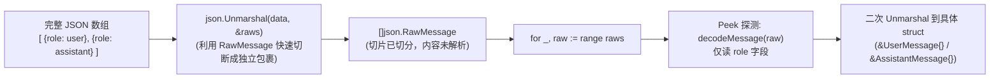

# json.RawMessage 机制与切片零分配复用深度剖析

本笔记深入剖析 Go 语言标准库中的 `json.RawMessage` 机制，以及 `MessageList` 在反序列化多态消息列表时所依赖的底层技巧。涵盖 **`[]byte` 到 `[]json.RawMessage` 的切片拆解**、**`(*m)[0:0]` 原地容量复用哲学**，以及 **避免解码器缓冲区污染（Buffer Aliasing）的安全考量**。

---

## 目录
- [一、核心解惑：为什么 []byte 能“转换”成 []json.RawMessage](#一核心解惑为什么-byte-能转换成-jsonrawmessage)
- [二、标准库剖析：json.RawMessage 的极简实现](#二标准库剖析jsonrawmessage-的极简实现)
- [三、切片黑魔法：(*m)[0:0] 的底层内存机制](#三切片黑魔法m00-的底层内存机制)
- [四、方案对比：为什么不写成其他形态](#四方案对比为什么不写成其他形态)
- [五、pigo 中的工程实践：两步解码的流水线第一步](#五pigo-中的工程实践两步解码的流水线第一步)
- [六、相关源码索引](#六相关源码索引)

---

## 一、核心解惑：为什么 []byte 能“转换”成 []json.RawMessage

在阅读 [`internal/agentcore/message.go`](file:///Users/yuqing/Documents/workspace/pigo/internal/agentcore/message.go) 中的 `MessageList.UnmarshalJSON` 时，经常会看到这样的写法：

```go
func (ml *MessageList) UnmarshalJSON(data []byte) error {
    var raws []json.RawMessage
    if err := json.Unmarshal(data, &raws); err != nil {
        return err
    }
    // ...
}
```

初看可能会产生困惑：*“`data` 是 `[]byte`，怎么就变成 `[]json.RawMessage` 了？”*

### 1. 明确边界：这不是语言级类型强转
如果直接写 `[]json.RawMessage(data)`，Go 编译器会立刻报错 `cannot convert data (variable of type []byte) to type []json.RawMessage`。
这里的转换是 **`json.Unmarshal` 标准库执行的“JSON 数组反序列化”**。

### 2. 反序列化切片（Slice）的过程：“切香肠”
传入的 `data` 是一段 JSON 数组文本的字节流：
```json
[
  {"role": "user", "content": "hello"},
  {"role": "assistant", "content": "world"}
]
```

当 `json.Unmarshal(data, &raws)` 运行时：
1. **识别外层数组**：`json.Unmarshal` 检查到目标对象 `raws` 是一个切片（`[]T`），它要求 JSON 必须以 `[` 开头、`]` 结尾。
2. **逐元素切分**：它按照逗号将 JSON 数组分割成独立的元素块。
3. **分发到具体元素**：遇到第 1 个元素时，调用该元素类型的反序列化逻辑。因为每个元素的类型是 `json.RawMessage`，触发了其专属的延迟复制逻辑。

---

## 二、标准库剖析：json.RawMessage 的极简实现

翻看 Go 标准库 `encoding/json` 的源码，`json.RawMessage` 的定义短小精悍：

```go
// encoding/json/stream.go
type RawMessage []byte

// MarshalJSON returns m as the JSON encoding of m.
func (m RawMessage) MarshalJSON() ([]byte, error) {
    if m == nil {
        return []byte("null"), nil
    }
    return m, nil
}

// UnmarshalJSON sets *m to a copy of data.
func (m *RawMessage) UnmarshalJSON(data []byte) error {
    if m == nil {
        return errors.New("json.RawMessage: UnmarshalJSON on nil pointer")
    }
    *m = append((*m)[0:0], data...)
    return nil
}
```

* **本质**：它就是一个 `[]byte` 的类型定义。
* **延迟解析契约**：它实现了 `json.Unmarshaler` 接口。当 JSON 解码器遇到它时，**完全不做任何 JSON AST 解析与字段映射**，而是只负责把当前 JSON 对象的**原始字节流原封不动地保存下来**。

---

## 三、切片黑魔法：(*m)[0:0] 的底层内存机制

在 `RawMessage.UnmarshalJSON` 中，最精巧的一行代码是：

```go
*m = append((*m)[0:0], data...)
```

### 1. 切片三元组解析
在 Go 语言中，切片在底层由一个三元组（`reflect.SliceHeader`）表示：
* `Data`: 指向底层数组的内存指针
* `Len`: 当前切片长度
* `Cap`: 底层数组从该位置起算的容量

```text
切片 *m 原状态：
[Data Pointer] ────> [ byte_0 | byte_1 | byte_2 | byte_3 | ... ]
Len: 4
Cap: 16

执行 (*m)[0:0] 截取之后：
[Data Pointer] ────> [ byte_0 | byte_1 | byte_2 | byte_3 | ... ]
Len: 0  (长度重置为 0)
Cap: 16 (容量完全保留！)
```

### 2. 结合 append 的原地复用（0 Allocations）
当把长度为 0 的切片传给 `append` 时：
* **情况 A（容量充足，`cap(*m) >= len(data)`）**：
  `append` 不需要向操作系统申请新的堆内存。它直接从底层数组的第 0 位开始**原地覆盖写**入 `data` 的字节。
  👉 **产生 0 次堆内存分配（0 Heap Allocations），无 GC 压力**。
* **情况 B（容量不足或原本为 nil）**：
  `append` 会自动帮我们分配一个足以容纳 `data` 的新数组，并拷贝内容。

---

## 四、方案对比：为什么不写成其他形态

对比其他常见写法，可以清晰看出标准库团队的防御性编程与性能考量：

### ❌ 陷阱 1：为什么不直接写 `*m = data`？（缓冲区数据篡改）
如果直接赋值 `*m = data`，这是**浅拷贝**（只复制了指针）。
在 `json.Decoder` 流式解析中，`data` 往往指向解码器内部一个**可复用的临时 Scratch Buffer**。
* 如果使用了浅拷贝，当解析下一个元素或下一个字段时，解码器会重写这个 Buffer；
* 这会导致之前保存下来的 `RawMessage` 数据在不知不觉中被**篡改覆盖（Data Corruption）**。
* 因此，必须执行独立的数据拷贝（Deep Copy）。

### ❌ 陷阱 2：为什么不写 `*m = append([]byte(nil), data...)`？（内存浪费）
这种写法每次都会强制丢弃原有的底层数组，无条件分配一块全新的堆内存。
如果上层逻辑是在重用一个对象（例如对象池 `sync.Pool` 或复用切片），这种做法会导致大量短暂对象逃逸到堆上，增加 Go 垃圾回收（GC）的标记-清除压力。

###  最优解：`*m = append((*m)[0:0], data...)`
1. **安全性**：通过 `append` 完成了真正的数据字节拷贝，与解码器的临时缓冲区完全隔离；
2. **极致性能**：在能够原地复用时最大化复用已有内存容量。

---

## 五、pigo 中的工程实践：两步解码的流水线第一步

在 `pigo` 的多态事件流与消息流架构中，`[]json.RawMessage` 充当了不可或缺的“分拣传送带”：



1. **避免低效的 AST 解析**：
   如果第一步先反序列化成 `[]map[string]any`，Go 需要在堆上为每一个 JSON 对象构建哈希表、分配键值字符串，然后再把 `map` 转换到结构体，性能开销极大；
2. **纯字节流轻量穿透**：
   使用 `[]json.RawMessage` 仅做了快速的字节切分定位，保持了原汁原味的字节切片（Zero-overhead bytes passing），随后精准喂给各变体的专用反序列化器。

---

## 六、相关源码索引

* 消息切片两步反序列化：[`internal/agentcore/message.go`](file:///Users/yuqing/Documents/workspace/pigo/internal/agentcore/message.go#L180-L204)
* 内容块切片两步反序列化：[`internal/agentcore/content.go`](file:///Users/yuqing/Documents/workspace/pigo/internal/agentcore/content.go#L130-L170)
* 密封接口与多态反序列化总览：[`study/密封接口设计与JSON多态反序列化.md`](./密封接口设计与JSON多态反序列化.md)
