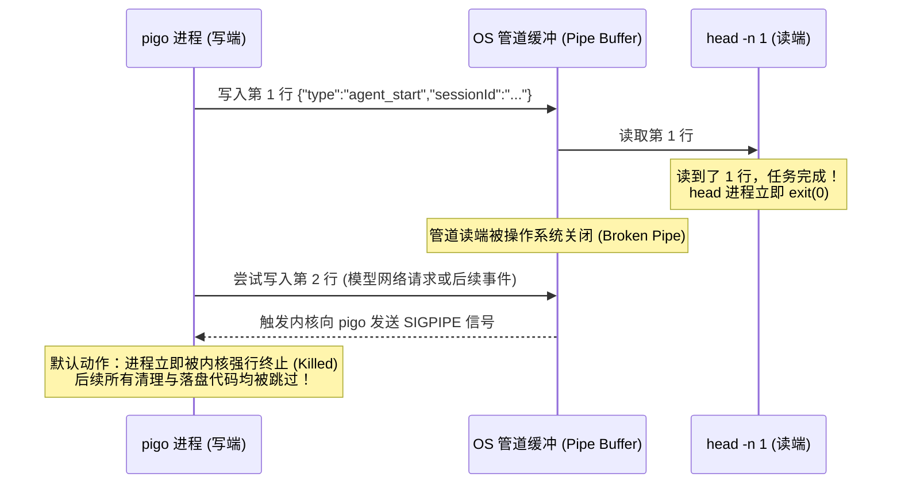

# 会话持久化时序、SIGPIPE 与信封模式架构设计

本笔记记录在无头模式（Headless）与 `stream-json` 事件流下，会话生成/持久化时序、Unix 管道 `SIGPIPE` 信号陷阱，以及 `eventEnvelope` 信封模式的设计考量。

---

## 目录
- [一、核心问题与实验现象](#一核心问题与实验现象)
- [二、Unix 管道机制与 SIGPIPE 陷阱](#二unix-管道机制与-sigpipe-陷阱)
- [三、会话生成的完整时序：诞生 vs 落盘](#三会话生成的完整时序诞生-vs-落盘)
- [四、信封模式（Envelope Pattern）：eventEnvelope 的职责](#四信封模式envelope-pattern-eventenvelope-的职责)
- [五、最佳实践：OUT=$(...) 与安全消费流式数据](#五最佳实践out-与安全消费流式数据)
- [六、相关源码索引](#六相关源码索引)

---

## 一、核心问题与实验现象

在测试 `pigo` 无头运行和会话续跑功能时：
```bash
# ⚠️ 错误做法：通过管道 head 截取第一行
go run ./cmd/pigo -p "第一轮" --output-format stream-json --no-tools | head -n 1
```
虽然控制台成功打印出了第一行的 `sessionId`：
```json
{"sessionId":"20260721-080320-412306","type":"agent_start"}
```
但在紧接着使用 `--resume "$SID"` 尝试续跑时，却会报错提示找不到该会话文件。

---

## 二、Unix 管道机制与 SIGPIPE 陷阱

为什么通过 `head` 截断会导致会话续跑失败？其根源在于 Unix 进程间通信的管道与信号机制：



1. **`head -n 1` 的行为**：只要读完指定的第 1 行数据，立即正常退出。
2. **读端关闭**：`head` 退出后，管道的读端文件描述符被 OS 关闭。
3. **`SIGPIPE` 触发**：左侧的 `pigo` 进程仍在继续执行（调用 LLM、流式生成事件）。当它尝试向已关闭的管道写入下一行时，操作系统的内核检测到向无读端的管道写入，立即向写进程发送 `SIGPIPE` 信号。
4. **进程猝死**：Unix 进程对 `SIGPIPE` 的默认处理行为是**直接终止进程**，程序甚至没有机会走完正常的 `defer` 或后续逻辑。

---

## 三、会话生成的完整时序：诞生 vs 落盘

`pigo` 中会话数据的生成和持久化具有严格的生命周期先后顺序：

| 阶段 | 发生时机 | 所在代码 | 行为与意义 |
| :--- | :--- | :--- | :--- |
| **会话诞生** | 刚装配好运行时，在执行任何网络请求之前 | [`internal/cli/headless/session.go:openHeadlessSession`](file:///Users/yuqing/Documents/workspace/pigo/internal/cli/headless/session.go#L112) | 生成 `sessionId`，并写进 `RunConfig.SessionID`，随首个 `AgentStartEvent` 发出，宣告一次运行开始。 |
| **会话落盘** | 整轮对话、工具执行完全结束，进程退出前夕 | [`internal/cli/headless/headless.go:Run`](file:///Users/yuqing/Documents/workspace/pigo/internal/cli/headless/headless.go#L133) -> [`hs.persist`](file:///Users/yuqing/Documents/workspace/pigo/internal/cli/headless/session.go#L163) | 将本次 Run 产出的完整消息列表、上下文变更真正序列化并写入磁盘文件（`~/.pigo/sessions/<id>.jsonl`）。 |

由于会话落盘发生在最末尾，如果 `pigo` 刚吐出第一行就被 `SIGPIPE` 强行击杀，**`hs.persist` 根本没机会执行**，磁盘上的会话文件未生成，下一次调用 `--resume` 自然无法恢复。

---

## 四、信封模式（Envelope Pattern）：eventEnvelope 的职责

在 `internal/runtime/headless.go` 中，函数 [`eventEnvelope`](file:///Users/yuqing/Documents/workspace/pigo/internal/runtime/headless.go#L191) 采用了分布式与通信领域经典的**信封模式（Envelope Pattern）**：

```go
func eventEnvelope(ev agentcore.AgentEvent) map[string]any {
    env := map[string]any{"type": ev.EventType()}
    switch e := ev.(type) {
    case agentcore.AgentStartEvent:
        if e.SessionID != "" {
            env["sessionId"] = e.SessionID
        }
    case agentcore.TurnEndEvent:
        env["stopReason"] = e.Message.StopReason
        // ...
    }
    return env
}
```

### 1. 为什么叫“信封”？
- **信封外壳（元数据）**：统一打上辨识字段 `"type": ev.EventType()`，就像信封表面统一印制的收件人与邮戳分类；
- **信封内容（有效载荷 Payload）**：装载具体的事件数据（如文本增量、工具调用信息、停止原因等）。

### 2. 核心职责
1. **统一序列化契约**：将 Go 内部十余种异构强类型结构体统一抹平为通用的 JSON 结构；
2. **外部协议解耦**：外部消费者（CI 脚本、其他语言集成）仅凭外层 `"type"` 即可做分发解析；
3. **数据脱敏与安全边界**：只将安全、适合对外公开的字段打包装入信封，防止内部敏感凭据（如 API Key）意外泄漏至标准输出。

---

## 五、最佳实践：OUT=$(...) 与安全消费流式数据

在 Shell 脚本或自动化测试中，为了既能提取会话 ID、又能确保会话完整持久化，应采用**变量捕获等待机制**：

```bash
# 1. 让第一次运行完整走完所有逻辑，将所有事件收进变量
OUT=$(go run ./cmd/pigo -p "第一轮" --output-format stream-json --no-tools 2>/dev/null)

# 2. 从变量内存文本中提取出第一行的 sessionId
SID=$(printf '%s\n' "$OUT" | grep -o '"sessionId":"[^"]*"' | head -n1 | sed -E 's/.*:"([^"]+)"/\1/')

# 3. 此时磁盘会话文件已安全落盘，可成功续跑
go run ./cmd/pigo -p "第二轮" --resume "$SID" --output-format stream-json --no-tools 2>/dev/null | head -n 1
```

### 为什么这能避免 SIGPIPE？
- `OUT=$(...)` 命令替换会**等待子进程生命周期彻底结束并正常退出（Exit 0）**，管道连接始终保持开启状态；
- `pigo` 顺利完成末尾的 `hs.persist(...)` 磁盘写入；
- 提取 ID 和后续操作在主进程内存中完成，互不干扰。

---

## 六、相关源码索引

- 无头会话管理与落盘：[`internal/cli/headless/session.go`](file:///Users/yuqing/Documents/workspace/pigo/internal/cli/headless/session.go)
- 无头驱动执行与持久化调用点：[`internal/cli/headless/headless.go:Run`](file:///Users/yuqing/Documents/workspace/pigo/internal/cli/headless/headless.go#L133)
- 事件信封转换：[`internal/runtime/headless.go:eventEnvelope`](file:///Users/yuqing/Documents/workspace/pigo/internal/runtime/headless.go#L191)
- 循环起始事件发射：[`internal/runtime/loop.go:runLoop`](file:///Users/yuqing/Documents/workspace/pigo/internal/runtime/loop.go#L187)
