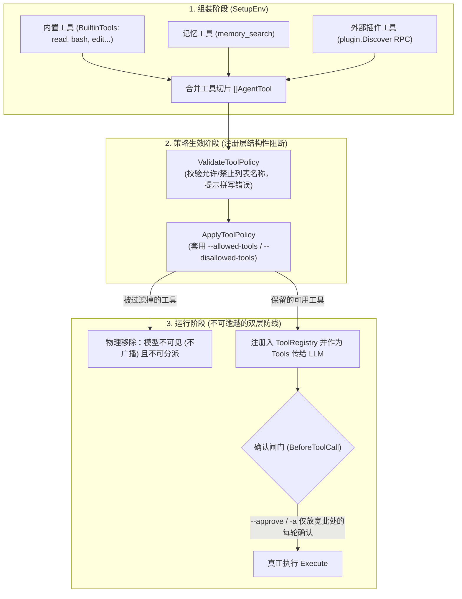

# 工具策略与安全边界架构设计

本笔记记录 `pigo` 中关于工具安全策略（`--allowed-tools` / `--disallowed-tools`）、运行期动态加载与信任确认机制的设计考量。

---

## 目录
- [一、核心设计哲学与架构全景](#一核心设计哲学与架构全景)
- [二、时序设计：为什么校验必须在插件与记忆就位之后](#二时序设计为什么校验必须在插件与记忆就位之后)
- [三、结构性物理阻断：为什么过滤发生在注册层](#三结构性物理阻断为什么过滤发生在注册层)
- [四、权限隔离：为什么 --approve 无法放宽该边界](#四权限隔离为什么---approve-无法放宽该边界)
- [五、冲突判定：Fail-Closed 原则（Deny 优先于 Allow）](#五冲突判定fail-closed-原则deny-优先于-allow)
- [六、相关源码索引](#六相关源码索引)

---

## 一、核心设计哲学与架构全景

`pigo` 采用**纵深防御（Defense in Depth）**与**分权隔离**原则：
- **能力层（Capability）**：决定当前会话“存在哪些工具”，定义系统的最大攻击面；
- **交互审计层（Audit/Trust）**：决定危险工具在执行时是否需要人工介入确认。



---

## 二、时序设计：为什么校验必须在插件与记忆就位之后

### 1. 动态名字空间问题
- 静态内置工具（如 `read`, `write`, `bash`）的名字在编译期确定；
- 但**外部插件工具**（用户通过 `~/.agents/plugins` 安装的扩展）以及**记忆工具**（`memory_search`）是在运行期动态加载的。例如插件需要由子进程启动并通过 RPC 交互汇报其支持的工具名。

### 2. 避免误报并提供精准拼写提示
- 如果在命令行 flag 解析期（刚启动时）就去校验 `--allowed-tools`，系统无法得知插件工具名，会导致合法插件被误报为“未知工具（unknown tool）”；
- 因此，校验（[`ValidateToolPolicy`](file:///Users/yuqing/Documents/workspace/pigo/internal/cli/run/toolpolicy.go#L110-L129)）必须严格推迟到：**内置工具 + 任务工具 + 记忆工具 + 插件工具 全部初始化并汇入工具切片之后**；
- 此时拥有完整的工具全集视图，若用户输入了错误拼写（如 `--allowed-tools readdd`），系统能精准识别并列出当前真实可用的所有候选名字。

---

## 三、结构性物理阻断：为什么过滤发生在注册层

工具过滤并不是在执行时做 `if (denied) return error` 的软拦截，而是在**工具注册层（Registration Layer）**完成结构性剔除：

1. **不向模型广播（Not Advertised）**：
   经过 [`ApplyToolPolicy`](file:///Users/yuqing/Documents/workspace/pigo/internal/cli/run/toolpolicy.go#L170-L185) 过滤后，被禁用的工具直接从工具切片中移除。后续组装系统提示词（`BuildSystemPrompt`）及发送给大模型 API 的 JSON Schema 中，**压根没有该工具的存在**，模型从认知层面就不知道该工具可用。
2. **底层不可分派（Not Dispatchable）**：
   运行时的执行注册表（[`ToolRegistry`](file:///Users/yuqing/Documents/workspace/pigo/internal/cli/run/run.go#L124)）只包含过滤后的工具。即使模型凭空“幻觉”并构造了已被禁用的工具调用，调度器寻址也会返回“未知工具”，根本无法触达执行逻辑。

---

## 四、权限隔离：为什么 --approve 无法放宽该边界

在安全设计上，`pigo` 严格区分了**能力边界**与**审计确认**：

| 维度 | 工具策略 (`--allowed/--disallowed-tools`) | 信任确认闸门 (`--approve` / `-a`) |
| :--- | :--- | :--- |
| **生效层级** | **第一道防线**：注册层（Registration Layer） | **第二道防线**：执行确认闸门（Confirmation Gate） |
| **解决的问题** | 系统被赋予了哪些能力（What can exist） | 具备副作用的操作是否需要人工放行（How to execute） |
| **受影响工具** | 作用于所有工具（内置、插件、记忆等） | 仅作用于有副作用的工具（如 `bash`, `write`, `edit`） |
| **越权能力** | 最高策略边界，不可被动态放宽 | 仅免除 per-call 的交互式确认提示（`y/n`） |

- `--approve` 仅仅代表“用户信任当前工作目录，免去每次调用危险工具时弹窗询问”；
- 被工具策略移除的工具在第一道防线就已经不复存在，执行引擎中没有它的注册项，因此 `--approve` **绝无可能、也无途径复活或放宽已被禁止的工具**。

---

## 五、冲突判定：Fail-Closed 原则（Deny 优先于 Allow）

当用户给出的策略存在冲突时（例如命令行同时声明了 `--allowed-tools "read,bash"` 与 `--disallowed-tools "bash"`）：
- `pigo` 在 [`ApplyToolPolicy`](file:///Users/yuqing/Documents/workspace/pigo/internal/cli/run/toolpolicy.go#L170-L185) 中采用 **Fail-Closed（默认拒绝）** 的原则：
  ```go
  // 先应用 allow 白名单过滤
  if len(allowSet) > 0 {
      if _, ok := allowSet[name]; !ok {
          continue
      }
  }
  // 再执行 deny 黑名单剔除（Deny 永远胜出）
  if _, denied := denySet[name]; denied {
      continue
  }
  ```
- 矛盾策略一律以“不执行”为准，杜绝由于配置冲突而产生意外的安全泄露。

---

## 六、相关源码索引

- 环境变量装配与工具装配：[`internal/cli/run/run.go:SetupEnv`](file:///Users/yuqing/Documents/workspace/pigo/internal/cli/run/run.go#L136)
- 工具策略结构体与解析：[`internal/cli/run/toolpolicy.go:ToolPolicy`](file:///Users/yuqing/Documents/workspace/pigo/internal/cli/run/toolpolicy.go#L18)
- 策略校验逻辑：[`internal/cli/run/toolpolicy.go:ValidateToolPolicy`](file:///Users/yuqing/Documents/workspace/pigo/internal/cli/run/toolpolicy.go#L110)
- 策略执行与物理过滤：[`internal/cli/run/toolpolicy.go:ApplyToolPolicy`](file:///Users/yuqing/Documents/workspace/pigo/internal/cli/run/toolpolicy.go#L170)
