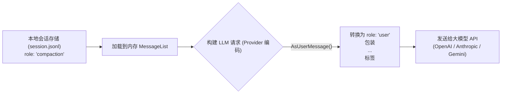
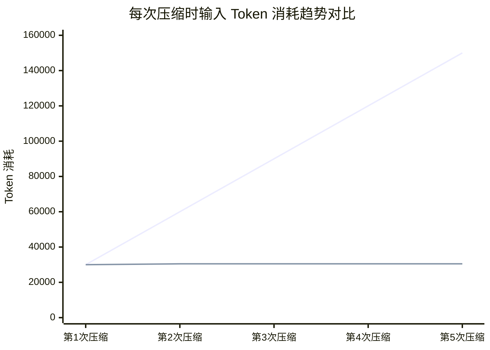

# 上下文压缩与增量检查点架构设计

本笔记记录 `pigo`（对齐原作 `pi`）在处理长对话历史时的**上下文压缩（Context Compaction）**机制。深入拆解系统如何解决**上下文窗口溢出**、**大模型 API 角色缺失**、**双重身份伪装入场**、**增量摘要防 Token 爆炸**，以及**零 Token 本地文件足迹追踪**等工程核心考量。

---

## 目录
- [一、背景与核心矛盾：长对话与上下文爆炸](#一背景与核心矛盾长对话与上下文爆炸)
- [二、双重形态设计：CompactionMessage 的入场与伪装](#二双重形态设计compactionmessage-的入场与伪装)
- [三、职责分离：Summary vs Details](#三职责分离summary-vs-details)
- [四、级联增量压缩：为什么后续压缩不会产生 Token 滚雪球](#四级联增量压缩为什么后续压缩不会产生-token-滚雪球)
- [五、零成本追踪：本地文件足迹（File Operations）的确定性捕获](#五零成本追踪本地文件足迹file-operations的确定性捕获)
- [六、相关源码索引](#六相关源码索引)

---

## 一、背景与核心矛盾：长对话与上下文爆炸

在自主编程 Agent 执行复杂任务时，经过几十轮工具调用（文件检索、长代码读写、测试命令输出），上下文中的消息往往会迅速消耗几万甚至十几万 Token：

1. **窗口超限与费用高昂**：直接触发大模型的最大上下文窗口限制（Context Window Overflow），即便没有超限，全量上下文每次发送也会带来高昂的计费与推理延迟。
2. **LLM API 协议的角色矛盾**：
   - 大模型 API（如 OpenAI、Anthropic、Gemini）只严格支持 `user`、`assistant`、`tool` 等基础角色，**不存在所谓的 `role: "compaction"` 角色**。
   - 如果直接丢弃历史消息，模型将彻底“失忆”；
   - 如果把压缩节点直接发给大模型 API，会触发协议校验错误（400 Bad Request）。

---

## 二、双重形态设计：CompactionMessage 的入场与伪装

`pigo` 采用了一种极其精妙的**“本地持久化为检查点，向外请求时降阶伪装”**的双重形态设计。



### 1. 本地落盘：一等公民数据结构
在 [`internal/agentcore/message.go`](file:///Users/yuqing/Documents/workspace/pigo/internal/agentcore/message.go#L106-L114) 中，压缩检查点被定义为核心消息接口的一等公民变体：

```go
type CompactionMessage struct {
    RoleField    string          `json:"role"`          // "compaction"
    Summary      string          `json:"summary"`       // 结构化摘要文本
    TokensBefore int             `json:"tokensBefore,omitempty"` // 压缩前估算的上下文 Token 数
    Details      json.RawMessage `json:"details,omitempty"`      // 机器可读的结构化细节
    Timestamp    int64           `json:"timestamp"`
}
```

### 2. 伪装入场：AsUserMessage() 重新入场
当准备发起下一次大模型 API 调用时，Provider 适配器在遍历消息列表时，通过 `AsUserMessage()` 将其动态降阶转义为大模型可以理解的 `user` 角色消息：

```go
// internal/agentcore/message.go
const (
    compactionSummaryPrefix = "The conversation history before this point was compacted into the following summary:\n\n<summary>\n"
    compactionSummarySuffix = "\n</summary>"
)

func (m CompactionMessage) AsUserMessage() UserMessage {
    return UserMessage{
        RoleField: RoleUser,
        Content:   ContentList{NewTextContent(compactionSummaryPrefix + m.Summary + compactionSummarySuffix)},
        Timestamp: m.Timestamp,
    }
}
```

* **语义锚定**：通过 `<summary>...</summary>` 标签明确告知大模型，此前的历史对话已被折叠归纳，大模型能立刻将其视作背景既成事实（Fact），而非用户的新一轮输入指令。
* **物理替代**：被压缩掉的前半截历史消息从此不再出现在活跃请求列表中，由这一条“伪装成 User 的摘要消息”**站在队列的最前端，充当了前面整段历史的化身**。

---

## 三、职责分离：Summary vs Details

在 `CompactionMessage` 中，`Summary` 与 `Details` 的设计体现了严格的“面向对象与职责分离”：

| 维度 | `Summary` (摘要) | `Details` (细节元数据) |
| :--- | :--- | :--- |
| **数据格式** | `string`（自然语言 Markdown 文本） | `json.RawMessage`（本地强类型 JSON 数据包） |
| **服务对象** | **大模型（LLM）** 与 开发者人类认知 | **系统运行时引擎（pigo 内部）** |
| **是否发往 LLM** | **是**（通过 `AsUserMessage()` 拼接入 Prompt） | **否**（纯本地存储与代码内部流转，0 Token） |
| **内容职责** | 目标、进度（Done/In Progress）、关键决策 | 记录被压缩区间内**读取过的文件**与**修改过的文件** |
| **容错特质** | 允许概括性模糊（LLM 自带模糊理解） | **100% 确定性**（Go 代码静态提取，无幻觉） |

### 架构考量：为什么 Details 使用 `json.RawMessage`？
在代码架构上，`CompactionMessage` 定义在底层地基包 `internal/agentcore`，而 `CompactionDetails`（`ReadFiles` 与 `ModifiedFiles`）定义在业务包 `internal/compaction`。
* 如果基础包直接引用业务包的结构体，将引发严重的**反向依赖与循环引用**。
* 地基包将其声明为 `json.RawMessage`（不透明的原始字节包），只做忠实的序列化中转，将解构与业务语义完全留给上层业务包（即下文所述的级联种子继承）。

---

## 四、级联增量压缩：为什么后续压缩不会产生 Token 滚雪球

如果一个会话持续了上百轮，会经历多次压缩（第 1 次、第 2 次、第 3 次……）。很多开发者会担心：*“后续压缩时是否要把前面的历史全带上？Token 消耗岂不是越来越大？”*

答案是：**绝对不会！** 机制采用的是**“滑动切片 + 增量 Diff 合并”**。

### 1. 物理切片：只总结增量范围
翻看 [`internal/compaction/compact.go`](file:///Users/yuqing/Documents/workspace/pigo/internal/compaction/compact.go#L68-L76)：

```go
start := prevCompactionIndex + 1
// toSummarize 仅仅是本次新增的消息切片，早期原始消息早已被丢弃
toSummarize := msgs[start:cut.FirstKeptIndex]
```
上一期被压缩掉的冗长原始日志，在内存中早已不复存在，根本不会被再次打包。

### 2. Update 增量提示词模板
在 [`internal/compaction/summary.go`](file:///Users/yuqing/Documents/workspace/pigo/internal/compaction/summary.go#L306-L317) 中，系统拼装给大模型的 Prompt 结构为：

```text
<conversation>
[自上一次压缩后，新产生的一小段对话 (toSummarize)]
</conversation>

<previous-summary>
[上一次压缩留下的结构化小摘要 (previousSummary，仅几百 Token)]
</previous-summary>

[updateSummarizationPrompt]
- PRESERVE all existing information from the previous summary
- ADD new progress, decisions, and context from the new messages
- UPDATE the Progress section: move items from "In Progress" to "Done"
```

大模型执行的是一次类似 **`git merge`** 的语义更新：将新对话里的工作结果合并进旧摘要的各级标题下。

### 3. Token 消耗模型全景对比



输入 Token 始终被约束在常数级别：`单批次新增消息 (~30k Token) + 前期紧凑摘要 (~500 Token)`，杜绝了无限滚雪球。

---

## 五、零成本追踪：本地文件足迹（File Operations）的确定性捕获

如果大模型在多次总结后，不小心把“之前改过哪个文件”给概括掉了怎么办？
系统在本地引入了**纯代码级、零 Token、零磁盘 I/O 的文件足迹闭环**。

### 1. 种子继承（Seeding）与静态提取
在 [`internal/compaction/compact.go`](file:///Users/yuqing/Documents/workspace/pigo/internal/compaction/compact.go#L78-L91) 中：

```go
ops := NewFileOps()
// 1. 本地继承上一期 Details 中的文件集合（滚雪球继承）
if prevDetails != nil {
    for _, f := range prevDetails.ReadFiles { ops.Read[f] = struct{}{} }
    for _, f := range prevDetails.ModifiedFiles { ops.Edited[f] = struct{}{} }
}

// 2. 从当前增量消息中静态提取工具调用参数里的 "path" 字段（不读磁盘、不耗 Token）
for _, m := range toSummarize {
    extractFileOpsFromMessage(m, ops)
}
readFiles, modifiedFiles := computeFileLists(ops)
```

* **无磁盘 I/O**：不调用 `os.ReadFile`，仅解析工具调用的 JSON 声明（如 `edit(path="foo.go")`）；
* **纯内存运算**：使用 Go 的 `map[string]struct{}` 做去重与集合运算；
* **大模型总结时不参与输入**：在调用 `GenerateSummary()` 时，并不向大模型灌入这些文件清单，避免增加总结时的推理开销。

### 2. 后置贴附机制
当大模型生成完 Markdown 摘要后，本地代码将计算好的文件集合以 XML 形式**无缝拼接在摘要底部**：

```go
summary += formatFileOperations(readFiles, modifiedFiles)
```

最终生成的检查点内容形式：

```markdown
## Goal
实现用户认证模块...

## Progress
### Done
- [x] 添加 JWT 验证中间件

<read-files>
config/jwt.json
</read-files>

<modified-files>
internal/auth/handler.go
internal/auth/middleware.go
</modified-files>
```

当后续轮次把 `<summary>` 喂给正常工作的大模型时，大模型在阅读文本的同时，能够一目了然地获知全局文件足迹，既精确又高效。

---

## 六、相关源码索引

* 消息模型与降阶入场：[`internal/agentcore/message.go`](file:///Users/yuqing/Documents/workspace/pigo/internal/agentcore/message.go)
* 压缩调度与文件足迹种子合并：[`internal/compaction/compact.go`](file:///Users/yuqing/Documents/workspace/pigo/internal/compaction/compact.go)
* 总结 Prompt 与增量合并逻辑：[`internal/compaction/summary.go`](file:///Users/yuqing/Documents/workspace/pigo/internal/compaction/summary.go)
* 截断切点定位算法：[`internal/compaction/cutpoint.go`](file:///Users/yuqing/Documents/workspace/pigo/internal/compaction/cutpoint.go)
* Provider 消息编码（Compaction 转换）：[`internal/provider/providers.go`](file:///Users/yuqing/Documents/workspace/pigo/internal/provider/providers.go)
