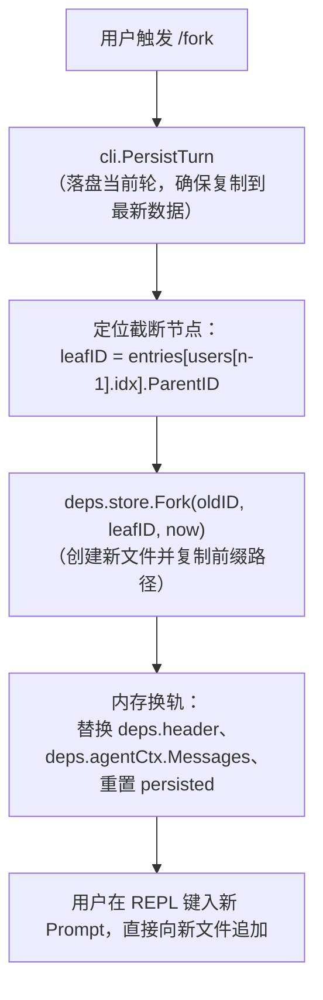
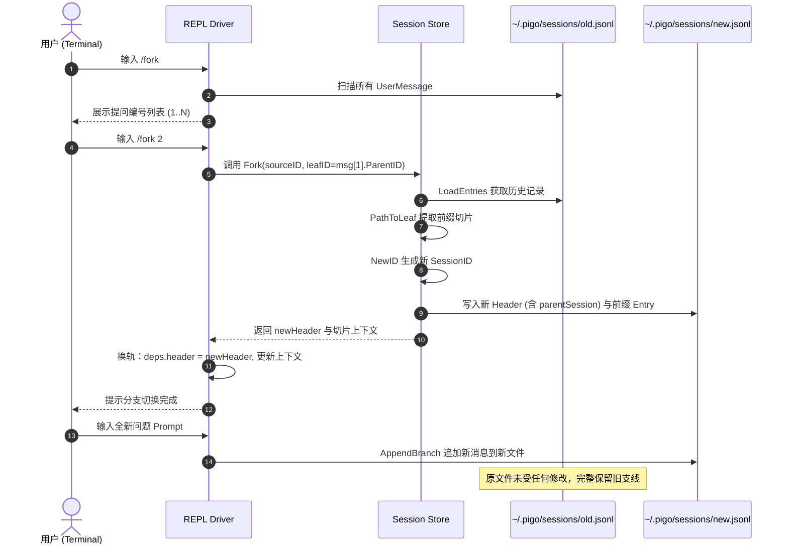

# 会话中途分叉重新生成与 Fork 物理隔离设计

在终端交互式 Agent（REPL）的使用过程中，用户常常需要“回退到某一步重新发问”或“针对同一上下文尝试不同方案”。本笔记剖析 `pigo` 如何通过 `/fork` 与 `/clone` 实现对话中途重新生成，以及为什么在持久化设计上选择**派生全新独立文件（物理隔离）**而非在同一文件内维护多叉树。

---

## 目录
- [一、需求背景：重新生成与探索性分支](#一需求背景重新生成与探索性分支)
- [二、交互形态：REPL 中的 /fork 与 /clone](#二交互形态repl-中的-fork-与-clone)
- [三、核心实现机制：从截断到换轨](#三核心实现机制从截断到换轨)
- [四、架构权衡：独立物理文件 vs 单文件树状共存](#四架构权衡独立物理文件-vs-单文件树状共存)
- [五、分叉全流程时序图解](#五分叉全流程时序图解)
- [六、相关源码索引](#六相关源码索引)

---

## 一、需求背景：重新生成与探索性分支

在传统的线性对话系统中，重新生成（Regenerate）往往采用**破坏性截断（Destructive Truncation）**策略：
* 用户回退到第 2 轮重新发问，系统直接删除第 2 轮之后的所有消息（第 3、4 轮历史彻底丢失）。
* 这种做法在普通聊天机器人中尚可接受，但在代码开发等重型任务中存在巨大弊端：大模型此前生成的长代码、工具调用产生的重要上下文被彻底抹杀，用户无法对照两套方案。

`pigo` 的目标是提供类似 **Git 分支** 的能力：**既能回到过去重新发问，又绝不丢失既有分支。**

---

## 二、交互形态：REPL 中的 /fork 与 /clone

在交互模式（[`internal/cli/repl/repl.go`](file:///Users/yuqing/Documents/workspace/pigo/internal/cli/repl/repl.go#L731-L806)）中，系统提供了两个互补的原语命令：

### 1. `/clone`：整树复刻
* **场景**：当前对话方案很棒，但接下来的探索具有破坏性，先打一个完整的存档点。
* **行为**：以当前最新的活动叶子节点（`curLeaf`）为准，将当前会话的完整历史拷贝到一个新会话中并切过去。

### 2. `/fork`：中途分叉重跑
* **交互流程**：
  1. 输入 `/fork`（无参数），REPL 会按时序扫描所有用户提问，格式化列出：
     ```text
     fork from which message? run /fork <n>:
       1. 请帮我用 Go 写一个 HTTP 服务
       2. 增加 JWT 认证中间件
       3. 给它加上 Prometheus 指标
     ```
  2. 用户输入 `/fork 2`，表示“我想从第 2 轮提问之前重新开始”。
  3. 系统定位到第 2 条用户消息的 **`ParentID`（即第 1 轮 Assistant 回答的末尾）** 作为截断点，切出新会话。
  4. REPL 提示切入新分支，用户输入新的提示词（例如改用“增加 API Key 认证”），从而沿着全新支线生长。

---

## 三、核心实现机制：从截断到换轨

`runForkClone` 函数（[repl.go L747-L835](file:///Users/yuqing/Documents/workspace/pigo/internal/cli/repl/repl.go#L747-L835)）串联了完整的生命周期：



### 1. 确保最新状态落盘：`cli.PersistTurn`
在 Fork 之前，先调用一次持久化操作，保证当前未保存的消息先写入磁盘树，避免复制出过时的状态。

### 2. 截断算法：`leafID = TargetUserMessage.ParentID`
分叉的关键是排除目标提问及其后续内容。由于树结构中每个条目都记录了 `ParentID`，目标提问的父节点正好就是其前一轮对话的终点。

### 3. 底层复制：`Store.Fork`
在 [`internal/session/session.go`](file:///Users/yuqing/Documents/workspace/pigo/internal/session/session.go#L681-L715) 中：
```go
func (s *Store) Fork(sourceID, leafID string, now time.Time) (SessionHeader, []Entry, error) {
    // 1. 读取原会话的全部条目
    _, entries, _ := s.LoadEntries(sourceID)
    // 2. 沿 ParentID 倒查，提取从根节点到 leafID 的前缀消息链
    path := PathToLeaf(entries, leafID)
    // 3. 生成全新的时间序 SessionID（如 20260710-143000-xxxx）
    newHeader := SessionHeader{
        ID:            NewID(now),
        ParentSession: sourceID, // 锚定血缘关系
        Model:         srcHeader.Model,
        Provider:      srcHeader.Provider,
        SystemPrompt:  srcHeader.SystemPrompt,
    }
    // 4. 将前缀条目原样写入全新文件 ~/.pigo/sessions/<newHeader.ID>.jsonl
    s.SaveEntries(newHeader, path)
    return newHeader, path, nil
}
```

### 4. 内存零感知换轨
在新文件生成后，REPL 直接将持有的 `deps.header` 指向 `newHeader`，将上下文 `deps.agentCtx.Messages` 替换为新分支的消息列表，并设置 `deps.persisted = len(path)`。后续的提问将天然向新文件追加，原文件保持完整。

---

## 四、架构权衡：独立物理文件 vs 单文件树状共存

底层原语 [`AppendBranch`](file:///Users/yuqing/Documents/workspace/pigo/internal/session/session.go#L194) 实际上已具备在同一个文件内保存兄弟分支的能力。但 `pigo` 在业务层坚定选择了**物理分叉（产生新文件）**，其背后的权衡对比清晰展现了工程设计的考量：

| 维度 | 物理隔离方案（独立新文件） | 逻辑隔离方案（单文件多分支） |
|---|---|---|
| **会话恢复体验（`--resume`）** | **极简确定**。`pigo --resume <ID>` 路径天然唯一，直接从根读到尾。 | 必须引入交互或次级参数，让用户在多条叶子分支中二次选择。 |
| **故障与删除隔离** | **彻底解耦**。删除或清理子会话文件，母会话毫发无损；反之亦然。 | 公共前缀节点若遭损坏或被 GC 误删，导致所有派生分支整体雪崩。 |
| **导出与分享（Export/Share）** | **自包含（Self-contained）**。单个 `.jsonl` 文件即代表完整对话，分享时无需剪枝。 | 导出时必须现场递归裁剪出子树，否则会将隐私分支一并导出。 |
| **磁盘存储开销** | 存在一定的前缀数据冗余（浅拷贝文本）。 | 零冗余，天然具备结构共享（Structural Sharing）。 |

> [!NOTE]
> **设计决断**：对于终端 Agent 工具，会话文件（几百 KB 至数 MB 的文本）的磁盘冗余成本微不足道，而“极简恢复”、“安全物理隔离”与“独立生命周期管理”的架构收益要远远压倒少量的磁盘节约。

---

## 五、分叉全流程时序图解



---

## 六、相关源码索引

* [`internal/cli/repl/repl.go`](file:///Users/yuqing/Documents/workspace/pigo/internal/cli/repl/repl.go)：
  * [`runForkClone()`](file:///Users/yuqing/Documents/workspace/pigo/internal/cli/repl/repl.go#L747-L835)：`/fork` 与 `/clone` 的命令分发、提问列表渲染与内存换轨。
* [`internal/session/session.go`](file:///Users/yuqing/Documents/workspace/pigo/internal/session/session.go)：
  * [`Store.Fork()`](file:///Users/yuqing/Documents/workspace/pigo/internal/session/session.go#L681-L715)：从指定叶子节点截取前缀并持久化到新会话文件的核心原语。
  * [`PathToLeaf()`](file:///Users/yuqing/Documents/workspace/pigo/internal/session/session.go#L178-L202)：沿 `ParentID` 倒查回溯线性消息链。
  * [`SessionHeader.ParentSession`](file:///Users/yuqing/Documents/workspace/pigo/internal/session/session.go#L77)：跨会话血缘指针定义。
* [`internal/cli/persist.go`](file:///Users/yuqing/Documents/workspace/pigo/internal/cli/persist.go)：
  * [`PersistTurn()`](file:///Users/yuqing/Documents/workspace/pigo/internal/cli/persist.go#L18)：单轮状态落盘保障。
