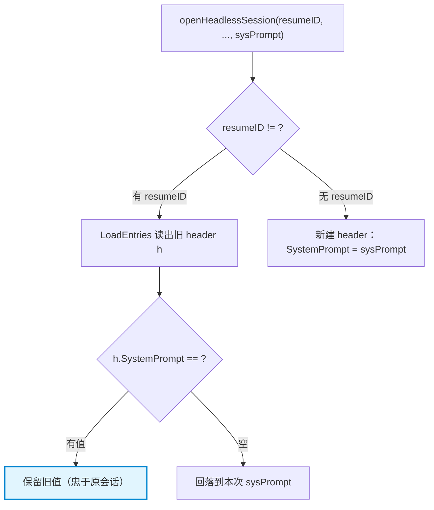

# 会话恢复 SystemPrompt 保留策略与落盘时序

本笔记记录 `pigo` headless 路径在 **resume（`--resume` / `--continue`）** 时如何处理 `SystemPrompt`：为什么**优先忠于原会话**、只在旧值缺失时回落，以及这个回落值**最终会不会被写回磁盘**。同时对比 `Model` / `Provider` 采取的相反策略（强制刷新），解释两者背后的判断标准。

---

## 目录
- [一、问题背景：resume 时用哪份 SystemPrompt](#一问题背景resume-时用哪份-systemprompt)
- [二、策略：有旧值则保留，无旧值才回落](#二策略有旧值则保留无旧值才回落)
- [三、为什么必须保留旧值](#三为什么必须保留旧值)
- [四、SystemPrompt 的去向：从 header 到本次运行上下文](#四systemprompt-的去向从-header-到本次运行上下文)
- [五、回落值会不会被写回磁盘](#五回落值会不会被写回磁盘)
- [六、对照：为什么 Model / Provider 反而要强制刷新](#六对照为什么-model--provider-反而要强制刷新)
- [七、相关源码索引](#七相关源码索引)

---

## 一、问题背景：resume 时用哪份 SystemPrompt

headless 运行前会先打开会话（[`openHeadlessSession`](file:///Users/yuqing/Documents/workspace/pigo/internal/cli/headless/session.go#L105-L143)），它接收四个参数：

```go
openHeadlessSession(p.ResumeID, p.Model, env.ProviderName, env.SysPrompt)
```

其中第四个 `sysPrompt` 是**本次调用**解析出来的系统提示（来自属于本次运行的 `env.SysPrompt`）。

于是产生一个冲突：resume 一个旧会话时，旧会话 header 里可能**自带**一份 `SystemPrompt`；而本次运行也有一份 `sysPrompt`。**两者不一致时该以谁为准？**

---

## 二、策略：有旧值则保留，无旧值才回落

resume 分支里的处理只有四行：

```go
// A resumed header keeps its own SystemPrompt when present so the run is
// faithful to the original session.
if h.SystemPrompt == "" {
    h.SystemPrompt = sysPrompt
}
```

| 情况 | 采用哪份 SystemPrompt |
|---|---|
| 旧会话 header **有** `SystemPrompt` | **保留旧的**（`if` 不成立，`h` 不改动） |
| 旧会话 header **为空**（老文件 / 未记录） | **回落填充**为本次的 `sysPrompt` |

对照**新建会话**分支（[session.go L133-L142](file:///Users/yuqing/Documents/workspace/pigo/internal/cli/headless/session.go#L133-L142)）：那里没有历史可谈，直接 `SystemPrompt: sysPrompt`。



---

## 三、为什么必须保留旧值

关键在于**「忠实于原会话」**（注释原话 *faithful to the original session*）。

`sysPrompt` 属于**本次调用**；而历史消息是按**旧 prompt** 生成并落盘的。如果 resume 时无条件用新 prompt 覆盖，就等于**用今天的系统提示去重放昨天的对话**——历史消息与系统提示自相矛盾，模型的角色、能力边界、输出风格都会发生漂移，破坏会话的因果一致性。

因此规则是：**旧值优先，新值只做兜底**。`SystemPrompt` 被视作「历史的一部分」而非「当前配置」。

> 注意：schema 里 `SystemPrompt` 是 `omitempty` 的可选字段（[SessionHeader](file:///Users/yuqing/Documents/workspace/pigo/internal/session/session.go#L71-L73)），所以「为空」是真实存在的情形（例如更早版本写的文件），兜底分支并非多余。

---

## 四、SystemPrompt 的去向：从 header 到本次运行上下文

回落赋值后，`h` 被装进 `headlessSession` 返回，回到 headless.go 成为**本次运行的 AgentContext 系统提示**：

```go
agentCtx := &agentcore.AgentContext{
    SystemPrompt: hs.header.SystemPrompt,   // ← 就是被赋值后的值
    Messages:     messages,
    Tools:        env.Tools,
}
```

所以若不写这个回落，旧文件缺 `SystemPrompt` 时本次运行就会拿到一个**空系统提示**。

---

## 五、回落值会不会被写回磁盘

**会。** 回落后的 `h` 存在 `hs.header`（[session.go L130](file:///Users/yuqing/Documents/workspace/pigo/internal/cli/headless/session.go#L130)），落盘时一路传下去，最终把 header 重新编码成文件第 1 行：

```text
persist(agentCtx)
  → hs.store.AppendBranch(hs.header, hs.curLeaf, tail)   // 传的是 hs.header
      → s.SaveEntries(header, entries)
          → writeSessionEntries(w, header, entries)
              → enc.Encode(header)                        // ← 第 1 行重写，含 SystemPrompt
```

`AppendBranch` 会重新落盘 header + 全部条目（[session.go L637-L660](file:///Users/yuqing/Documents/workspace/pigo/internal/session/session.go#L637-L660) → [`SaveEntries`](file:///Users/yuqing/Documents/workspace/pigo/internal/session/session.go#L382-L390) → [`writeSessionEntries`](file:///Users/yuqing/Documents/workspace/pigo/internal/session/session.go#L449-L460)）。于是**被兜底填上的值会固化到会话文件**——下次再读，`h.SystemPrompt` 就不再是空的了。

两个前提/边界：

1. **只有本次运行产生了新消息才会写。** [`persist`](file:///Users/yuqing/Documents/workspace/pigo/internal/cli/headless/session.go#L163-L185) 里若 `len(tail) == 0` 会提前 `return nil`，根本不调用 `AppendBranch`——此时内存里的赋值**不会落盘**，下一次 resume 仍会重新走一遍兜底。
2. **`omitempty` 边界**：若旧值为空、且本次 `sysPrompt` 也恰好为空，则该字段被**省略**（文件里不写这个 key）；只有填进去的值非空时才会写成 `"systemPrompt":"..."`。

### 有旧值时也一样会被重写（但内容不变）

若旧会话本来就有 `SystemPrompt`，`if` 不成立、`h` 未被改动；但落盘时**照样把这份原值重新编码写回第 1 行**——结果与原来一致，既不会丢、也不会被本次的 `sysPrompt` 顶掉。

---

## 六、对照：为什么 Model / Provider 反而要强制刷新

与 `SystemPrompt` 相反，`model` / `provider` 在 [`persist`](file:///Users/yuqing/Documents/workspace/pigo/internal/cli/headless/session.go#L175-L179) 中被**强制刷新**为本次实际使用的值：

```go
hs.header.Model = hs.model
hs.header.Provider = hs.provider
hs.header.UpdatedAt = time.Now().UTC()
```

判断标准在于「**它是不是对话语义的一部分**」：

| 字段 | 语义角色 | 策略 | 理由 |
|---|---|---|---|
| `SystemPrompt` | 塑造整段对话语义，属于历史 | **保留旧值**，仅缺失时兜底 | 换掉会让重放的历史消息与系统提示自相矛盾 |
| `Model` / `Provider` | 描述性元数据，反映「最近一次是谁跑的」 | **强制取最新** | 陈旧元数据无意义，写回旧值反而是错误信息 |
| `UpdatedAt` | 时间戳 | **取当前时间** | 本次确实追加了内容 |

---

## 七、相关源码索引

* headless 会话打开、兜底与持久化：[`internal/cli/headless/session.go`](file:///Users/yuqing/Documents/workspace/pigo/internal/cli/headless/session.go)
* headless 运行驱动（拼装 AgentContext、调用 persist）：[`internal/cli/headless/headless.go`](file:///Users/yuqing/Documents/workspace/pigo/internal/cli/headless/headless.go)
* header 契约（`SystemPrompt` / `Model` / `Provider` 字段）与写入链路：`internal/session/session.go`（[`SessionHeader`](file:///Users/yuqing/Documents/workspace/pigo/internal/session/session.go#L56-L94)、[`SaveEntries`](file:///Users/yuqing/Documents/workspace/pigo/internal/session/session.go#L382-L390)、[`AppendBranch`](file:///Users/yuqing/Documents/workspace/pigo/internal/session/session.go#L637-L660)、[`writeSessionEntries`](file:///Users/yuqing/Documents/workspace/pigo/internal/session/session.go#L449-L460)）

### 关联笔记

* [会话消息格式演进与单元素数组解码技巧](./会话消息格式演进与单元素数组解码技巧.md)——同一份会话文件的**行格式**与读写/迁移/分支机制。
* [会话持久化时序、SIGPIPE 与信封模式架构设计](./session-persistence-and-sigpipe.md)——持久化**时机**与落盘失败的风险。
* [环境装配与运行配置解耦设计](./环境装配与运行配置解耦设计.md)——`Env`（本次调用）与 `RunConfig`（运行期唯一真理）的职责边界，是本篇「保留 vs 刷新」判断的上层依据。