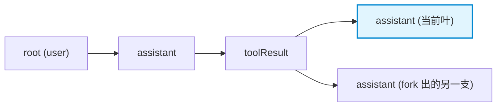
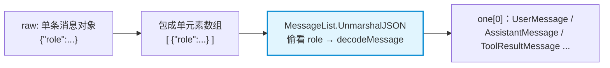

# 会话消息格式演进与单元素数组解码技巧

本笔记记录 `pigo` 会话持久化层（`internal/session`）中**消息行格式的演进**：从 v1/v2 的「裸消息」到 v3+ 的「包装条目」，以及贯穿两者的一个核心解码手法——**把单条消息伪装成单元素数组，借 `MessageList` 完成按 `role` 的多态判别**。同时澄清「v1/v2 能否直接解码」这一常见误解。

---

## 目录
- [一、会话文件的物理布局：JSONL 与 header 行](#一会话文件的物理布局jsonl-与-header-行)
- [二、两代消息行格式对比](#二两代消息行格式对比)
- [三、为什么要演进到 v3：从线性到树](#三为什么要演进到-v3从线性到树)
- [四、解码难点：Message 是密封接口](#四解码难点message-是密封接口)
- [五、破局：单元素数组包装技巧](#五破局单元素数组包装技巧)
- [六、误区澄清：v1/v2 并不能「直接解码」](#六误区澄清v1v2-并不能直接解码)
- [七、透明迁移：v1/v2 如何升级为 v3](#七透明迁移v1v2-如何升级为-v3)
- [八、配套工程细节](#八配套工程细节)
- [九、相关源码索引](#九相关源码索引)

---

## 一、会话文件的物理布局：JSONL 与 header 行

会话以 **JSONL（JSON Lines）** 持久化：一行一个 JSON 对象，文件名为 `<sessionID>.jsonl`（见 [`FileName`](file:///Users/yuqing/Documents/workspace/pigo/internal/session/session.go#L204-L205)）。

* **第 1 行固定是 header**（[`SessionHeader`](file:///Users/yuqing/Documents/workspace/pigo/internal/session/session.go#L56-L94)）：schema 版本、会话 id、时间戳、Model/Provider、SystemPrompt、Cwd 等元数据。列表页只读这一行即可（[`loadHeader`](file:///Users/yuqing/Documents/workspace/pigo/internal/session/session.go#L582-L602)），无需扫描全文件。
* **第 2 行起是消息行**：每行承载一条消息，行的内部格式由 header 里的 `version` 决定。

```text
{"version":3,"id":"20260929-...","model":"...","systemPrompt":"..."}   ← 第 1 行 header
{"id":"a1b2c3d4","parentId":"","timestamp":"...","message":{...}}        ← 第 2 行起：消息行
{"id":"e5f6a7b8","parentId":"a1b2c3d4","timestamp":"...","message":{...}}
```

---

## 二、两代消息行格式对比

当前 `SchemaVersion = 3`（[session.go](file:///Users/yuqing/Documents/workspace/pigo/internal/session/session.go#L46)）。消息行存在两代格式：

### v1 / v2 —— 裸消息（bare message）

每一行**直接就是一个序列化后的 `agentcore.Message`**，只有消息本身，没有任何结构信息：

```json
{"role":"user","content":[{"type":"text","text":"你好"}]}
{"role":"assistant","content":[{"type":"text","text":"..."}]}
```

### v3+ —— 包装条目（wrapped entry）

每一行是一个 [`Entry`](file:///Users/yuqing/Documents/workspace/pigo/internal/session/session.go#L96-L111)，消息被塞进 `message` 字段，外层多了 id / parentId / timestamp。其落盘形状由 [`entryWire`](file:///Users/yuqing/Documents/workspace/pigo/internal/session/session.go#L113-L121) 定义：

```json
{"id":"a1b2c3d4","parentId":"","timestamp":"2026-09-29T...","message":{"role":"user","content":[...]}}
```

| 维度 | v1 / v2 | v3+ |
|---|---|---|
| 每行内容 | 裸 `Message` | `Entry`（外层元数据 + 内层 `message`） |
| 身份标识 | 无 | `id`（[`newEntryID`](file:///Users/yuqing/Documents/workspace/pigo/internal/session/session.go#L162-L170) 生成的 8 位十六进制随机串） |
| 树结构 | 隐式（只能靠文件顺序线性读） | 显式 `parentId` 链，构成一棵树 |
| 分叉 / 克隆 | 做不到 | 支持（沿 `parentId` 走 [`PathToLeaf`](file:///Users/yuqing/Documents/workspace/pigo/internal/session/session.go#L178-L202)） |
| 时间戳 | 无 | `timestamp` |

---

## 三、为什么要演进到 v3：从线性到树

v1/v2 的会话只能表达**一条线性对话**——顺序即语义，无法表达「从历史某个节点再分出一支」的树结构。

v3 引入 `parentId` 后，一条线性会话退化为「每个条目都挂在上一条之下」的**退化树**；首条 `parentId` 为空，是根。这一结构是 `/fork` 与 `/clone` 的前提（[`Fork`](file:///Users/yuqing/Documents/workspace/pigo/internal/session/session.go#L681)）：

* **`/clone`** 传当前叶子 id → 把当前整段对话复制成一个独立新会话。
* **`/fork`** 传某条历史用户消息的**父 id** → 新会话只保留到该消息之前，用户从那里重新提问，形成新分支。



写入侧也随之分化为两个原语：

* [`writeSession`](file:///Users/yuqing/Documents/workspace/pigo/internal/session/session.go#L429-L444)：从 `MessageList` **合成**一条全新线性链（每条 `parentId` 链到上一条）。
* [`writeSessionEntries`](file:///Users/yuqing/Documents/workspace/pigo/internal/session/session.go#L449-L460)：把已有的 `[]Entry` **原样**落盘，保留各自 id/parentId（`Fork` 需要它来复制一段已知的树）。

---

## 四、解码难点：Message 是密封接口

`agentcore.Message` 是**密封接口（sealed interface）**——内含未导出的 `isMessage()`，包外无法实现（[message.go](file:///Users/yuqing/Documents/workspace/pigo/internal/agentcore/message.go#L24-L28)）。它有四个变体：`UserMessage` / `AssistantMessage` / `ToolResultMessage` / `CompactionMessage`。

Go 的 `encoding/json` 遇到**接口类型**时不知道该实例化哪个具体结构体，所以**不能直接反序列化**：

```go
var m agentcore.Message
json.Unmarshal(raw, &m)   // ❌ 无法把 JSON 解进接口：运行时不知道要 new 哪个 struct
```

`pigo` 的解法是给**切片类型** [`MessageList`](file:///Users/yuqing/Documents/workspace/pigo/internal/agentcore/message.go#L149-L168) 实现自定义 `UnmarshalJSON`：先读成 `[]json.RawMessage`，再逐个交给 [`decodeMessage`](file:///Users/yuqing/Documents/workspace/pigo/internal/agentcore/message.go#L172-L208)，后者**先偷看 `role` 字段，再挑具体类型**（即两步解码 Peek & Dispatch）。

---

## 五、破局：单元素数组包装技巧

`MessageList` 的判别解码器解的是**数组**，且 `decodeMessage` 是**包内私有、包外不可见**。因此 `session` 包想复用这套判别逻辑，唯一导出的入口就是 `MessageList`。

结论：要解**一条**消息，就把它**临时伪装成单元素数组**——字符串拼接即可：

```go
raw := sc.Bytes()                                  // {"role":"toolResult", ...}
var one agentcore.MessageList
json.Unmarshal([]byte("["+string(raw)+"]"), &one)  // [ {"role":"toolResult", ...} ]  → 借数组解码器判别
if len(one) != 1 { /* ... */ }
msg := one[0]                                      // 唯一一条，已是具体类型
```

`"["+raw+"]"` 不是特殊语法，就是**拼字符串**。整个流程：



这一招在代码库中出现**两处**：

| 位置 | 场景 | 写法 |
|---|---|---|
| [session.go L538](file:///Users/yuqing/Documents/workspace/pigo/internal/session/session.go#L538) | v1/v2 迁移分支，**显式**使用 | `json.Unmarshal([]byte("["+string(raw)+"]"), &one)` |
| [message.go L146-L153](file:///Users/yuqing/Documents/workspace/pigo/internal/agentcore/message.go#L146-L153) | v3 的 `Entry.UnmarshalJSON` 内部，**隐藏**使用 | `json.Unmarshal([]byte("["+string(w.Message)+"]"), &one)` |

也就是说：**无论 v1/v2 还是 v3，内层那条消息的解码都复用同一个技巧**，区别只在调用点藏在哪儿。

---

## 六、误区澄清：v1/v2 并不能「直接解码」

一个容易产生的误解是：*「v3 行是包装对象，所以能整行解进结构体；v1/v2 行是裸消息，也该能直接解吧？」*

**恰恰相反**：v1/v2 才是**不能直接解码**的那种。区分要分**外层**与**内层**看：

### 外层：整行解到哪里

| 格式 | 该行是什么 | 能否整行解进结构体 |
|---|---|---|
| v3+ | `Entry` 包装对象 | ✅ 能，解进 [`Entry`](file:///Users/yuqing/Documents/workspace/pigo/internal/session/session.go#L135-L155)（自带 `UnmarshalJSON`）——这正是 [session.go L531](file:///Users/yuqing/Documents/workspace/pigo/internal/session/session.go#L531) `json.Unmarshal(raw, &e)` 看似「直接」的原因 |
| v1/v2 | **裸消息对象** | ❌ 不能，没有任何结构体能承载一个 `Message` 接口 |

所以 v1/v2 走 [session.go L538](file:///Users/yuqing/Documents/workspace/pigo/internal/session/session.go#L538) 的包装写法——**正因为没法直接解，才必须包一层**。

### 内层：消息本身（两种格式都一样）

无论哪条路径，内层消息都不能直接解码，都必须包成 `[...]` 交给 `MessageList`：

* **v1/v2**：在 `session` 包里显式写出这一招。
* **v3**：封装在 `Entry.UnmarshalJSON` 内部，`session` 层面看不到。

**一句话**：格式差异只在**外层外壳**（v3 有 `Entry` 外壳、v1/v2 没有）；**内层解码手法完全相同**。「v1/v2 能直接解码」不成立。

---

## 七、透明迁移：v1/v2 如何升级为 v3

[`readSession`](file:///Users/yuqing/Documents/workspace/pigo/internal/session/session.go#L497-L553) 根据 `header.Version >= 3` 决定是否包装（[L520](file:///Users/yuqing/Documents/workspace/pigo/internal/session/session.go#L520)），随后分两条分支：

* **`wrapped == true`（v3+）**：整行 `json.Unmarshal(raw, &e)` 解成 `Entry`。
* **`wrapped == false`（v1/v2，即注释中的 "migrate"）**：把裸消息行包成单元素数组解出 `one[0]` 后，**现场合成树元数据**：

```go
e = Entry{ID: newEntryID(), ParentID: parentID, Timestamp: header.UpdatedAt, Message: one[0]}
```

其中 `parentID` 指向上一行。于是旧会话被**透明升级成一条线性 v3 链**（每条 `parentId` 链到前一条），加载 / resume 行为与升级前完全一致。

> 注意：迁移是**读时（on-load）**进行的，并不回写文件——旧文件保持原样，只是每次读取时按 v3 语义解释。

---

## 八、配套工程细节

### 1. Scanner 缓冲放大：一行 = 一条消息

会话行可能很长（例如一次超长工具调用的结果），而 `bufio.Scanner` 默认单行上限仅 **64KiB**。因此读取时统一放大缓冲：

```go
sc.Buffer(make([]byte, 0, sessionScanBufInit), sessionScanBufMax) // 初始 64KiB，上限 16MiB
```

见 [`sessionScanBufInit` / `sessionScanBufMax`](file:///Users/yuqing/Documents/workspace/pigo/internal/session/session.go#L50-L53)，在 [`readSession`](file:///Users/yuqing/Documents/workspace/pigo/internal/session/session.go#L501) 与 [`loadHeader`](file:///Users/yuqing/Documents/workspace/pigo/internal/session/session.go#L590) 各用一次。

### 2. `sc.Bytes()` 不消耗字节，但要小心别名

真正「消耗字节、推进游标」的是 `sc.Scan()`；`sc.Bytes()` 只返回**指向 Scanner 内部缓冲的切片别名**（不拷贝、不推进）。其有效期**只到下一次 `Scan()` 之前**——所以必须当场 `Unmarshal`/取用，不能把返回值留到后续行复用。

### 3. schema 版本校验

读取时对 header 做两道校验（[session.go](file:///Users/yuqing/Documents/workspace/pigo/internal/session/session.go#L513-L518)）：

* `Version == 0` → 报 `header missing version`（拒绝无版本文件）；
* `Version > SchemaVersion` → 报「文件版本高于本程序支持版本」，避免用旧代码误读新格式。

### 4. 原子写入

所有写路径经 [`atomicWrite`](file:///Users/yuqing/Documents/workspace/pigo/internal/session/session.go#L396-L423)：先写 `.tmp`，`Flush` + `Close` 后 `os.Rename` 落位，保证并发读者永远看不到半写文件。

### 5. 增量与分支写入

* [`Append`](file:///Users/yuqing/Documents/workspace/pigo/internal/session/session.go#L614-L622)：load-modify-save，把文件**压平成单条线性链**。
* [`AppendBranch`](file:///Users/yuqing/Documents/workspace/pigo/internal/session/session.go#L637-L660)：从 `parentLeafID` 往下**长出真实分支**，保留原有所有分支——把活动叶切到历史节点继续对话时，产生真正的兄弟分支而非截断历史。

---

## 九、相关源码索引

* 会话持久化主实现（header / Entry / 读写 / 迁移 / 分支）：[`internal/session/session.go`](file:///Users/yuqing/Documents/workspace/pigo/internal/session/session.go)
* 消息契约与判别解码器（`Message` 密封接口 / `MessageList` / `decodeMessage`）：[`internal/agentcore/message.go`](file:///Users/yuqing/Documents/workspace/pigo/internal/agentcore/message.go)
* headless 路径的会话打开与持久化：[`internal/cli/headless/session.go`](file:///Users/yuqing/Documents/workspace/pigo/internal/cli/headless/session.go)

### 关联笔记

* [密封接口设计与 JSON 多态反序列化](./密封接口设计与JSON多态反序列化.md)——`isContent()` / `decodeContent` 的两步解码，是本文内层判别逻辑的同源兄弟。
* [json.RawMessage 机制与切片零分配复用深度剖析](./json-rawmessage与切片零分配复用.md)——`[]json.RawMessage` 逐元素延迟拷贝的底层机制。
* [会话持久化时序、SIGPIPE 与信封模式架构设计](./session-persistence-and-sigpipe.md)——持久化时机与落盘失败的风险。