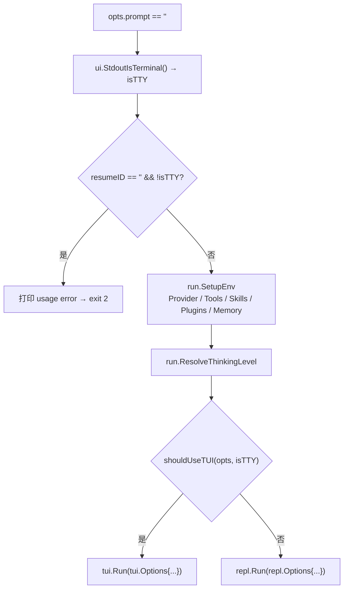
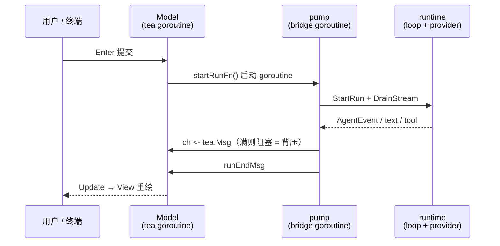
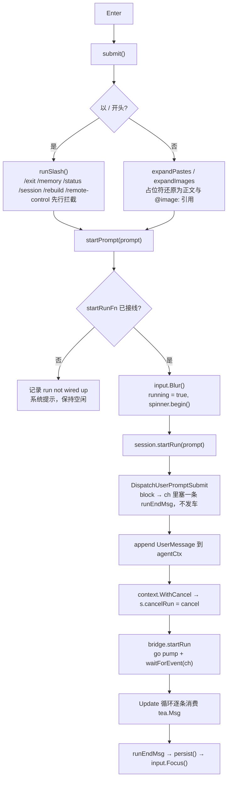
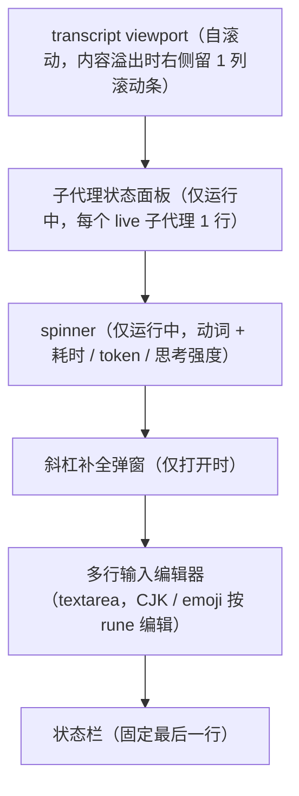

# 全屏 TUI 事件桥与 MVU 生命周期设计

本笔记以 [`tui.Run`](file:///Users/yuqing/Documents/workspace/pigo/internal/cli/tui/run.go#L13-L24) 为主线，记录全屏 TUI（`internal/cli/tui`）的完整运行流程：入口分派与门控、会话装配、Bubble Tea v2 的 MVU 主循环、把 `AgentEvent` 翻译为 `tea.Msg` 的事件桥，以及提交 → 泵 → 落盘的运行生命周期。它与 [行式 REPL 与全屏 TUI 架构对比](./行式REPL与全屏TUI架构对比.md) 互补：那篇讲「两种表现层如何共用同一内核」，本文讲「TUI 这条表现层内部怎么跑」。

---

## 目录

- [一、TUI 的整体形态](#一tui-的整体形态)
- [二、入口分派与门控](#二入口分派与门控)
- [三、启动装配链路](#三启动装配链路)
- [四、MVU 主循环](#四mvu-主循环)
- [五、事件桥：两条 goroutine，一个 channel](#五事件桥两条-goroutine一个-channel)
- [六、Update 消息分派表](#六update-消息分派表)
- [七、一次提交的完整生命周期](#七一次提交的完整生命周期)
- [八、键盘映射与两段式中断](#八键盘映射与两段式中断)
- [九、布局是减法：relayout 与渲染分层](#九布局是减法relayout-与渲染分层)
- [十、相关源码索引](#十相关源码索引)

---

## 一、TUI 的整体形态

TUI 本质上是一台 **Bubble Tea v2 的 MVU 状态机**（Model / Update / View），外加一条把 agent 运行时的 `AgentEvent` 翻译成 `tea.Msg` 的**事件桥**。

它有三条硬约束贯穿全文，记牢这三条，后面所有代码都顺理成章：

1. **单写者**：agent 循环跑在 `pump` goroutine 上，独占 `agentCtx.Messages`；tea 循环跑在另一条 goroutine 上，独占 `Model`。两者只通过一个 channel 对话，绝不互相触碰对方状态。
2. **事件不丢**：channel 是带缓冲的（容量 64），满了就阻塞生产者，形成背压——宁可让模型等，也不丢任何一条事件。
3. **表现层可替换**：TUI 与 REPL 共用同一套 `runtime.StartRun` + `runtime.DrainStream` 内核，差异只在事件消费端——TUI 把它转成 `tea.Msg`，REPL 直接 `fmt.Fprint`。

`doc.go` 也明确写了这个定位：TUI 是「行式 REPL 的 alt-screen 对应物」，由 `cmd/pigo` 在没有 prompt、stdout 是 TTY 且未设 `--no-tui` 时分派进入。

---

## 二、入口分派与门控

分派发生在 [`cmd/pigo/main.go` 的 dispatch](file:///Users/yuqing/Documents/workspace/pigo/cmd/pigo/main.go#L425-L481)：**没有 prompt** 时先判断 `resumeID == "" && !isTTY` 是否为使用错误（CI/管道里既无输入也无交互对象），然后 `run.SetupEnv` 装配环境，最后门控：



门控函数极简（[`shouldUseTUI`](file:///Users/yuqing/Documents/workspace/pigo/cmd/pigo/main.go#L653-L655)）：

```go
func shouldUseTUI(opts cliOptions, isTTY bool) bool {
	return isTTY && !opts.noTUI
}
```

两个关键点：

- **两条路径吃同一份 `Options`**：[`tui.Options`](file:///Users/yuqing/Documents/workspace/pigo/internal/cli/tui/options.go#L16-L59) 字段与 `repl.Options` 逐一对齐，dispatch 才能把同一份装配结果映射到任一路径，不需要适配层。
- **非 TTY 强制降级**：在 CI 或 `| head` 这类管道里 `isTTY` 为假，强制走 REPL，避免脚本卡在 alt-screen 里。

---

## 三、启动装配链路

`Run` 只有三步，且**在进入 alt-screen 之前**完成会话装配：

```go
s, history, err := newRunSession(opts)   // 装配：store / context / live / slash / hooks
if err != nil {
	return err                                    // 干净的前置错误，而不是半个交互会话
}
p := tea.NewProgram(NewModel(opts).withSession(s, history))
_, err = p.Run()
```

这样设计的意图是：store 打不开或 resume 失败，应该是一个明确的启动错误，而不是进到黑屏里才发现问题。

[`newRunSessionWithStore`](file:///Users/yuqing/Documents/workspace/pigo/internal/cli/tui/session.go#L138-L295) 装配的 [`runSession`](file:///Users/yuqing/Documents/workspace/pigo/internal/cli/tui/session.go#L45-L124) 覆盖：

| 装配物                                          | 说明                                                |
| :---------------------------------------------- | :-------------------------------------------------- |
| `store` / `header` / `agentCtx`                 | resume 时 `LoadEntries` 重建上下文；否则新建 header |
| `live *cli.LiveConfig`                          | 可变的运行配置，`/model`、`/think` 切换的就是它     |
| `reg` / `reminders` / `schedule` / `creds`      | 工具注册表、提醒、调度、凭据                        |
| `slash *runtime.SlashRegistry`                  | 斜杠命令注册表，与 REPL 共用                        |
| `trust` / `dispatcher` / `hookDeps` / `onEvent` | 信任管理、Hook 分发器与观察者链                     |
| `curLeaf` / `persisted` / `compacted`           | 树状会话游标与分支落盘状态                          |

装配后 [`withSession`](file:///Users/yuqing/Documents/workspace/pigo/internal/cli/tui/model.go#L210-L223) 把模型的**接缝**接上：

- `startRunFn = s.startRun` → 提交时真正启动一次 run
- `interruptFn = s.interrupt` → 两段式中断的取消函数
- `m.live = s.live` / `m.slash = s.slash` → 让 `/model` 改的是运行循环读的那份配置
- `addBanner` + `seedTranscript(history)` → resume 时把历史回放进 transcript

---

## 四、MVU 主循环

标准 Bubble Tea 三件套，职责边界清晰：

- [`Init`](file:///Users/yuqing/Documents/workspace/pigo/internal/cli/tui/model.go#L228-L232)：拉起异步 git 探测、聚焦输入框、请求终端背景色。alt-screen 不在 `Init` 里开，而是通过 `View` 返回值声明。
- [`Update`](file:///Users/yuqing/Documents/workspace/pigo/internal/cli/tui/model.go#L238-L547)：唯一的纯状态迁移入口，一个大 `type switch` 分派所有 `tea.Msg`。
- [`View`](file:///Users/yuqing/Documents/workspace/pigo/internal/cli/tui/model.go#L1186-L1198)：渲染，并声明 `AltScreen: true` 与 `MouseMode: tea.MouseModeCellMotion`。

```go
func (m Model) View() tea.View {
	if m.quitting {
		return tea.View{AltScreen: true}
	}
	content := m.applySelection(m.renderContent())
	return tea.View{Content: content, AltScreen: true, MouseMode: tea.MouseModeCellMotion}
}
```

- **alt-screen 靠 `View` 声明**：Bubble Tea v2 据此进入/离开备用缓冲区，所以 `Run` 干净返回时，用户进入前的 scrollback 会被原样恢复。
- **必须开 `MouseModeCellMotion`**：alt-screen 吞掉了终端原生滚轮（没有 scrollback），只有开了 cell-motion 才会收到滚轮/点击/释放事件，transcript 的滚轮滚动、滚动条拖拽、鼠标框选才成立。

---

## 五、事件桥：两条 goroutine，一个 channel

这是整个 TUI 最核心的一块（[`bridge.go`](file:///Users/yuqing/Documents/workspace/pigo/internal/cli/tui/bridge.go)）。问题陈述很直白：**agent 循环在 emit 事件，tea 循环一次只处理一个 `tea.Msg`**，中间需要一个泵。



三个原语（均集中在 bridge.go，可脱离真实 provider 单测）：

- [`newStreamHandler`](file:///Users/yuqing/Documents/workspace/pigo/internal/cli/tui/bridge.go#L44-L76)：构造 `runtime.StreamHandler`，把每个回调/事件转成对应 `tea.Msg` 塞进 channel。`OnEvent` 先投递观察者事件（插件通知器、SessionEnd/PreCompact hook），再翻译成 TUI 消息。
- [`pump`](file:///Users/yuqing/Documents/workspace/pigo/internal/cli/tui/bridge.go#L113-L117)：阻塞地跑完一次 run，最后发 `runEndMsg{err}`。
- [`waitForEvent`](file:///Users/yuqing/Documents/workspace/pigo/internal/cli/tui/bridge.go#L123-L127)：一个 `tea.Cmd`，`return <-ch` 阻塞等一条消息。

`Model` 侧靠 [`pumpNext`](file:///Users/yuqing/Documents/workspace/pigo/internal/cli/tui/model.go#L1173-L1178) 维持节奏——**每处理完一条桥消息就再发一次 `waitForEvent(ch)`**，于是事件被一条条拉出来、顺序天然保序，tea 循环也从不空转：

```go
func (m Model) pumpNext() tea.Cmd {
	if m.running && m.runCh != nil {
		return waitForEvent(m.runCh)
	}
	return nil   // runEndMsg 后 runCh 置 nil，泵自然停止
}
```

设计要点：

- **channel 是唯一同步点**：生产者不碰 Model，消费者不碰 run，所有状态迁移都发生在 tea goroutine 上。
- **背压是刻意的**：`eventChanCap = 64` 的缓冲让一段工具事件突发能排进队列而不必每次 send 都阻塞；超过 64 就阻塞生产者，**绝不丢弃**——tea 循环总会追上。
- **`argsToMap` 的容错**：工具调用参数的 `Args` 在事件层是 `any`，可能是 `json.RawMessage`、`[]byte`、已解码的 `map`、甚至 `string`，统一收敛成 `map[string]any` 供工具卡片展示，非 JSON 对象一律返回 `nil`。

---

## 六、Update 消息分派表

`tea.Msg` 类型全部定义在 [`msgs.go`](file:///Users/yuqing/Documents/workspace/pigo/internal/cli/tui/msgs.go)，一律用**值类型**（不是指针），这样穿过 `chan any` 时不会别名到生产者的状态：

| tea.Msg                                    | 由哪个事件产生             | `Update` 里的动作                                               |
| :----------------------------------------- | :------------------------- | :-------------------------------------------------------------- |
| `tea.WindowSizeMsg`                        | 终端尺寸                   | 记录宽高并 `relayout()`                                         |
| `tea.BackgroundColorMsg`                   | 终端背景色                 | `SetMarkdownDark` + `transcript.reflow()` 重刷配色              |
| `tea.KeyPressMsg`                          | 键盘                       | `handleKey()` → 提交 / 中断 / 交给 textarea                     |
| `tea.MouseWheelMsg`                        | 滚轮                       | 交给 transcript viewport 滚动，清空选区                         |
| `tea.MouseClickMsg` / `Motion` / `Release` | 鼠标                       | 滚动条拖拽 或 文本框选                                          |
| `tea.PasteMsg` / `ClipboardMsg`            | 括号粘贴 / OSC52           | `handlePaste`：多行折叠为占位符                                 |
| `clipboardImageMsg`                        | 图片读取回应               | `handleImagePaste`，无图则回退成文本读取                        |
| `textDeltaMsg`                             | `OnText`                   | `transcript.appendDelta` + `spinner.addTokens`                  |
| `turnEndMsg`                               | `OnTurnEnd`                | `finalizeTurn`，并兜底报错 / 空响应                             |
| `toolStartMsg`                             | `ToolExecutionStartEvent`  | 建 `toolCard` 入 map 并插入 transcript；`task` 另开子代理面板行 |
| `toolUpdateMsg`                            | `ToolExecutionUpdateEvent` | 累积子代理输出                                                  |
| `toolEndMsg`                               | `ToolExecutionEndEvent`    | 翻转卡片状态、解析结果（含 `ui.DiffFromDetails` 的 diff）       |
| `subagentProgressMsg`                      | `SubAgentProgressEvent`    | 刷新面板行的 activity / tokens                                  |
| `telemetryMsg`                             | `TelemetryEvent`           | 更新状态栏上下文占用 + `telemetry.Fold`                         |
| `compactionStartMsg` / `compactionMsg`     | Compaction 事件            | spinner 钉住 / 解除 + 系统提示                                  |
| `runEndMsg`                                | `pump` 收尾                | 停 `running`、`persist()`、重新聚焦输入                         |
| `rebuildDoneMsg`                           | `/rebuild` 异步收尾        | 解 pin spinner，报告结果                                        |
| `spinnerTickMsg`                           | 自调度 tick                | 推进动画帧，仅运行中续期                                        |
| `remoteInputMsg`                           | 远程浏览器                 | 复用 submit / slash 路径                                        |

两处值得一提的**兜底**：

- `turnEndMsg` 会检查 `StopReason`：`error` / `aborted` 时插入 `error: ...` 系统块，`end_turn` 但内容与工具结果都为空的，插入「empty response」提示。原因是请求失败是以**终态 assistant 消息**（而非 `runEndMsg.err`）随流送来的，不检查就会静默回到提示符。
- `runEndMsg` 里**先停 `running` / 清 `runCh` / 清空子代理面板**，再 `persist()`。这一步无竞态的依据是：`pump` 只有在 `DrainStream` 返回后才发 `runEndMsg`，此刻已无人再写 `agentCtx.Messages`。

---

## 七、一次提交的完整生命周期

按时间顺序把「按 Enter」之后的链路串起来：



几个关键设计：

- **提交前的占位符还原**：多行粘贴被折叠成 `[Pasted text #N +M lines]`，图片粘贴折叠成 `[Image #N]`；`submit` 在发车前用 [`expandPastes`](file:///Users/yuqing/Documents/workspace/pigo/internal/cli/tui/model.go#L1108-L1123) / [`expandImages`](file:///Users/yuqing/Documents/workspace/pigo/internal/cli/tui/model.go#L1153-L1168) 换回真实内容（图片变成 `@image:<path>` 交给 `ui.BuildUserContent` 组装多模态块）。这样大段粘贴不会把编辑器撑爆。
- **斜杠命令先经注册表**：`runSlash` 与 REPL 的 dispatch 对齐。`/exit`、`/memory`、`/status`、`/session`、`/rebuild`、`/remote-control` 会在注册表解析**之前**被拦截，因为它们需要读取 host 才能拿到的实时状态（`cli.Host` 契约由 [`host.go`](file:///Users/yuqing/Documents/workspace/pigo/internal/cli/tui/host.go) 让 `runSession` 满足）。
- **Hook 在 prompt 落 context 之前**：`DispatchUserPromptSubmit` 若 block，会合成一个只含错误的 `runEndMsg`，**不留下悬空的 user 消息**。

### 落盘：分支追加而非线性重写

[`persist`](file:///Users/yuqing/Documents/workspace/pigo/internal/cli/tui/session.go#L438-L473) 有两种模式：

- **常规**：把 `Messages[persisted:]` 作为新分支用 `AppendBranch` 从 `curLeaf` 长出去，推进 leaf 与游标——保留完整会话树，让 `/fork`、`/clone` 有意义。
- **compaction 之后**：压缩把 `Messages` 重写成「摘要 + 近期尾部」，前缀变了、切片还可能比 `persisted` 短，增量的 `Messages[persisted:]` 会越界。此时改为 `store.Save` 线性重写，并重置分支游标。

判断条件就是这一行：

```go
if s.compacted || s.persisted > len(s.agentCtx.Messages) {
	// 线性重写 + 重置 curLeaf
}
```

---

## 八、键盘映射与两段式中断

[`handleKey`](file:///Users/yuqing/Documents/workspace/pigo/internal/cli/tui/model.go#L554-L739) 是按键的唯一入口，整体是**优先级从高到低的三层**：

1. **补全菜单**（空闲且 `menu.active`）：`up`/`down` 移动、`tab` 补全、`esc` 关闭、`enter` 执行选中项。
2. **子代理面板**（运行中、有 live 子代理、输入框为空）：`up`/`down` 选择行、`enter` 展开、`esc` 清选并重新聚焦输入框。
3. **全局键**：`ctrl+c` / `super+c` / `esc` / `ctrl+o` / `ctrl+d` / `enter` / `pgup` / `pgdown` / `ctrl+v` / `super+v` / `ctrl+y`。

其中最关键的是**两段式中断**（[`interruptOrQuit`](file:///Users/yuqing/Documents/workspace/pigo/internal/cli/tui/model.go#L1044-L1055)）：

```go
func (m Model) interruptOrQuit() (tea.Model, tea.Cmd) {
	if m.running {
		if m.interruptFn != nil {
			m.interruptFn()          // 取消 ctx，停止当前 run
		}
		m.transcript.addSystem("(interrupting the current run…)")
		return m, nil                // 留在程序里
	}
	m.shutdownRemote()
	m.quitting = true
	return m, tea.Quit               // 空闲时才退出
}
```

取消如何生效：`session.startRun` 用 `context.WithCancel` 建 run 上下文并把 `cancel` 存进 `s.cancelRun`，`interruptFn`（即 `s.interrupt`）只需调它。取消沿 `StartRun` / `DrainStream` 传播，最终仍以一条 `runEndMsg` 收尾，模型回到空闲——**中断路径和正常结束路径是同一条**。

其余按键细节：

- **`ctrl+c` 有多义**：有鼠标选区时先走 OSC52 复制（剪贴板），清空选区；无选区时才落到「中断或退出」。这样运行中框选一段输出不会误触中断。
- **`super+c`（macOS Cmd+C）永不停机**：有选区复制选区，否则复制整个输入缓冲，在任何状态下都不会中断或退出。
- **`ctrl+d` 运行中被忽略**：避免一个误触的 EOF 把正在跑的 run 丢掉；只在空闲时退出。
- **`ctrl+o`** 切换最近一张工具卡片的展开态并 `reflow`，在预览与完整响应树之间切换。
- **`↑`/`↓` 双职责**：光标在第一行 / 最后一行时走历史浏览（`historyPrev` / `historyNext`，带草稿暂存），否则在 textarea 内移动光标——多行编辑不受影响。

---

## 九、布局是减法：relayout 与渲染分层

[`relayout`](file:///Users/yuqing/Documents/workspace/pigo/internal/cli/tui/model.go#L1327-L1344) 的思路是**先扣掉所有固定开销，剩下的才给 transcript**：

```go
rows := m.height - 1 - m.input.Height() - m.menu.rows()
if m.running {
	rows--                                  // 工作 spinner 占 1 行
	rows -= m.subagents.lineCount(m.width)  // 每个 live 子代理 1 行 + 展开行
}
if rows < 0 {
	rows = 0
}
m.transcript.setSize(m.width, rows)
m.input.SetWidth(m.width)
```

渲染的垂直分层（[`renderContent`](file:///Users/yuqing/Documents/workspace/pigo/internal/cli/tui/model.go#L1204-L1262)，自上而下）：



- **transcript 自适应宽度**：`totalWidth` 是可用总宽，`width` 是实际换行宽度。内容装得下时 `width == totalWidth`（不显示滚动条）；溢出时 `width = totalWidth - 1`，让出 1 列给滚动条。这个决定在**每次 reflow 时重算**，所以流式输出新增行导致溢出时，滚动条会自动出现，而不是只在 resize 时才更新。
- **`follow` 是粘连底部的显式意图**：用户提交时置真（新回合一定要看到），用户向上滚动读历史时置假。之所以用显式布尔而不是在 reflow 里采样 `vp.AtBottom()`，是因为 `setSize` 会先改 viewport 尺寸再 reflow，此时采样必然读到假值。
- **`applySelection` 是后置覆盖**：渲染出完整 shell 后，把选区交叠的行重写成「纯文本 + 反色」，未交叠的行保持原配色。`selectedText` 复用同一个 `renderContent()` 从用户看到的那些行里截取纯文本，保证「复制到的内容」和「屏幕上看到的」严格一致。
- **工具卡片用指针入 transcript**：`toolStartMsg` 时把 `*toolCard` 追加为有序 block，后续 `toolEndMsg` / `Ctrl+O` 原地改卡片状态，下一次 `reflow` 就地重渲染——不重新分配 block。

---

## 十、相关源码索引

- 入口分派与门控：[`cmd/pigo/main.go:dispatch`](file:///Users/yuqing/Documents/workspace/pigo/cmd/pigo/main.go#L425-L481)、[`shouldUseTUI`](file:///Users/yuqing/Documents/workspace/pigo/cmd/pigo/main.go#L653-L655)
- TUI 入口：[`internal/cli/tui/run.go:Run`](file:///Users/yuqing/Documents/workspace/pigo/internal/cli/tui/run.go#L13-L24)
- 包定位与设计依据：[`internal/cli/tui/doc.go`](file:///Users/yuqing/Documents/workspace/pigo/internal/cli/tui/doc.go)
- 根模型（Init/Update/View、handleKey、relayout）：[`internal/cli/tui/model.go`](file:///Users/yuqing/Documents/workspace/pigo/internal/cli/tui/model.go)
- 事件桥：[`internal/cli/tui/bridge.go`](file:///Users/yuqing/Documents/workspace/pigo/internal/cli/tui/bridge.go)
- `tea.Msg` 类型定义：[`internal/cli/tui/msgs.go`](file:///Users/yuqing/Documents/workspace/pigo/internal/cli/tui/msgs.go)
- 会话装配 / run 接缝 / 落盘：[`internal/cli/tui/session.go`](file:///Users/yuqing/Documents/workspace/pigo/internal/cli/tui/session.go)
- `cli.Host` 契约实现：[`internal/cli/tui/host.go`](file:///Users/yuqing/Documents/workspace/pigo/internal/cli/tui/host.go)
- 滚动消息区：[`internal/cli/tui/transcript.go`](file:///Users/yuqing/Documents/workspace/pigo/internal/cli/tui/transcript.go)
- 内核（两条路径共用）：[`runtime.StartRun`](file:///Users/yuqing/Documents/workspace/pigo/internal/runtime/loop.go#L135)、[`runtime.DrainStream`](file:///Users/yuqing/Documents/workspace/pigo/internal/runtime/render.go#L40)
- 对照阅读：[行式 REPL 与全屏 TUI 架构对比](./行式REPL与全屏TUI架构对比.md)
