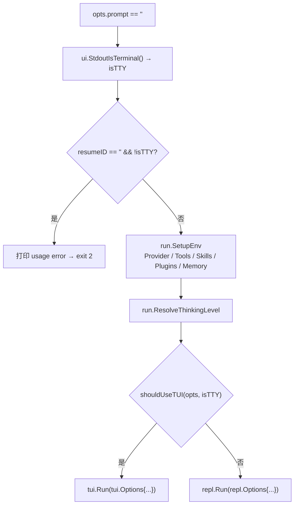
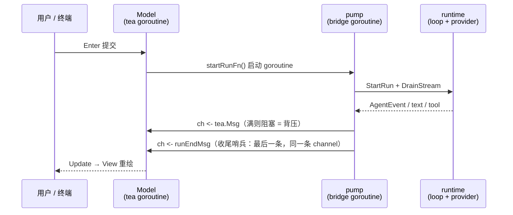
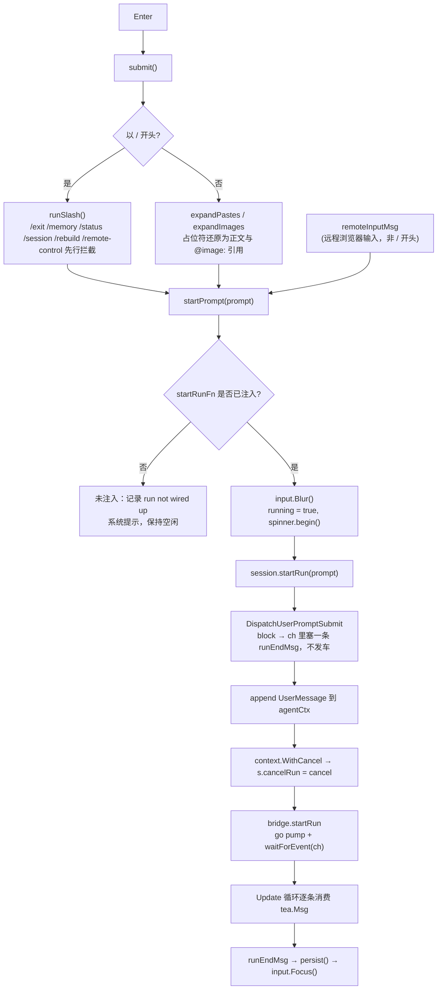
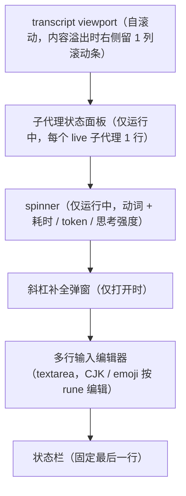

# 全屏 TUI 事件桥与 MVU 生命周期设计

本笔记以 [`tui.Run`](../internal/cli/tui/run.go#L13-L24) 为主线，记录全屏 TUI（`internal/cli/tui`）的完整运行流程：入口分派与门控、会话装配、Bubble Tea v2 的 MVU 主循环、把 `AgentEvent` 翻译为 `tea.Msg` 的事件桥，以及提交 → 泵 → 落盘的运行生命周期。它与 [行式 REPL 与全屏 TUI 架构对比](./行式REPL与全屏TUI架构对比.md) 互补：那篇讲「两种表现层如何共用同一内核」，本文讲「TUI 这条表现层内部怎么跑」。

---

## 目录

- [一、TUI 的整体形态](#一tui-的整体形态)
- [二、入口分派与门控](#二入口分派与门控)
- [三、启动装配链路](#三启动装配链路)
- [四、MVU 主循环](#四mvu-主循环)
- [五、事件桥：两条 goroutine，一个 channel](#五事件桥两条-goroutine一个-channel)
- [六、Update 消息分派表](#六update-消息分派表)
- [七、一次提交的完整生命周期](#七一次提交的完整生命周期)
- [八、键盘映射与两段式中断](#八键盘映射与两段式中断)
- [九、布局是减法：relayout 与渲染分层](#九布局是减法relayout-与渲染分层)
- [十、相关源码索引](#十相关源码索引)

---

## 一、TUI 的整体形态

TUI 本质上是一台 **Bubble Tea v2 的 MVU 状态机**（Model / Update / View），外加一条把 agent 运行时的 `AgentEvent` 翻译成 `tea.Msg` 的**事件桥**。

### 先立个约定：`Model` 有两个含义

全文大量出现 `Model`，但它在同一个包里被重载成了两个毫不相干的东西——**MVU 状态机**和**LLM 模型名**。先分清再往下读：

| 写法                                                             | 含义                                  | 位置                                                                                                    |
| :--------------------------------------------------------------- | :------------------------------------ | :------------------------------------------------------------------------------------------------------ |
| `type Model struct`                                              | **MVU 状态机**：整个 TUI 的状态快照   | [`model.go`](../internal/cli/tui/model.go#L32-L164)                                                     |
| `NewModel(opts) Model`、`func (m Model) Update(...)`             | 同上，作类型 / 接收者使用             | [`model.go`](../internal/cli/tui/model.go#L173-L203)                                                    |
| `Options.Model`、`live.Model`、`header.Model`、`statusBar.model` | **LLM 模型名**（如 `gpt-4` 的字符串） | [`options.go`](../internal/cli/tui/options.go#L17)、[`session.go`](../internal/cli/tui/session.go#L190) |

区分办法很机械：

- `Model` 作**类型**用（构造返回、方法接收者）→ MVU 状态机。
- `Model` 作**字符串字段**用（`opts.Model`、`live.Model`）→ LLM 模型名，即「用哪个大模型」。

所以 `NewModel(opts)` 的读法是「用 `opts`（其中含 LLM 配置 `opts.Model`）构造 MVU 状态机」；返回的那个 `Model` 里装着 `m.opts`、`m.transcript`、`m.input` 等 **UI 状态，与 LLM 无关**。也正因如此，方向是 MVU Model 持有 `m.opts`（含 LLM 配置），而不是反过来。

> 本文以下若不加限定，**`Model` 一律指 MVU 状态机**；指 LLM 时一律写成 `opts.Model` / `live.Model` 这类带前缀的形式。

它有三条硬约束贯穿全文，记牢这三条，后面所有代码都顺理成章：

1. **单写者**：agent 循环跑在 `pump` goroutine 上，独占 `agentCtx.Messages`；tea 循环跑在另一条 goroutine 上，独占 `Model`。两者只通过一个 channel 对话，绝不互相触碰对方状态。
2. **事件不丢**：channel 是带缓冲的（容量 64），满了就阻塞生产者，形成背压——宁可让模型等，也不丢任何一条事件。
3. **表现层可替换**：TUI 与 REPL 共用同一套 `runtime.StartRun` + `runtime.DrainStream` 内核，差异只在事件消费端——TUI 把它转成 `tea.Msg`，REPL 直接 `fmt.Fprint`。

[`doc.go`](../internal/cli/tui/doc.go) 也明确写了这个定位：TUI 是「行式 REPL 的 alt-screen 对应物」，由 `cmd/pigo` 在没有 prompt、stdout 是 TTY 且未设 `--no-tui` 时分派进入。

---

## 二、入口分派与门控

分派发生在 [`cmd/pigo/main.go` 的 dispatch](../cmd/pigo/main.go#L377-L533)：**没有 prompt** 时先判断 `resumeID == "" && !isTTY` 是否为使用错误（CI/管道里既无输入也无交互对象），然后 `run.SetupEnv` 装配环境，最后门控：



门控函数极简（[`shouldUseTUI`](../cmd/pigo/main.go#L653-L655)）：

```go
func shouldUseTUI(opts cliOptions, isTTY bool) bool {
	return isTTY && !opts.noTUI
}
```

两个关键点：

- **两条路径吃同一份 `Options`**：[`tui.Options`](../internal/cli/tui/options.go#L16-L59) 与 [`repl.Options`](../internal/cli/repl/interactive.go#L39-L84) 有 16 个字段逐一对齐，dispatch 才能把同一份装配结果映射到任一路径，不需要适配层（两者的差异见下）。
- **非 TTY 强制降级**：在 CI 或 `| head` 这类管道里 `isTTY` 为假，强制走 REPL，避免脚本卡在 alt-screen 里。

### 两个 `Options` 的差异

它们是**两个各自独立声明的结构体**，不是别名也不是复用：共同子集逐字段一致，各自另有一个专有字段。

| 结构体                                                        | 独有字段  | 用途                                                         |
| :------------------------------------------------------------ | :-------- | :----------------------------------------------------------- |
| [`tui.Options`](../internal/cli/tui/options.go#L16-L59)       | `Version` | 启动 banner 显示版本与升级提示                               |
| [`repl.Options`](../internal/cli/repl/interactive.go#L39-L84) | `Dream`   | `[dream]` 配置（US-008），决定是否触发启动后台 consolidation |

共同的 16 个字段（名称、类型、顺序全一致）：

```
Model  ProviderName  Provider  BaseURL  APIKey  Protocol  ThinkingLevel  Tools
SysPrompt  ResumeID  Approve  Skills  Plugins  ConfigPrompts  CliPrompts  NoPromptTemplates
```

它们在 Go 里是两个**不同的命名类型**，即便字段全同也不能直接互相赋值（可赋值性要求两侧类型相同，或至少一侧是未命名类型）。所以 [dispatch](../cmd/pigo/main.go#L458-L499) 里是**两处 struct literal 逐字段复写**：

```go
tui.Run(tui.Options{
    // ... 16 个共同字段
    NoPromptTemplates: opts.noPromptTemplates,
})
repl.Run(repl.Options{
    // ... 同样 16 个共同字段
    NoPromptTemplates: opts.noPromptTemplates,
    Dream:             opts.dreamCfg,        // REPL 独有
})
```

既没有类型转换，也没有中间 DTO——这才是「不需要适配层」的真实含义：映射零成本，一眼能看出两条路径吃的是同一份环境。

代价是对齐靠人工：谁加了字段，另一头得手动跟，编译器不会替你把关。也正因如此，TUI 路径天然没有 `Dream`（不做启动 [consolidation](./Dream记忆整合机制与后台触发设计.md)——也就是记忆整合），而不是「忘了传」：

- **REPL 的机制**：REPL 运行在终端主屏（main screen），启动时若触发 [`maybeStartBackgroundDream`](../internal/cli/repl/dream_startup.go#L38-L58)，后台协程跑完后直接通过 `fmt.Fprintln(out, ...)` 往 `os.Stdout` 追加一行暗色完成摘要（`RenderReportLine`）。在主屏的普通滚动缓冲区里，这一行输出顺着 scrollback 自然滑过，完全不影响交互。
- **TUI 的防花屏约束**：全屏 TUI 运行在 alt-screen 上，每个字符的位置都由 Bubble Tea 的 MVU 全屏重绘严格控制。如果启动后台协程直接向 stdout 异步写文本，会破坏转义序列与光标布局，造成严重的终端花屏与撕裂。
- **架构抉择**：若要让 TUI 也感知后台 consolidation，必须将结果包装为 `tea.Msg`、通过事件桥送入通道、再在 UI 视口内渲染通知条。由于启动自动记忆整理并非交互刚需，TUI 直接在入口装配处裁减掉了 `Dream` 配置，从根源上避免异步写 stdout。

---

## 三、启动装配链路

`Run` 只有三步，且**在进入 alt-screen 之前**完成会话装配：

```go
s, history, err := newRunSession(opts)   // 装配：store / context / live / slash / hooks
if err != nil {
	return err                                    // 干净的前置错误，而不是半个交互会话
}
p := tea.NewProgram(NewModel(opts).withSession(s, history))
_, err = p.Run()
```

这样设计的意图是：store 打不开或 resume 失败，应该是一个明确的启动错误，而不是进到黑屏里才发现问题。

上面这行 `newRunSession` 只是薄包装（[L125-L131](../internal/cli/tui/session.go#L125-L131)）：先打开共享 store，再转交给 store 无关的核心 [`newRunSessionWithStore`](../internal/cli/tui/session.go#L138-L264)（拆出核心是为了让测试用临时目录的 store 驱动它）。真正的装配都在核心这边，它构造的 [`runSession`](../internal/cli/tui/session.go#L45-L118) 覆盖：

| 装配物                                          | 说明                                                                                                      |
| :---------------------------------------------- | :-------------------------------------------------------------------------------------------------------- |
| `store` / `header` / `agentCtx`                 | resume 时 `LoadEntries` 重建上下文；否则新建 header                                                       |
| `live *cli.LiveConfig`                          | 可变的运行配置，`/model`、`/think` 切换的就是它                                                           |
| `reg` / `reminders` / `schedule` / `creds`      | 工具注册表、提醒、调度、凭据                                                                              |
| `slash *runtime.SlashRegistry`                  | 斜杠命令注册表，与 REPL 共用（见 [SlashRegistry 专文](./斜杠命令注册表SlashRegistry与双前端共用设计.md)） |
| `trust` / `dispatcher` / `hookDeps` / `onEvent` | 信任管理、Hook 分发器与观察者链                                                                           |
| `curLeaf` / `persisted` / `compacted`           | 树状会话游标与分支落盘状态                                                                                |

装配后 [`withSession`](../internal/cli/tui/model.go#L210-L223) 把模型的依赖**注入**进去：

- `startRunFn = s.startRun` → 提交时真正启动一次 run
- `interruptFn = s.interrupt` → 两段式中断的取消函数
- `m.live = s.live` / `m.slash = s.slash` → 让 `/model` 改的是运行循环读的那份配置
- `addBanner` + `seedTranscript(history)` → resume 时把历史回放进 transcript

### 为什么是「注入」而不是直接 new

`startRunFn`、`interruptFn` 在 [`Model`](../internal/cli/tui/model.go#L67-L86) 里只是**函数类型的字段**：Model 声明签名、持有调用点，但既不实现、也不 import `session` / `store` / `runtime`。真正的实现由 `runSession` 提供，`withSession` 只做赋值。这个技法就是**依赖注入 / 回调注册**（Go 社区口语叫 wiring），在 Go 里用函数值代替接口是常规手法。

不直接在 Model 里 new 一个 session，换来两件事：

- **可测**：[slash_test.go:184](../internal/cli/tui/slash_test.go#L184) 把 `startRunFn` 换成 stub，就能在不碰真 store、真 provider 的情况下验证 prompt 路径；[input_test.go:169](../internal/cli/tui/input_test.go#L169) 给 `interruptFn` 装一个记录器，就能断言 `ctrl+c` 触发了两段式中断。字段为 nil 时模型照样能构造（`NewModel` 之后不注入），所以「未注入」是一条**正常可走**的状态，不是崩溃。
- **Model 不拥有状态**：`store`、`agentCtx`、`header`、`live`、`slash` 都归 `runSession` 所有，Model 只是**持有引用**（`m.session` / `m.live` / `m.slash`）并按需调用它的方法（`m.session.persist()`、`m.session.startRemote()`、`m.session.renderSession()`）。所有权在 `runSession`，Model 是调用方——两者的生命周期因此保持干净：程序退出后 Model 消失，会话内容已经落到 store 里。

顺带把术语落到实处：**「注入」在代码层面就是一行赋值**（`m.startRunFn = s.startRun`），没有任何额外机制。之所以值得单起一个名字，是因为这行赋值同时确定了「谁拥有实现」（`runSession`）和「谁负责调用」（Model）——也正因如此，[`startPrompt`](../internal/cli/tui/model.go#L996-L1008) 里才需要 `startRunFn == nil` 这个分支（见[第七节](#七一次提交的完整生命周期)流程图中的 `startRunFn 是否已注入?`）。

---

## 四、MVU 主循环

标准 Bubble Tea 三件套，职责边界清晰：

- [`Init`](../internal/cli/tui/model.go#L228-L232)：拉起异步 git 探测、聚焦输入框、请求终端背景色。alt-screen 不在 `Init` 里开，而是通过 `View` 返回值声明。
- [`Update`](../internal/cli/tui/model.go#L238-L547)：唯一的纯状态迁移入口，一个大 `type switch` 分派所有 `tea.Msg`。
- [`View`](../internal/cli/tui/model.go#L1186-L1198)：渲染，并声明 `AltScreen: true` 与 `MouseMode: tea.MouseModeCellMotion`。

MVU 三元各自的职责边界，以及 tea 运行时究竟怎么驱动它们——`Update` 与绘制是两步、`Cmd` 的真实语义是「被返回的函数」而非「被调用的函数」、`cmds` / `msgs` 为何都是无缓冲——单独成篇，见 [MVU 主循环与 tea 运行时机制设计](./MVU主循环与tea运行时机制设计.md)。

```go
func (m Model) View() tea.View {
	if m.quitting {
		return tea.View{AltScreen: true}
	}
	content := m.applySelection(m.renderContent())
	return tea.View{Content: content, AltScreen: true, MouseMode: tea.MouseModeCellMotion}
}
```

### 什么是 alt-screen（备用屏）

**alt-screen 是终端模拟器内置的第二块「屏幕」。** 终端内部同时维护两块屏幕缓冲区，同一时刻只显示其中一块：

| 缓冲区            | 内容                                                               | scrollback     |
| :---------------- | :----------------------------------------------------------------- | :------------- |
| **主屏**（main）  | 平时看到的 shell 输出、命令历史                                    | 有，可向上翻页 |
| **备用屏**（alt） | 进入时清空的独立空白屏，全屏程序专用（vim / less / htop / 本 TUI） | 无             |

切换靠转义序列，对应 terminfo 里的 `smcup` / `rmcup`：

```
进入 alt-screen:  ESC [ ? 1049 h      (smcup)
退出 alt-screen:  ESC [ ? 1049 l      (rmcup)
```

（`1049` 是「保存光标 + 清屏 + 切换」的合并变体，等价于早期的 `1047` / `47` 加一对光标保存/恢复。）

关键在于**退出时**：终端只是把显示切回主屏，主屏原有的内容**原样还在，不会被重新打印一遍**——所以退出 vim 后 shell 历史仍在原地、光标位置也没乱。这正是备用屏存在的意义：全屏程序不需要自己「清理现场」。

落到本项目，这个特性有三条直接后果：

- **alt-screen 靠 `View` 声明**：Bubble Tea v2 据此进入/离开备用缓冲区，所以 `Run` 干净返回时，用户进入前的 scrollback 会被原样恢复。
- **必须开 `MouseModeCellMotion`**：alt-screen 吞掉了终端原生滚轮（没有 scrollback），只有开了 cell-motion 才会收到滚轮/点击/释放事件，transcript 的滚轮滚动、滚动条拖拽、鼠标框选才成立——本项目的滚动完全是自实现的，见[第九节](#九布局是减法relayout-与渲染分层)。
- **每帧整屏重绘**：备用屏上没有任何遗留内容可以依赖，`View` 每帧返回完整界面，而不是增量输出。

---

## 五、事件桥：两条 goroutine，一个 channel

这是整个 TUI 最核心的一块（[`bridge.go`](../internal/cli/tui/bridge.go#L28-L139)）。问题陈述很直白：**agent 循环在 emit 事件，tea 循环一次只处理一个 `tea.Msg`**，中间需要一个泵。



桥由五个原语拼成，全部集中在 bridge.go，且都能脱离真实 provider 单测：

| 原语                                                                                                              | 位置      | 职责                                                                        |
| :---------------------------------------------------------------------------------------------------------------- | :-------- | :-------------------------------------------------------------------------- |
| [`startRun`](../internal/cli/tui/bridge.go#L135-L139)                                                             | L135-L139 | 建 channel、`go pump(...)`，把「channel + 第一条 `waitForEvent`」交回 Model |
| [`pump`](../internal/cli/tui/bridge.go#L113-L117)                                                                 | L113-L117 | 在 bridge goroutine 上跑完一次 run，收尾发 `runEndMsg`                      |
| [`newStreamHandler`](../internal/cli/tui/bridge.go#L44-L76)                                                       | L44-L76   | 把 `runtime.StreamHandler` 的三个回调翻译成 `tea.Msg`                       |
| [`waitForEvent`](../internal/cli/tui/bridge.go#L123-L127)                                                         | L123-L127 | 一个 `tea.Cmd`，阻塞读走一条消息                                            |
| [`newEventChan`](../internal/cli/tui/bridge.go#L35-L37) / [`eventChanCap`](../internal/cli/tui/bridge.go#L28-L31) | L28-L37   | 容量 64 的带缓冲 channel                                                    |

**建立：`startRun` 一次交出手柄。** 它只做三件事，但返回值刻意是 `(chan, tea.Cmd)` 而不是把 channel 藏进闭包——Model 因此持有 channel 句柄，能自己决定何时停止拉取：

```go
func startRun(ctx context.Context, agentCtx *agentcore.AgentContext, cfg runtime.RunConfig, onEvent func(agentcore.AgentEvent)) (chan tea.Msg, tea.Cmd) {
	ch := newEventChan()
	go pump(ctx, ch, agentCtx, cfg, onEvent)
	return ch, waitForEvent(ch)
}
```

**翻译：`newStreamHandler` 的三条路径。** `runtime.StreamHandler` 只有三个回调，各对应一类消息：

| 回调                      | 触发时机                | 产出                         |
| :------------------------ | :---------------------- | :--------------------------- |
| `OnText(delta)`           | 流式文本增量            | `textDeltaMsg`               |
| `OnTurnEnd(msg, results)` | 一次 assistant 回合收尾 | `turnEndMsg`                 |
| `OnEvent(ev)`             | 结构化 `AgentEvent`     | 观察者回调 + 下表的 7 种消息 |

`OnEvent` 内部是一个 `type switch`，负责把结构化事件分类翻译：

| `AgentEvent`                               | `tea.Msg`                                 |
| :----------------------------------------- | :---------------------------------------- |
| `ToolExecutionStartEvent`                  | `toolStartMsg`（`Args` 先过 `argsToMap`） |
| `ToolExecutionUpdateEvent`                 | `toolUpdateMsg`                           |
| `ToolExecutionEndEvent`                    | `toolEndMsg`（带 `IsError` 与 `Details`） |
| `SubAgentProgressEvent`                    | `subagentProgressMsg`                     |
| `TelemetryEvent`                           | `telemetryMsg`                            |
| `CompactionStartEvent` / `CompactionEvent` | `compactionStartMsg` / `compactionMsg`    |

两个顺序细节值得留意，它们合起来决定了「屏幕渲染的顺序」与「hook 观察到的顺序」为何一致。

**一是 `OnEvent` 里 `extra(ev)` 排在翻译之前。** [`OnEvent`](../internal/cli/tui/bridge.go#L51-L57) 干的第一件事是把事件交给 `extra`（观察者链上的插件通知器与 SessionEnd/PreCompact hook），等它返回才进 `type switch` 翻译成 `tea.Msg` 并 `ch <-`。同一顺序在更外一层也成立：[`DrainStream`](../internal/runtime/render.go#L55-L59) 也是先 `h.OnEvent(ev)`、再按事件类型分发 `OnText` / `OnTurnEnd`；所以不论一条事件最终变成哪条消息（文本增量、回合收尾、结构化事件都一样），hook 都先于它衍生出的那条消息跑完。

**再叠上「只有一个生产者」这个前提，保序才成立。** `DrainStream` 就是一个跑在 pump goroutine 上的 `for ev := range stream.Events()` 循环，上一轮回调不返回、下一轮不会开始；hook 序列与入队序列因此各自严格等于事件到达顺序，而 channel 是 FIFO、消费者又只有 tea 主循环一个，于是**渲染顺序 = 入队顺序 = 事件顺序**。这两条合起来给出一个不变量，对每一条事件 e 都成立：

```text
extra(e)  →  ch <- msg(e)  →  渲染 e         （前两者同一个 goroutine，第三者异步）
```

反过来说，若把顺序颠倒（先 `ch <-` 再 `extra(ev)`），64 的缓冲让 `ch <-` 通常立即返回，tea goroutine 完全可能已经把 `msg(e₁)` 取走并渲染完，而 `extra(e₁)` 还没跑——插件通知（写 stderr）与 hook 的落盘/告警就会落后于它本该对应的那次屏幕更新。注意这是**顺序**保证而非**同时**保证：渲染本身是异步的，`extra(e₂)` 并不保证晚于 `render(e₁)`。

**二是所有 `ch <-` 都是阻塞发送**，回调这一层本身没有任何缓冲或异步——缓冲只存在于 channel 里。也就是说，「排队」只发生在 channel 上，回调里的每一次 send 都是同步的：满了就卡住生产者（背压，见后文「四个性质」），但绝不丢弃、绝不覆盖。

**泵：`pump` 是「一次 run 一条 goroutine」。**

```go
func pump(ctx context.Context, ch chan tea.Msg, agentCtx *agentcore.AgentContext, cfg runtime.RunConfig, onEvent func(agentcore.AgentEvent)) {
	stream := runtime.StartRun(ctx, agentCtx, cfg)
	_, err := runtime.DrainStream(ctx, stream, newStreamHandler(ch, onEvent))
	ch <- runEndMsg{err: err}
}
```

三行就交代完一次 run 的一生：`StartRun` 建流、`DrainStream` 消费到流关闭、`runEndMsg` 收尾。它是唯一直接写 `agentCtx.Messages` 的地方，也是唯一往 `ch` 里发消息的地方（除最后这句收尾外，其余消息都由 `newStreamHandler` 的回调代发）。注意 **`runEndMsg` 必须等 `DrainStream` 返回之后才发**，这条时序是后面 `persist()` 敢在 tea goroutine 上直接读 `Messages` 的全部依据。

**拉取：`waitForEvent` 与 `Update` 里的「续期协议」。**

```go
func waitForEvent(ch chan tea.Msg) tea.Cmd {
	return func() tea.Msg { return <-ch }
}
```

它是 `tea.Cmd`，Bubble Tea 会把它放到**自己的 goroutine** 上执行，所以 `<-ch` 阻塞的是那条命令 goroutine，**不会卡住 `Update`**；消息一到，tea 运行时把返回值送回主循环，触发一次 `Update`。（这条机制的源码依据见 [MVU 主循环与 tea 运行时机制设计 § 三](./MVU主循环与tea运行时机制设计.md#三cmd-是被返回的函数)。）

真正的节奏感来自 `Update` 里的**续期（re-arm）协议**：除收尾的 `runEndMsg` 外，其余 9 个消费桥消息的 case 都以 `return m, m.pumpNext()` 结尾——`textDeltaMsg`、`turnEndMsg`、`toolStartMsg`、`toolUpdateMsg`、`subagentProgressMsg`、`toolEndMsg`、`telemetryMsg`、`compactionStartMsg`、`compactionMsg`，共 9 处，全在 [`Update`](../internal/cli/tui/model.go#L238) 的 switch 里。于是「处理一条 → 立刻再挂一条」，channel 被一条条拉空：

```go
func (m Model) pumpNext() tea.Cmd {
	if m.running && m.runCh != nil {
		return waitForEvent(m.runCh)   // 还在跑：续一条
	}
	return nil                          // 兜底：已无在途 run，不续期
}
```

它的调用点全部落在同一个 switch 里，每个桥消息 case 各一处：

| 桥消息                | `case` 行                                 | 续期语句                                  |
| :-------------------- | :---------------------------------------- | :---------------------------------------- |
| `textDeltaMsg`        | [L349](../internal/cli/tui/model.go#L349) | [L353](../internal/cli/tui/model.go#L353) |
| `turnEndMsg`          | [L355](../internal/cli/tui/model.go#L355) | [L382](../internal/cli/tui/model.go#L382) |
| `toolStartMsg`        | [L384](../internal/cli/tui/model.go#L384) | [L399](../internal/cli/tui/model.go#L399) |
| `toolUpdateMsg`       | [L401](../internal/cli/tui/model.go#L401) | [L412](../internal/cli/tui/model.go#L412) |
| `subagentProgressMsg` | [L414](../internal/cli/tui/model.go#L414) | [L420](../internal/cli/tui/model.go#L420) |
| `toolEndMsg`          | [L422](../internal/cli/tui/model.go#L422) | [L448](../internal/cli/tui/model.go#L448) |
| `telemetryMsg`        | [L450](../internal/cli/tui/model.go#L450) | [L462](../internal/cli/tui/model.go#L462) |
| `compactionStartMsg`  | [L464](../internal/cli/tui/model.go#L464) | [L466](../internal/cli/tui/model.go#L466) |
| `compactionMsg`       | [L468](../internal/cli/tui/model.go#L468) | [L474](../internal/cli/tui/model.go#L474) |

这 9 处形态完全一致：先迁移自己的 UI 状态，最后一句 `return m, m.pumpNext()`。也就是说续期不是某个 case 的特例，而是「凡是从 channel 取走一条消息，就补挂一条」的固定收尾——**只要这条消息进了 switch，续期就必然发生在 tea goroutine 上**，`m.running` / `m.runCh` 的读写因此不需要任何锁。

`runEndMsg` 是唯一的例外：它先 `m.running = false`、`m.runCh = nil`，然后直接 `return m, tea.Batch(focus, fetchGitCmd(m.cwd))`——**不再续期**。泵的终止不需要任何额外信号，就是这条 case 之后无人再挂 `waitForEvent`；`pumpNext` 里那句 `return nil` 只是防御性兜底，正常路径走不到。

这四步叠在一起，同时拿到了四个性质：

- **保序**：生产者只有一个（pump goroutine 串行执行 `DrainStream` 的回调），channel 是 FIFO，消费者也只有一个（tea 主循环一次只处理一条 `tea.Msg`）；三者叠加使「事件发生顺序 = 屏幕渲染顺序」。
- **不丢**：`ch <-` 是阻塞发送，缓冲写满就阻塞生产者，背压一路传导回 provider 的流——`eventChanCap = 64` 只是让一段工具事件突发能先排进队列、不必每次 send 都等消费者，**绝不丢弃、绝不覆盖**。
- **不空转**：`waitForEvent` 只在有在途 run 时被挂上；`runEndMsg` 之后无人再续期，tea 循环保持空闲，没有任何轮询。
- **无竞态**：所有 `m.*` 状态迁移都发生在 tea goroutine，pump 只碰 `agentCtx` 和 channel；所以 `runEndMsg` 里 `persist()` 可以放心读 `Messages`——`DrainStream` 已返回，再无人写。

还有一个容错细节：**`argsToMap`**（[bridge.go](../internal/cli/tui/bridge.go#L83-L95)）把工具调用参数的 `Args` 从事件层的 `any` 收敛成 `map[string]any`——它可能是 `json.RawMessage`、`[]byte`、已解码的 `map`，甚至 `string`，非 JSON 对象一律返回 `nil`，保证工具卡片不会因为参数形态不同而崩。

---

## 六、Update 消息分派表

`tea.Msg` 类型全部定义在 [`msgs.go`](../internal/cli/tui/msgs.go#L1-L84)，一律用**值类型**（不是指针），这样穿过 `chan any` 时不会别名到生产者的状态：

| tea.Msg                                    | 由哪个事件产生             | `Update` 里的动作                                                                     |
| :----------------------------------------- | :------------------------- | :------------------------------------------------------------------------------------ |
| `tea.WindowSizeMsg`                        | 终端尺寸                   | 记录宽高并 `relayout()`                                                               |
| `tea.BackgroundColorMsg`                   | 终端背景色                 | `SetMarkdownDark` + `transcript.reflow()` 重刷配色                                    |
| `tea.KeyPressMsg`                          | 键盘                       | `handleKey()` → 提交 / 中断 / 交给 textarea                                           |
| `tea.MouseWheelMsg`                        | 滚轮                       | 交给 transcript viewport 滚动，清空选区                                               |
| `tea.MouseClickMsg` / `Motion` / `Release` | 鼠标                       | 滚动条拖拽 或 文本框选                                                                |
| `tea.PasteMsg` / `ClipboardMsg`            | 括号粘贴 / OSC52           | `handlePaste`：多行折叠为占位符                                                       |
| `clipboardImageMsg`                        | 图片读取回应               | `handleImagePaste`，无图则回退成文本读取                                              |
| `textDeltaMsg`                             | `OnText`                   | `transcript.appendDelta` + `spinner.addTokens`                                        |
| `turnEndMsg`                               | `OnTurnEnd`                | `finalizeTurn`，并兜底报错 / 空响应                                                   |
| `toolStartMsg`                             | `ToolExecutionStartEvent`  | 建 `toolCard` 入 map 并插入 transcript；`task` 另开子代理面板行                       |
| `toolUpdateMsg`                            | `ToolExecutionUpdateEvent` | 累积子代理输出                                                                        |
| `toolEndMsg`                               | `ToolExecutionEndEvent`    | 翻转卡片状态、解析结果（含 `ui.DiffFromDetails` 的 diff）                             |
| `subagentProgressMsg`                      | `SubAgentProgressEvent`    | 刷新面板行的 activity / tokens                                                        |
| `telemetryMsg`                             | `TelemetryEvent`           | 更新状态栏上下文占用 + `telemetry.Fold`                                               |
| `compactionStartMsg` / `compactionMsg`     | Compaction 事件            | spinner 钉住 / 解除 + 系统提示                                                        |
| `runEndMsg`                                | `pump` 收尾                | 停 `running`、`persist()`、重新聚焦输入                                               |
| `rebuildDoneMsg`                           | `/rebuild` 异步收尾        | 解 pin spinner，报告结果                                                              |
| `spinnerTickMsg`                           | 自调度 tick                | 推进动画帧，仅运行中续期                                                              |
| `remoteInputMsg`                           | 远程浏览器                 | 斜杠走 `runSlash`；普通文本补做 `addUser` 后**直接**进 `startPrompt`（绕过 `submit`） |

两处值得一提的**兜底**：

- `turnEndMsg` 会检查 `StopReason`：`error` / `aborted` 时插入 `error: ...` 系统块，`end_turn` 但内容与工具结果都为空的，插入「empty response」提示。原因是请求失败是以**终态 assistant 消息**（而非 `runEndMsg.err`）随流送来的，不检查就会静默回到提示符。
- `runEndMsg` 里**先停 `running` / 清 `runCh` / 清空子代理面板**，再 `persist()`。这一步无竞态的依据是：`pump` 只有在 `DrainStream` 返回后才发 `runEndMsg`，此刻已无人再写 `agentCtx.Messages`。

---

## 七、一次提交的完整生命周期

按时间顺序把「按 Enter」之后的链路串起来：



几个关键设计：

- **提交前的占位符还原**：多行粘贴被折叠成 `[Pasted text #N +M lines]`，图片粘贴折叠成 `[Image #N]`；`submit` 在发车前用 [`expandPastes`](../internal/cli/tui/model.go#L1108-L1123) / [`expandImages`](../internal/cli/tui/model.go#L1153-L1168) 换回真实内容（图片变成 `@image:<path>` 交给 `ui.BuildUserContent` 组装多模态块）。这样大段粘贴不会把编辑器撑爆。
- **斜杠命令先经注册表**：`runSlash` 与 REPL 的 dispatch 对齐。`/exit`、`/memory`、`/status`、`/session`、`/rebuild`、`/remote-control` 会在注册表解析**之前**被拦截，因为它们需要读取 host 才能拿到的实时状态（`cli.Host` 契约由 [`host.go`](../internal/cli/tui/host.go#L29-L58) 让 `runSession` 满足）。
- **Hook 在 prompt 落 context 之前**：`DispatchUserPromptSubmit` 若 block，会合成一个只含错误的 `runEndMsg`，**不留下悬空的 user 消息**。

### 三个入口，同一个 startPrompt

上面这张图只画了本地键盘这一条。实际上 [`startPrompt`](../internal/cli/tui/model.go#L996-L1008) 有三个调用点，它们都是「用户发起一轮对话」的入口：

| 入口     | 调用点                                                     | 触发条件                                                                                                          |
| :------- | :--------------------------------------------------------- | :---------------------------------------------------------------------------------------------------------------- |
| 本地提交 | [`submit`](../internal/cli/tui/model.go#L769) 末尾         | `handleKey` 的 `case "enter"` → `submit()`，且输入不以 `/` 开头                                                   |
| 斜杠展开 | [`runSlash`](../internal/cli/tui/model.go#L929) 末尾       | [L926](../internal/cli/tui/model.go#L926) 放行 `Kind != SlashAction && Prompt != ""`，即 prompt / skill 类命令    |
| 远程输入 | [`case remoteInputMsg`](../internal/cli/tui/model.go#L541) | 远程浏览器发来的文本不以 `/` 开头（[L526](../internal/cli/tui/model.go#L526) 先挡掉空输入和「正在跑 run」的情况） |

三条路径汇合后行为是统一的：`startRunFn == nil`（测试、或未装配 session 的模型）只记一条 `(run not wired up)` 系统提示并**保持空闲**；否则 `input.Blur()` → `startRunFn(prompt)` 换取 `(ch, cmd)` → `running = true` + `spinner.begin` + `relayout`，最后 `tea.Batch(cmd, m.tickSpinner())`——`cmd` 是事件桥的第一条 `waitForEvent`，`tickSpinner` 是 spinner 的自调度动画 tick，两者并跑。这个注入在 [`withSession`](../internal/cli/tui/model.go#L210-L223) 里完成（`m.startRunFn = s.startRun`），所以三个入口最终都落到同一次 run。

两点差异值得记：

- **只有本地提交走 `submit`**。远程输入这条路绕过了 `submit`，所以它自己补做了 `addUser` + `remoteEcho`，也就**不经过占位符还原**（`expandPastes` / `expandImages`）。
- **action 类斜杠命令根本不进 `startPrompt`**。`/exit`、`/memory`、`/status` 这类在 `runSlash` 的 L926 处就 `return m, nil` 了，只有 prompt / skill 类命令才会走到 L929——所以图里「以 `/` 开头 → `startPrompt`」这个分支是**有条件**的。

### 远程输入：会话的第二个端点

`remoteInputMsg` 来自 `/remote-control`：TUI 在自己进程内起一个 HTTP + WebSocket 服务（[internal/remotecontrol](../internal/remotecontrol/server.go)、[bridge.go](../internal/remotecontrol/bridge.go)），把当前会话镜像到同一局域网内的浏览器。它**不是另起一个 agent 或新会话**，而是同一个 `runSession`、同一份 `agentCtx` 的第二个输入/输出端点。

- **出**：[`remoteEcho`](../internal/cli/tui/remotecontrol.go#L184-L188) 在 transcript 每次新增可见内容时送一份给 server；**即使当时没有浏览器连着也会记进 replay ring**，中途才配对上的浏览器因此能收到最近的回放。
- **入**：[`waitRemoteInput`](../internal/cli/tui/remotecontrol.go#L194-L206) 是一个 `tea.Cmd`，阻塞在 `bridge.RemoteInput()` channel 上，每收到一次浏览器提交就产出 [`remoteInputMsg`](../internal/cli/tui/msgs.go#L80-L84)。

它和事件桥的 `pumpNext` 是**同一个「续期」模式**：`case remoteInputMsg` 无论走哪条分支，结束时必然再挂一次 `waitRemoteInput()`，输入才能持续进来（`tea.Batch(cmd, m.waitRemoteInput())`）；远程控制关闭时它返回 `nil`，监听自然停摆。另外，它只在这个 case 里被处理——**正在跑 run 时提交会被丢弃并留一条系统提示，但不打断当前 run**，这与本地单 run 门控是同一个约束，却不像 `ctrl+c` 那样触发中断。

生命周期由 [`runRemoteControl`](../internal/cli/tui/remotecontrol.go#L126-L179) 管理：`/remote-control` 启动、打印配对 URL 与二维码，`stop` / `status` 子命令收尾；服务句柄（`{server, bridge, url}`）挂在 `s.remote` 上，进程退出时由 [`shutdownRemote`](../internal/cli/tui/model.go#L1057-L1062) 收掉，避免监听器泄漏。还有一条容易忽略的联动：浏览器已配对时，需要确认的工具调用会被路由到浏览器（[`remoteConfirmSeam`](../internal/cli/tui/remotecontrol.go#L88-L111)，未信任目录直接 block）；没有 client 时不装这个 seam，工具按 TUI 已授予的信任直接跑。

### 落盘：分支追加而非线性重写

[`persist`](../internal/cli/tui/session.go#L438-L473) 有两种模式：

- **常规**：把 `Messages[persisted:]` 作为新分支用 `AppendBranch` 从 `curLeaf` 长出去，推进 leaf 与游标——保留完整会话树，让 `/fork`、`/clone` 有意义。
- **compaction 之后**：压缩把 `Messages` 重写成「摘要 + 近期尾部」，前缀变了、切片还可能比 `persisted` 短，增量的 `Messages[persisted:]` 会越界。此时改为 `store.Save` 线性重写，并重置分支游标。

判断条件就是这一行：

```go
if s.compacted || s.persisted > len(s.agentCtx.Messages) {
	// 线性重写 + 重置 curLeaf
}
```

---

## 八、键盘映射与两段式中断

[`handleKey`](../internal/cli/tui/model.go#L554-L739) 是按键的唯一入口，整体是**优先级从高到低的三层**：

1. **补全菜单**（空闲且 `menu.active`）：`up`/`down` 移动、`tab` 补全、`esc` 关闭、`enter` 执行选中项。
2. **子代理面板**（运行中、有 live 子代理、输入框为空）：`up`/`down` 选择行、`enter` 展开、`esc` 清选并重新聚焦输入框。
3. **全局键**：`ctrl+c` / `super+c` / `esc` / `ctrl+o` / `ctrl+d` / `enter` / `pgup` / `pgdown` / `ctrl+v` / `super+v` / `ctrl+y`。

其中最关键的是**两段式中断**（[`interruptOrQuit`](../internal/cli/tui/model.go#L1044-L1055)）：

```go
func (m Model) interruptOrQuit() (tea.Model, tea.Cmd) {
	if m.running {
		if m.interruptFn != nil {
			m.interruptFn()          // 取消 ctx，停止当前 run
		}
		m.transcript.addSystem("(interrupting the current run…)")
		return m, nil                // 留在程序里
	}
	m.shutdownRemote()
	m.quitting = true
	return m, tea.Quit               // 空闲时才退出
}
```

取消如何生效：`session.startRun` 用 `context.WithCancel` 建 run 上下文并把 `cancel` 存进 `s.cancelRun`，`interruptFn`（即 `s.interrupt`）只需调它。取消沿 `StartRun` / `DrainStream` 传播，最终仍以一条 `runEndMsg` 收尾，模型回到空闲——**中断路径和正常结束路径是同一条**。

其余按键细节：

- **`ctrl+c` 有多义**：有鼠标选区时先走 OSC52 复制（剪贴板），清空选区；无选区时才落到「中断或退出」。这样运行中框选一段输出不会误触中断。
- **`super+c`（macOS Cmd+C）永不停机**：有选区复制选区，否则复制整个输入缓冲，在任何状态下都不会中断或退出。
- **`ctrl+d` 运行中被忽略**：避免一个误触的 EOF 把正在跑的 run 丢掉；只在空闲时退出。
- **`ctrl+o`** 切换最近一张工具卡片的展开态并 `reflow`，在预览与完整响应树之间切换。
- **`↑`/`↓` 双职责**：光标在第一行 / 最后一行时走历史浏览（`historyPrev` / `historyNext`，带草稿暂存），否则在 textarea 内移动光标——多行编辑不受影响。

---

## 九、布局是减法：relayout 与渲染分层

[`relayout`](../internal/cli/tui/model.go#L1327-L1344) 的思路是**先扣掉所有固定开销，剩下的才给 transcript**：

```go
rows := m.height - 1 - m.input.Height() - m.menu.rows()
if m.running {
	rows--                                  // 工作 spinner 占 1 行
	rows -= m.subagents.lineCount(m.width)  // 每个 live 子代理 1 行 + 展开行
}
if rows < 0 {
	rows = 0
}
m.transcript.setSize(m.width, rows)
m.input.SetWidth(m.width)
```

渲染的垂直分层（[`renderContent`](../internal/cli/tui/model.go#L1204-L1262)，自上而下）：



- **transcript 自适应宽度**：`totalWidth` 是可用总宽，`width` 是实际换行宽度。内容装得下时 `width == totalWidth`（不显示滚动条）；溢出时 `width = totalWidth - 1`，让出 1 列给滚动条。这个决定在**每次 reflow 时重算**，所以流式输出新增行导致溢出时，滚动条会自动出现，而不是只在 resize 时才更新。
- **`follow` 是粘连底部的显式意图**：用户提交时置真（新回合一定要看到），用户向上滚动读历史时置假。之所以用显式布尔而不是在 reflow 里采样 `vp.AtBottom()`，是因为 `setSize` 会先改 viewport 尺寸再 reflow，此时采样必然读到假值。
- **`applySelection` 是后置覆盖**：渲染出完整 shell 后，把选区交叠的行重写成「纯文本 + 反色」，未交叠的行保持原配色。`selectedText` 复用同一个 `renderContent()` 从用户看到的那些行里截取纯文本，保证「复制到的内容」和「屏幕上看到的」严格一致。
- **工具卡片用指针入 transcript**：`toolStartMsg` 时把 `*toolCard` 追加为有序 block，后续 `toolEndMsg` / `Ctrl+O` 原地改卡片状态，下一次 `reflow` 就地重渲染——不重新分配 block。

---

## 十、相关源码索引

- 入口分派与门控：[`cmd/pigo/main.go:dispatch`](../cmd/pigo/main.go#L377-L533)、[`shouldUseTUI`](../cmd/pigo/main.go#L653-L655)
- TUI 入口：[`internal/cli/tui/run.go:Run`](../internal/cli/tui/run.go#L13-L24)
- 包定位与设计依据：[`doc.go`](../internal/cli/tui/doc.go#L1-L14)
- 根模型：[`NewModel`](../internal/cli/tui/model.go#L173-L203)、[`withSession`](../internal/cli/tui/model.go#L210-L223)、[`Init`](../internal/cli/tui/model.go#L228-L232)、[`Update`](../internal/cli/tui/model.go#L238-L547)、[`handleKey`](../internal/cli/tui/model.go#L554-L739)、[`submit`](../internal/cli/tui/model.go#L746-L770)、[`runSlash`](../internal/cli/tui/model.go#L802-L930)、[`startPrompt`](../internal/cli/tui/model.go#L996-L1008)、[`interruptOrQuit`](../internal/cli/tui/model.go#L1044-L1055)、[`pumpNext`](../internal/cli/tui/model.go#L1173-L1178)、[`View`](../internal/cli/tui/model.go#L1186-L1198)、[`renderContent`](../internal/cli/tui/model.go#L1204-L1262)、[`relayout`](../internal/cli/tui/model.go#L1327-L1344)
- 事件桥：[`eventChanCap`](../internal/cli/tui/bridge.go#L28-L31)、[`newEventChan`](../internal/cli/tui/bridge.go#L35-L37)、[`newStreamHandler`](../internal/cli/tui/bridge.go#L44-L76)、[`argsToMap`](../internal/cli/tui/bridge.go#L83-L95)、[`unmarshalArgsMap`](../internal/cli/tui/bridge.go#L99-L108)、[`pump`](../internal/cli/tui/bridge.go#L113-L117)、[`waitForEvent`](../internal/cli/tui/bridge.go#L123-L127)、[`startRun`](../internal/cli/tui/bridge.go#L135-L139)
- `tea.Msg` 类型定义：[`msgs.go`](../internal/cli/tui/msgs.go#L1-L84)
- 会话装配：[`newRunSessionWithStore`](../internal/cli/tui/session.go#L138-L264)、[`buildConfig`](../internal/cli/tui/session.go#L297-L337)
- run 注入点：[`startRun`](../internal/cli/tui/session.go#L393-L422)、[`interrupt`](../internal/cli/tui/session.go#L427-L431)
- 落盘：[`persist`](../internal/cli/tui/session.go#L438-L473)、[`seedTranscript`](../internal/cli/tui/session.go#L481-L497)
- `cli.Host` 契约实现：[`host.go`](../internal/cli/tui/host.go#L29-L58)
- 滚动消息区：[`transcript`](../internal/cli/tui/transcript.go#L52-L80)、[`setSize`](../internal/cli/tui/transcript.go#L97-L107)、[`addUser`](../internal/cli/tui/transcript.go#L116-L121)、[`appendDelta`](../internal/cli/tui/transcript.go#L150-L157)、[`finalizeTurn`](../internal/cli/tui/transcript.go#L162-L173)、[`update`](../internal/cli/tui/transcript.go#L178-L183)、[`view`](../internal/cli/tui/transcript.go#L244-L271)、[`scrollbar`](../internal/cli/tui/transcript.go#L284-L329)、[`reflow`](../internal/cli/tui/transcript.go#L344-L361)、[`renderBlock`](../internal/cli/tui/transcript.go#L387-L404)
- 内核（两条路径共用）：[`runtime.StartRun`](../internal/runtime/loop.go#L135)、[`runtime.DrainStream`](../internal/runtime/render.go#L40)
- 远程控制：[`runRemoteControl`](../internal/cli/tui/remotecontrol.go#L126-L179)、[`remoteEcho`](../internal/cli/tui/remotecontrol.go#L184-L188)、[`waitRemoteInput`](../internal/cli/tui/remotecontrol.go#L194-L206)、[`remoteConfirmSeam`](../internal/cli/tui/remotecontrol.go#L88-L111)、[`shutdownRemote`](../internal/cli/tui/model.go#L1057-L1062)、[`internal/remotecontrol`](../internal/remotecontrol/server.go)
- 对照阅读：[行式 REPL 与全屏 TUI 架构对比](./行式REPL与全屏TUI架构对比.md)
