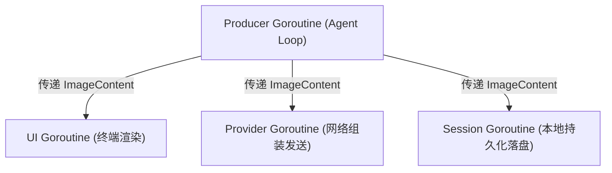
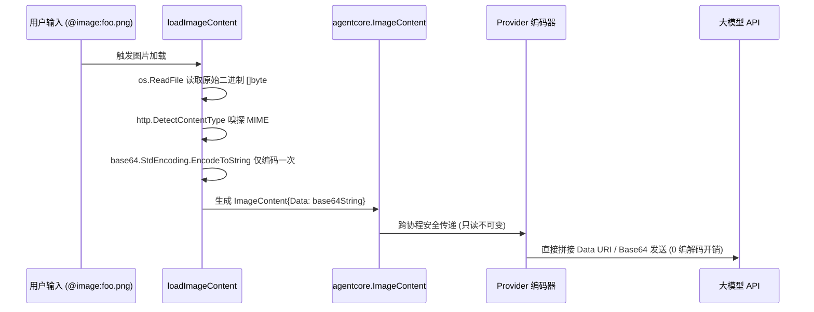

# 多模态 ImageContent 类型选型设计

本笔记深入剖析 `pigo` 在多模态内容建模（`internal/agentcore`）中，图片块 `ImageContent` 的字段类型选型哲学。重点解析为什么表示图像数据的 `Data` 字段选用 **`string`** 而非 Go 语言中表示二进制数据的 **`[]byte`**，涵盖 **大模型 Wire Format 协议对齐**、**避免 `encoding/json` 二次 Base64 编码陷阱**、**不可变性与并发安全** 等工程考量。

---

## 目录
- [一、核心疑问：为什么 Data 字段使用 string 而非 []byte？](#一核心疑问为什么-data-字段使用-string-而非-byte)
- [二、协议对齐：主流 LLM 多模态 API 的文本化契约](#二协议对齐主流-llm-多模态-api-的文本化契约)
- [三、序列化陷阱：规避 Go encoding/json 的二次 Base64 灾难](#三序列化陷阱规避-go-encodingjson-的二次-base64-灾难)
- [四、并发安全：string 的只读不可变性（Immutability）](#四并发安全string-的只读不可变性immutability)
- [五、语义清晰：区分“原始二进制”与“编码后文本”](#五语义清晰区分原始二进制与编码后文本)
- [六、完整数据生命周期：从磁盘图片到大模型 Payload](#六完整数据生命周期从磁盘图片到大模型-payload)
- [七、相关源码索引](#七相关源码索引)

---

## 一、核心疑问：为什么 Data 字段使用 string 而非 []byte？

在 [`internal/agentcore/content.go`](file:///Users/yuqing/Documents/workspace/pigo/internal/agentcore/content.go#L60-L65) 中，`ImageContent` 的结构体定义如下：

```go
// ImageContent is an image block (base64 data + mime type).
type ImageContent struct {
    Type     string `json:"type"`
    Data     string `json:"data"` // 为什么这里是 string 而不是 []byte？
    MimeType string `json:"mimeType"`
}
```

在日常 Go 开发直觉中，图像通常属于二进制文件，开发者往往第一反应会想用 `[]byte`。但在 Agent 系统的类型契约层，将其定义为 `string` 才是经过深思熟虑的最优设计。

---

## 二、协议对齐：主流 LLM 多模态 API 的文本化契约

Agent 运行时的定位是 **“LLM 协调编排驱动层”**，它不同于图像处理软件，**自身无需对图像执行解码像素、旋转、裁剪或色彩矩阵运算**。图片被加载进内存的唯一目的，就是序列化后发往大模型。

而目前全球主流的大模型 API，其多模态接口要求提交的全部都是 **Base64 编码后的 ASCII 文本字符串**：

### 1. OpenAI 规范（Data URI 字符串）
在 [`internal/provider/providers.go`](file:///Users/yuqing/Documents/workspace/pigo/internal/provider/providers.go#L234-L241) 中，发往 OpenAI / Azure / 兼容端点时，图片必须以标准的 Data URI 形式组装：
```go
case agentcore.ImageContent:
    parts = append(parts, map[string]any{
        "type": "image_url",
        "image_url": map[string]any{
            "url": fmt.Sprintf("data:%s;base64,%s", b.MimeType, b.Data),
        },
    })
```
直接使用 `string`，只需要极速的字符串拼接（`fmt.Sprintf`），零二次转换开销。

### 2. Anthropic 规范（Base64 Source 字符串）
在 [`internal/provider/providers.go`](file:///Users/yuqing/Documents/workspace/pigo/internal/provider/providers.go#L496-L505) 中，Claude 协议要求显式声明 `source` 对象：
```go
case agentcore.ImageContent:
    blocks = append(blocks, map[string]any{
        "type": "image",
        "source": map[string]any{
            "type":       "base64",
            "media_type": b.MimeType,
            "data":       b.Data, // 直接赋值 base64 string
        },
    })
```
如果字段定义为 `[]byte`，那么每次构建请求时都必须额外调用一次 `base64.StdEncoding.EncodeToString(b.Data)`，在多轮对话中带来不必要的重复计算与内存分配。

---

## 三、序列化陷阱：规避 Go encoding/json 的二次 Base64 灾难

这是许多 Go 开发者容易忽视的标准库特性：**Go 的 `encoding/json` 在序列化 `[]byte` 类型的结构体字段时，会默认将其自动编码为 Base64 字符串**。

### 设想反模式：如果定义为 `Data []byte` 会发生什么？

假设我们在读取图片时已经完成了 Base64 编码并存入了 `Data []byte`：
```go
// 假设的错误设计
type ImageContent struct {
    Data []byte `json:"data"` // 存入的是 "aGVsbG8=" 这个 ASCII 字符串的字节切片
}
```

当系统执行**会话持久化**（保存到 `session.jsonl`），调用 `json.Marshal(imageContent)` 时：
1. `encoding/json` 探测到 `Data` 是 `[]byte` 类型；
2. 标准库误以为它是原始二进制数据，于是**再次调用了一次 Base64 编码**；
3. 最终落盘的 JSON 内容变成了 **Double Base64（二次 Base64 编码）** 的乱码串（`"YUdWc2JHOz0="`）；
4. 反序列化读取会话时，整个多模态历史直接损坏不可用！

**结论**：字段使用 `string`，`encoding/json` 会直接视其为普通文本，忠实地完成单次序列化与反序列化，从根源上杜绝了这一隐蔽的序列化灾难。

---

## 四、并发安全：string 的只读不可变性（Immutability）

在 `pigo` 的并发模型中，一次 Agent Turn 包含多个协程的并行协同：
* **Producer 协程**：在后台推进循环，维护 `AgentContext`；
* **UI 协程**：在终端刷新 TUI 界面或行式输出；
* **Provider 协程**：在后台网络 I/O 线程将消息列表打包并发送到远端 API。



### 1. `[]byte` 的可变性风险（Data Race）
在 Go 语言中，`[]byte` 是可变的引用类型（包含指向底层数组的指针）。如果多方共享切片，某一方进行切片截取、就地覆盖写（In-place Mutation）时，极易引发**并发数据竞争（Data Race）**。为了保证安全，各模块之间传递时往往需要做昂贵的“防御性拷贝（Defensive Copy）”。

### 2. `string` 的天然不可变性
在 Go 语言中，`string` 的内存结构是只读的。传递 `string` 仅仅是拷贝一个长度与只读指针（16 字节），多协程之间并发读取 `Data string` 具有**绝对的线程安全保证**，既不需要互斥锁，也不需要防御性拷贝。

---

## 五、语义清晰：区分“原始二进制”与“编码后文本”

类型系统本身应当是具备**自解释性（Self-documenting）**的：

* **`[]byte`**：向调用方表达的是“这里是一段未经修饰的、从磁盘读出来的**原始二进制流（Raw Bytes）**”；
* **`string`**：向调用方明确表达“这是一段已经完成格式化/编码的**文本字符串**”。

在调用构造函数 [`NewImageContent(data, mimeType string)`](file:///Users/yuqing/Documents/workspace/pigo/internal/agentcore/content.go#L126-L129) 时，类型签名强制要求传入 `string`，在编译期就杜绝了调用方误把未编码的 raw PNG bytes 塞进去的可能。

---

## 六、完整数据生命周期：从磁盘图片到大模型 Payload

整个流转链路在系统设计上做到了**“只在边界处编码一次，后续全链路只读流转”**：



1. **唯一边界（Boundary）**：在 [`internal/cli/ui/imageref.go`](file:///Users/yuqing/Documents/workspace/pigo/internal/cli/ui/imageref.go#L99) 读盘时，一次性编码为 Base64 `string`；
2. **核心契约（Contract）**：`agentcore.ImageContent` 作为只读值对象（Value Object）跨模块分发；
3. **网络发射（Wire）**：各 Provider 适配器无缝组装网络 Payload，整条通路零重复计算、零格式转换。

---

## 七、相关源码索引

* 图片块结构体定义与构造器：[`internal/agentcore/content.go`](file:///Users/yuqing/Documents/workspace/pigo/internal/agentcore/content.go#L60-L65)
* 磁盘图片读取与一次性 Base64 编码：[`internal/cli/ui/imageref.go`](file:///Users/yuqing/Documents/workspace/pigo/internal/cli/ui/imageref.go#L86-L101)
* OpenAI 多模态网络协议组装：[`internal/provider/providers.go`](file:///Users/yuqing/Documents/workspace/pigo/internal/provider/providers.go#L234-L241)
* Anthropic 多模态网络协议组装：[`internal/provider/providers.go`](file:///Users/yuqing/Documents/workspace/pigo/internal/provider/providers.go#L496-L505)
