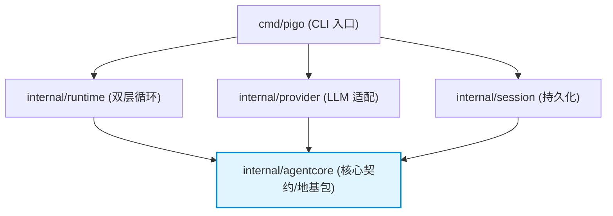
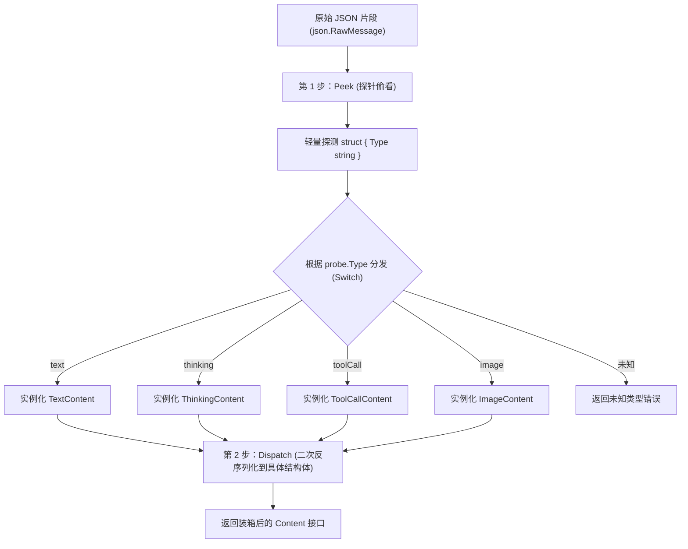

# 密封接口设计与 JSON 多态反序列化

本笔记记录 `pigo` 在核心契约层（`internal/agentcore`）中的类型系统建模与数据序列化架构设计。涵盖**单向地基包哲学**、**密封接口（Sealed Interface）**模拟代数数据类型、**Go 接口反序列化的类型擦除困境**，以及工程落地的**两步解码（Peek & Dispatch）**最佳实践。

---

## 目录
- [一、架构基石：为什么 agentcore "imports nothing from them"](#一架构基石为什么-agentcore-imports-nothing-from-them)
- [二、类型建模：密封接口（Sealed Interface）实现闭合多态](#二类型建模密封接口sealed-interface实现闭合多态)
- [三、核心痛点：为什么 Go 的 encoding/json 无法反序列化接口](#三核心痛点为什么-go-的-encodingjson-无法反序列化接口)
- [四、破局方案：两步解码模式（Two-Pass Peek & Dispatch）](#四破局方案两步解码模式two-pass-peek--dispatch)
- [五、工业级容错：畸形参数的防御性序列化](#五工业级容错畸形参数的防御性序列化)
- [六、相关源码索引](#六相关源码索引)

---

## 一、架构基石：为什么 agentcore "imports nothing from them"

在 [`internal/agentcore/content.go`](file:///Users/yuqing/Documents/workspace/pigo/internal/agentcore/content.go#L1-L4) 的包级注释中有这样一句定义：

> *"It is the foundation package that every other agent sub-package depends on and imports nothing from them."*
> （它是基础包：所有其他 agent 子包都依赖它，而它不从它们那里导入任何包。）

### 1. 被所有人依赖，又不依赖任何人
在 Go 语言中，编译期对**循环依赖（Import Cycle Not Allowed）**实行严格零容忍。`agentcore` 定义了贯穿整个系统的核心契约（消息模型 `Message`、内容块 `Content`、事件流 `AgentEvent`、工具抽象 `AgentTool` 等）。

* **上层模块全部依赖它**：CLI 编排、Agent 运行循环（`runtime`）、LLM Provider 适配器、会话存储（`session`）、工具库（`tools`）都必须导入 `agentcore` 来传递状态。
* **它自身作为叶子节点（Leaf Package）**：绝对不导入上层任何业务包，只依赖 Go 标准库。保持了依赖拓扑图单向无环（DAG），形成了极度稳固的“地基”。



---

## 二、类型建模：密封接口（Sealed Interface）实现闭合多态

在 TypeScript 原始实现中，消息内容和事件都是**判别联合（Discriminated Union / 标签联合）**：
```typescript
type Content = TextContent | ThinkingContent | ToolCallContent | ImageContent;
```
TypeScript 具备完整的代数数据类型（ADT），但在 Go 语言中**没有语言级的联合类型（Union Type）**。

### 1. 传统公开接口的漏洞
如果直接在 Go 里定义公开接口：
```go
type Content interface {
    Role() string
}
```
由于 Go 是结构化类型系统（Duck Typing），任何第三方包只要碰巧实现了 `Role() string`，就能冒充 `Content` 传给循环，导致核心事件流变体集合不可控，破坏契约闭包。

### 2. 密封接口（Sealed Interface）手法
`pigo` 采用了在 Go 工业界经典的“密封接口”模式：**在接口中嵌入一个未导出的私有标记方法**。

```go
// internal/agentcore/content.go
type Content interface {
    isContent() // 未导出私有方法，仅限当前包实现
}

type TextContent struct { ... }
func (TextContent) isContent() {}

type ThinkingContent struct { ... }
func (ThinkingContent) isContent() {}

type ToolCallContent struct { ... }
func (ToolCallContent) isContent() {}

type ImageContent struct { ... }
func (ImageContent) isContent() {}
```

* **闭合变体集合**：包外的代码无法声明带有小写 `isContent()` 的方法来满足该接口。因此，`Content` 的变体被牢牢锁死在 `agentcore` 包内部的这 4 种。
* **消费端分发**：调用方使用 `switch c := c.(type)` 进行模式匹配和分发，避免了不确定性。

---

## 三、核心痛点：为什么 Go 的 encoding/json 无法反序列化接口

很多人会产生一个误区：*“是不是因为接口里加了私有方法 `isContent()`，导致 JSON 序列化/反序列化报错了？”*

**答案是否定的：私有方法本身完全不影响 JSON 序列化。** 真正的问题出在 **反序列化到 Go 接口（Interface）类型时的类型擦除与抽象实例化缺失**。

### 1. 结构体与接口在反序列化时的本质差异

当反序列化一个具体结构体时，Go 知道具体内存布局：
```go
var txt TextContent
json.Unmarshal(data, &txt) // 成功：分配 TextContent 内存并赋值导出字段
```

但一个消息对象包含的是一组多态的内容块：
```go
type Message struct {
    Role    string    `json:"role"`
    Content []Content `json:"content"` // Content 是接口类型！
}
```

当标准库 `encoding/json` 解析到 `"content"` 数组中的某个 JSON 对象时：
```json
{ "type": "text", "text": "Hello, world!" }
```
它面临无法逾越的难题：
1. **接口无法直接实例化**：Go 运行时不可能执行 `new(Content)`，因为接口没有字段和实体尺寸。
2. **标准库不具备判别式语义**：`encoding/json` 极其朴素，它并不知道 JSON 中的 `"type"` 字段是类型的代表，也不知道 `"type": "text"` 对应哪个 Go struct。
3. **退化为 map[string]any**：面对抽象接口，标准库最多只能将其反序列化为 `map[string]any`。但 `map[string]any` 根本没有实现 `Content` 接口（更不可能拥有未导出的 `isContent()` 方法），随后引发类型断言 Panic 或反序列化失败。

---

## 四、破局方案：两步解码模式（Two-Pass Peek & Dispatch）

为了让 Go 的强类型系统与外部平铺的 JSON 数据握手，`pigo` 在 [`internal/agentcore/content.go`](file:///Users/yuqing/Documents/workspace/pigo/internal/agentcore/content.go#L135-L170) 中实现了**两步解码（Peek & Dispatch）**机制。

### 1. 拆解流程



### 2. 核心源码剖析

```go
// decodeContent 是所有持有 Content 容器的统一反序列化入口
func decodeContent(raw json.RawMessage) (Content, error) {
    // 步骤 1：Peek（偷看）判别字段
    var probe struct {
        Type string `json:"type"`
    }
    if err := json.Unmarshal(raw, &probe); err != nil {
        return nil, fmt.Errorf("content: peek type: %w", err)
    }

    // 步骤 2：根据判别字段派发到具体类型
    switch probe.Type {
    case ContentTypeText:
        var c TextContent
        if err := json.Unmarshal(raw, &c); err != nil {
            return nil, fmt.Errorf("content: decode text: %w", err)
        }
        return c, nil
    case ContentTypeThinking:
        var c ThinkingContent
        if err := json.Unmarshal(raw, &c); err != nil {
            return nil, fmt.Errorf("content: decode thinking: %w", err)
        }
        return c, nil
    case ContentTypeToolCall:
        var c ToolCallContent
        if err := json.Unmarshal(raw, &c); err != nil {
            return nil, fmt.Errorf("content: decode tool call: %w", err)
        }
        return c, nil
    case ContentTypeImage:
        var c ImageContent
        if err := json.Unmarshal(raw, &c); err != nil {
            return nil, fmt.Errorf("content: decode image: %w", err)
        }
        return c, nil
    default:
        return nil, fmt.Errorf("content: unknown type %q", probe.Type)
    }
}
```

持有切片的容器（例如 `ContentList` 或 `UserMessage`）只需要重写 `UnmarshalJSON`，将数组拆成 `[]json.RawMessage`，逐个调用 `decodeContent` 即可完成多态集合的无缝重构。

---

## 五、工业级容错：畸形参数的防御性序列化

在多模态 Agent 运行时，大模型输出的内容并非始终符合规范。例如大模型在流式生成工具参数时可能吐出不合法的 JSON（如截断或缺少括号的 `{"key": [}{...`）。

如果将这段不合法的原始字节保留在 `ToolCallContent.Arguments`（类型为 `json.RawMessage`）中：
* 后续进行**会话落盘持久化（Session Persistence）**或**上下文组装**时，`json.Marshal` 遇到无效的 `json.RawMessage` 会直接崩溃报错，导致整个轮次中断。

`pigo` 在 [`internal/agentcore/content.go`](file:///Users/yuqing/Documents/workspace/pigo/internal/agentcore/content.go#L81-L107) 中实现了精妙的容错保护：

```go
func (t ToolCallContent) MarshalJSON() ([]byte, error) {
    args := t.Arguments
    if len(bytes.TrimSpace(args)) == 0 {
        args = json.RawMessage("{}")
    } else if !json.Valid(args) {
        // 如果模型输出的参数是不合法 JSON，则将其整体编码为一个转义的 JSON 字符串
        // 这样既完整保留了模型的原始输出文本，又确保了外层整体 JSON 序列化绝对不会崩
        s, err := json.Marshal(string(args))
        if err != nil {
            return nil, fmt.Errorf("content: encode invalid tool arguments: %w", err)
        }
        args = s
    }
    
    // 通过定义别名类型，避免在 MarshalJSON 中递归死循环
    type wire struct {
        Type             string          `json:"type"`
        ID               string          `json:"id"`
        Name             string          `json:"name"`
        Arguments        json.RawMessage `json:"arguments"`
        ThoughtSignature string          `json:"thoughtSignature,omitempty"`
    }
    return json.Marshal(wire{
        Type:             t.Type,
        ID:               t.ID,
        Name:             t.Name,
        Arguments:        args,
        ThoughtSignature: t.ThoughtSignature,
    })
}
```

---

## 六、相关源码索引

* 地基与内容多态定义：[`internal/agentcore/content.go`](file:///Users/yuqing/Documents/workspace/pigo/internal/agentcore/content.go)
* 消息契约与判别定义：[`internal/agentcore/message.go`](file:///Users/yuqing/Documents/workspace/pigo/internal/agentcore/message.go)
* 密封事件流模型：[`internal/agentcore/event.go`](file:///Users/yuqing/Documents/workspace/pigo/internal/agentcore/event.go)
* 核心契约单元测试与两步解码断言：[`internal/agentcore/types_test.go`](file:///Users/yuqing/Documents/workspace/pigo/internal/agentcore/types_test.go)
