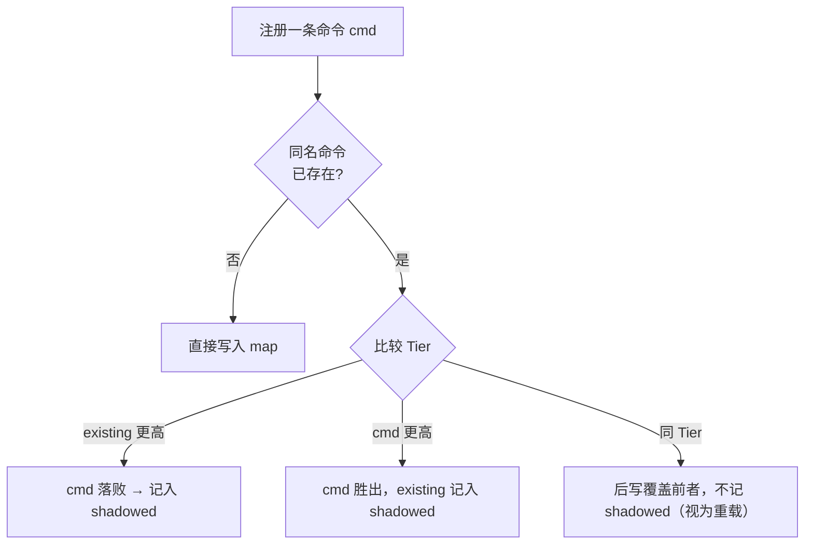

# 斜杠命令注册表 SlashRegistry 与双前端共用设计

本笔记拆解 `internal/runtime` 的 `SlashRegistry`：一张把 `/name` 映射到「行为」的表，以及它如何在 TUI 与 REPL 两条表现层之间**完全共用**（装配在 [全屏 TUI 事件桥与 MVU 生命周期设计](./全屏TUI事件桥与MVU生命周期设计.md#L145) 的 `runSession.slash` 字段）。

核心结论先给：**命令的「注册与解析」属于内核层（`internal/runtime` + `internal/cli/prompts`），只有「怎么把解析结果画出来」才各归各的前端**——所以 `/model`、`/help`、用户模板、插件命令、技能命令在两种界面下行为完全一致。

---

## 目录

- [一、它是什么：一张 `/name → 行为` 的映射表](#一它是什么一张-name--行为的映射表)
- [二、动作命令是怎么工作的](#二动作命令是怎么工作的)
- [三、命令的四种来源与优先级分层](#三命令的四种来源与优先级分层)
- [四、装配：BuildSlashRegistry 一次组装](#四装配buildslashregistry-一次组装)
- [五、解析：ResolveOutcome 的四种结局](#五解析resolveoutcome-的四种结局)
- [六、双前端共用](#六双前端共用)
- [七、一个例子：从写一个 md 到敲下 /review](#七一个例子从写一个-md-到敲下-review)
- [八、相关源码索引](#八相关源码索引)

---

## 一、它是什么：一张 `/name → 行为` 的映射表

[`SlashRegistry`](../internal/runtime/slashcommand.go#L229-L237) 本体简单到近乎朴素：

```go
type SlashRegistry struct {
    commands map[string]SlashCommand  // name（不含前导 "/"）→ 命令
    shadowed []ShadowedEntry          // 冲突落败者，仅用于诊断
}
```

真正有设计感的是 [`SlashCommand`](../internal/runtime/slashcommand.go#L138-L172)——**一条命令的「性格」由设置哪个回调决定**：

| 回调     | 命令类型 | 行为                                                   | 例子                                |
| :------- | :------- | :----------------------------------------------------- | :---------------------------------- |
| `Expand` | 提示命令 | 把参数展开成**喂给模型的提示文本**，启动一轮对话       | 用户模板 `/review`、技能 `/prd`     |
| `Action` | 动作命令 | 执行副作用（如切换模型），返回一行状态，**不启动运行** | `/model`、`/think`、`/help`         |
| `Run`    | 混合命令 | 先做副作用、再可选地返回提示文本跑一轮                 | 插件命令（RPC 插件后注入其 prompt） |

注释里写明了优先序：**`Action` > `Run` > `Expand`**。这个拆分是整个机制的关键——旧设计只能产出提示文本，而 `/model` 需要**改动运行循环真正读的那份配置**，这必须靠能捕获 live 状态的 `Action` 闭包才能做到。

配套的两个类型把「一次调用」结构化，让调用方不必自己去猜字符串：

- [`SlashKind`](../internal/runtime/slashcommand.go#L176-L185)：`SlashPrompt`（有提示要跑）/ `SlashAction`（动作已执行，只显示消息）。
- [`SlashOutcome`](../internal/runtime/slashcommand.go#L197-L202)：`Handled` + `Kind` + `Prompt` + `Message`。混合命令会同时带回 `Message`（先展示）与 `Prompt`（再运行）。

## 二、动作命令是怎么工作的

一句话：**`Action` 是一个 `func(args string) string` 的闭包，它在「解析」这一步就被当场调用、副作用立刻发生，返回值只是一行给人看的状态文本**。因为它不产出 prompt，所以不会启动一轮对话。

关键在于闭包**捕获的是指针，不是副本**。以 `/model` 为例（[registry.go](../internal/cli/prompts/registry.go#L264-L300)）：

```go
func RegisterLiveCommands(reg *runtime.SlashRegistry, live *cli.LiveConfig, creds *provider.CredentialStore) {
    reg.AddBuiltin(runtime.SlashCommand{
        Name: "model",
        Action: func(args string) string {
            // ...解析出目标 model / provider...
            live.Model = model             // ← 原地改写！不是副本
            live.ProviderName = providerName
            live.Provider = prov
            return fmt.Sprintf("model switched to %s (provider: %s)", model, providerName)
        },
    })
}
```

**为什么原地改写就能生效**：注册时传进来的 `live` 是个 `*cli.LiveConfig` 指针，而前端（TUI 的 `m.live`、REPL 的 run 循环）持有的是**同一个指针**。所以闭包改的就是「运行循环下一次构造请求时真正读的那份配置」——不需要任何「重新装配」「通知运行器」的步骤。副作用天然可见。

这也解释了**为什么 `/model` 不能写成 `Expand`**：`Expand` 的返回值只能是提示文本，它碰不到 live 配置，没法真正切换模型。这正是当初引入 `Action` 的原因（见[第一节](#一它是什么一张-name--行为的映射表)表下方的说明）。

### 完整时序（以 REPL 为例）

1. 用户输入 `/model zai/glm-4.6`。
2. [`ResolveOutcome`](../internal/runtime/slashcommand.go#L395-L422) 查表命中，发现 `Action != nil` → **当场执行** `cmd.Action("zai/glm-4.6")`（[第 412 行](../internal/runtime/slashcommand.go#L412)）。
   → 此刻 `live.Model` 已被改写为 `zai/glm-4.6`。
3. 闭包返回 `"model switched to zai/glm-4.6 (provider: zai)"`。
4. `ResolveOutcome` 把它包成 `{Handled:true, Kind:SlashAction, Message:<上面那行>}` 返回——**注意没有 Prompt 字段**。
5. 前端只负责展示，不启动运行：
   - REPL：[`if outcome.Kind == runtime.SlashAction`](../internal/cli/repl/repl.go#L527-L532) → `fmt.Fprintln(out, outcome.Message)` 然后 `continue`。
   - TUI：[`addSystem(outcome.Message)`](../internal/cli/tui/model.go#L915-L928) → 刷新状态栏 → `return m, nil`。

一句话概括分工：**`ResolveOutcome` 负责「执行」，前端负责「显示」**。

### 一个佐证：「TUI 要多刷一次状态栏」

TUI 里紧跟着那段 Action 处理，有这四行（[model.go](../internal/cli/tui/model.go#L918-L923)）：

```go
// A live-state command (/model, /think) may have mutated m.live; sync the
// status bar so the model/thinking segments reflect the switch immediately.
if m.live != nil {
    m.statusBar.SetModel(m.live.Model)
    m.statusBar.SetThinking(string(m.live.ThinkingLevel))
}
```

这恰好是「闭包持有同一个指针」的反向证据：`live` 被**绕过 MVU 单向数据流**直接从闭包里改掉了，所以状态栏这个渲染缓存必须手动 re-sync 一次，否则界面会显示旧模型。**副作用是命令自己做的，UI 同步是前端补的**——两者职责分离得很清楚。

### 哪些内置命令是 Action

`/model`、`/models`、`/think`、`/effect`、`/help` 全部是 Action 命令（[RegisterLiveCommands](../internal/cli/prompts/registry.go#L264-L330)），共性都是「**改状态或查状态，不需要跑模型**」。它们必须用 `AddBuiltin` 做**实例级**注册而不是 init 期的全局注册，因为闭包要捕获 `live` 与 `creds`——这些运行期状态在 `init()` 阶段根本不可达。

### 边界：什么时候做不成 Action

反例是 `/remote-control`。它语义上也是「改状态」，却没有做成 Action，而是在**解析之前被前端特判掉**（[repl.go](../internal/cli/repl/repl.go#L505-L513)、[model.go](../internal/cli/tui/model.go#L896-L901)）：

```go
// /remote-control is intercepted here (not a slash Action) because it
// starts/stops the in-process server and toggles deps.remote / the
// output tee in place — per-session state a pure string→string Action
// closure cannot reach (#443).
```

原因有两层：

1. 它要操作的是 server / bridge / listener 这些**会话中途才创建**的对象，而注册表在会话开始时就已经组装完毕，那时这些对象还不存在，闭包无处捕获。
2. 它还要改前端**自己的字段**（`deps.remote`、输出 tee），这些也不是注册表能拿到的。

所以「能不能做成 Action」的判据是：**所需的可变状态，在注册表构建那一刻是否已经存在、并且能通过闭包捕获到**。`live` 满足（会话开始即创建），server 不满足（会话中途才创建）。

### 与 `Run`（混合命令）的区别

|          | 返回                 | 是否执行副作用 | 是否跑一轮          |
| :------- | :------------------- | :------------- | :------------------ |
| `Action` | `string`（消息）     | 是             | 否，**永不**        |
| `Run`    | `(message, prompt)`  | 是             | 仅当 `prompt != ""` |
| `Expand` | `string`（提示文本） | 否             | 是，总是跑          |

`Run` 就是 `Action` + 可选 `Expand`：插件命令用它——先 RPC 拿通知（副作用），再把插件回的 prompt 交给运行循环。前端区分方式很朴素：只看 `outcome.Kind` 与 `outcome.Prompt` 是否为空。

> 附带一提：老的 [`Resolve`](../internal/runtime/slashcommand.go#L379-L385) 是 `ResolveOutcome` 的降级包装，它**只报告动作命令被 handled，但不执行它**（因为它只返回 `(prompt, handled, err)`，没法带回消息）。新代码一律用 `ResolveOutcome`。

## 三、命令的四种来源与优先级分层

命令来源分四类（[SlashCommandSource](../internal/runtime/slashcommand.go#L30-L48)），但**冲突解决不看来源、只看 Tier**：

| 来源      | 装载方式                                                                                  | Tier                                       |
| :-------- | :---------------------------------------------------------------------------------------- | :----------------------------------------- |
| `builtin` | `init()` 期 `RegisterBuiltin`，或实例级 `AddBuiltin`                                      | `TierBuiltin`（最高）                      |
| `user`    | `~/.pigo/{commands,prompts}`、config `prompts`、`--prompt-template`、项目 `.pigo/prompts` | 依路径分 Global / Settings / CLI / Project |
| `skill`   | `~/.agents/skills` 每条技能注册成 `/skill-name`                                           | `TierGlobal`（仅标签不同）                 |
| `plugin`  | 插件清单声明的命令                                                                        | `TierGlobal`（仅标签不同）                 |

[Tier 枚举](../internal/runtime/slashcommand.go#L68-L107)由低到高：`CLI < Settings < Package < Global < Project < Builtin`。冲突规则集中在 [`add`](../internal/runtime/slashcommand.go#L333-L351)：



三条由此推出的性质：

1. **内置永远赢**：`TierBuiltin` 最高，用户写一个同名模板只会被 shadow 掉。
2. **同层后写覆盖**：不在 `shadowed` 里记账——语义是「重载」，例如 `prompts/` 里的 `dup.md` 会覆盖 `commands/` 里的同名的（[测试](../internal/cli/prompts/prompts_dir_test.go#L58-L78)）。
3. **输家可诊断**：落败者进 [`Shadowed()`](../internal/runtime/slashcommand.go#L293-L296)，`BuildSlashRegistry` 在 stderr 打一行提示「命令被更高优先级来源遮蔽，请改名」（[registry.go](../internal/cli/prompts/registry.go#L152-L158)）。

内置命令还有一条**编译期约定**：[`RegisterBuiltin`](../internal/runtime/slashcommand.go#L217-L227) 只允许在 `init()` 里调用，重名直接 `panic`。因为「两个内置抢一个名字」是代码错误而非用户输入错误，应该在启动瞬间炸掉，而不是运行时悄悄二选一。全局 map 因此**不需要加锁**——init 期单线程写完，之后只读。

## 四、装配：BuildSlashRegistry 一次组装

两条前端都是调用同一个 [`prompts.BuildSlashRegistry`](../internal/cli/prompts/registry.go#L81-L160)，装载顺序是固定的：

1. `NewSlashRegistry()` —— 先铺上所有编译期内置。
2. `RegisterLiveCommands` —— 装需要 live 状态的内置动作命令：`/model`、`/models`、`/think`、`/effect`、`/help`（[registry.go](../internal/cli/prompts/registry.go#L258-L301)）。它们用 `AddBuiltin` 而非全局注册，因为闭包必须捕获 `live` 与 `creds`——init 期够不着这些运行期状态。
3. `RegisterPluginCommands` —— 插件命令装成 `Run` 混合命令：调 `CallCommand` 做 RPC，把通知当 `Message` 返回、把插件回的 prompt 当 `Prompt` 返回（[registry.go](../internal/cli/prompts/registry.go#L176-L198)）。
4. 用户模板（除非 `--no-prompt-templates`）：先 `commands/` 再 `prompts/`（同层后写覆盖）、再 config `prompts`（Settings 层）、再 `--prompt-template`（CLI 层）、最后项目 `.pigo/prompts`（Project 层，且**仅当项目被信任**）。
5. 技能：把预先加载好的 `[]*Skill` 逐个注册成 `/skill-name`（`--no-skills` 时切片为空，等于不注册）。

用户模板的格式就是**一个 Markdown 文件 = 一条命令**（[LoadUserCommandsDir](../internal/runtime/slashcommand.go#L456-L483)）：文件名即命令名，可选 YAML frontmatter 提供 `description` / `argument-hint`（缺 description 时回退取正文首个非空行），正文是提示模板（[ParseUserCommand](../internal/runtime/slashcommand.go#L490-L537)）。

参数展开在 [`ExpandTemplate`](../internal/runtime/template.go#L24-L33)：支持 `$1` 位置参数、`$@`/`$ARGUMENTS` 全体、`${1:-default}` 默认值、`${@:N}` 切片；**没有占位符就把参数追加到末尾**。参数先经 [`SplitArgs`](../internal/runtime/args.go#L19-L25) 按 shell 引号规则切分；切分失败（如引号没闭合）时降级为「整串当作一个 `$ARGUMENTS`」，保证一次手滑的调用仍然可用。

## 五、解析：ResolveOutcome 的四种结局

统一入口是 [`ResolveOutcome`](../internal/runtime/slashcommand.go#L395-L422)，它把一行输入解析成四态之一：

| 输入                     | `Handled` | `Kind`        | 调用方该做什么                             |
| :----------------------- | :-------- | :------------ | :----------------------------------------- |
| 不以 `/` 开头            | `false`   | `SlashPrompt` | `Prompt` 是原样输入，直接跑一轮            |
| `/name args`（提示命令） | `true`    | `SlashPrompt` | 跑 `cmd.Expand(args)` 的结果               |
| `/name args`（动作命令） | `true`    | `SlashAction` | **此处已执行副作用**，只显示 `Message`     |
| `/name args`（混合命令） | `true`    | `SlashPrompt` | 先显示 `Message`，若 `Prompt` 非空再跑一轮 |
| `/unknown`               | —         | —             | 返回 error，调用方提示未知命令             |

注意第一行那个「非命令」分支：`Handled=false`，但 `Prompt` 就是原样输入——所以调用方（如 TUI）可以无脑直接跑 `outcome.Prompt`，不必自己先判断有没有斜杠前缀。

这也解释了表格里动作命令那行为什么「此处已执行副作用」：**解析与执行是同一步**，动作命令在 `ResolveOutcome` 内部就调用了 `cmd.Action(args)`。它为什么必须这样、以及与 `Run` 的区别，见[第二节](#二动作命令是怎么工作的)。

老 API [`Resolve`](../internal/runtime/slashcommand.go#L379-L385) 是降级包装，只返回 `(prompt, handled, err)`，**报告动作命令为 handled 但不会执行它**——保留给只需处理提示命令的老调用方，新代码一律用 `ResolveOutcome`。

## 六、双前端共用

两条前端各自组装**同一份**注册表：

- REPL：[`internal/cli/repl/interactive.go`](../internal/cli/repl/interactive.go#L187-L195) 调 `prompts.BuildSlashRegistry`，注册表存在 `deps.slash`（[repl.go](../internal/cli/repl/repl.go#L64)）。
- TUI：[`newSlashRegistry`](../internal/cli/tui/slash.go#L41-L55) 调同一个函数，结果存在 [`runSession.slash`](../internal/cli/tui/session.go#L62-L65)，再由 `withSession` 赋给 `m.slash`。

共用带来的直接收益是**上层语义零分叉**：`/model` 改的是同一个 `live`，用户模板、插件命令、技能命令在两边完全一致。依赖方向也是干净的——[tui/slash.go](../internal/cli/tui/slash.go#L1-L16) 的文件头注释明确写了 **`tui` 只 import `prompts`/`runtime`/`cli` 这些共享下层，绝不 import `repl`**，因为 `prompts` 位于两条前端之下，不存在循环依赖。

共用之下的两处差异值得留意：

| 维度     | REPL                                                                                | TUI                                                                                                                          |
| :------- | :---------------------------------------------------------------------------------- | :--------------------------------------------------------------------------------------------------------------------------- |
| 结果呈现 | `fmt.Fprintln` 直接打一行                                                           | 写进 transcript / system 行                                                                                                  |
| 补全     | 行编辑器按前缀补全                                                                  | [`slashMenu`](../internal/cli/tui/slash.go#L57-L210) 弹出式菜单（↑↓ 选择、Tab 补全、Enter 执行），并参与 `relayout` 预留行高 |
| 前置拦截 | `/remote-control` 在解析前特判（[repl.go](../internal/cli/repl/repl.go#L505-L513)） | 同样在解析前特判（[model.go](../internal/cli/tui/model.go#L896-L901)），因为这类命令要持有 `string→string` 闭包装不下的状态  |
| 项目模板 | 传 `ProjectDir` / `ProjectTrusted`，加载 `.pigo/prompts`                            | `newSlashRegistry` 未传这两项，故不加载项目层模板                                                                            |

「前置拦截」这条体现了一个边界：**注册表擅长处理「纯函数式」命令，凡是需要持有 server / bridge / listener 等长生命周期状态的命令，都在解析之前被各自前端特判掉**——`/remote-control` 与 `/rebuild` 都是如此。

## 七、一个例子：从写一个 md 到敲下 /review

**第 1 步**：在 `~/.pigo/prompts/` 放一个文件 **`review.md`**——文件名去掉扩展名就是命令名，所以这个文件对应 `/review`（若 frontmatter 里写了 `name:`，则以它为准，见 [ParseUserCommand](../internal/runtime/slashcommand.go#L511-L513)）。

```markdown
---
description: 审查一段 diff，按严重度输出问题
argument-hint: "<PR-URL>"
---

请审查以下代码变更，按严重度分级列出问题：
$ARGUMENTS
```

**第 2 步**：`BuildSlashRegistry` 扫描 `commands/` 与 `prompts/` 目录，`LoadUserCommandsDir` 读到 `review.md` → 命令名 `review`，frontmatter 的 `description` 与 `argument-hint` 填入，正文成为模板。经 `AddUser` 以 `TierGlobal` 入表。

**第 3 步**：用户输入 `/review https://github.com/x/y/pull/12`：

1. `ResolveOutcome` 剥掉前导 `/`，切出 `name="review"`、`args="https://github.com/x/y/pull/12"`。
2. 查表命中，`cmd.Action`/`cmd.Run` 均为 nil → 走 `Expand`。
3. `Expand` 内先 `SplitArgs(args)`，再 `ExpandTemplate(template, tokens)`，把 `$ARGUMENTS` 替换成 URL，返回完整提示文本。
4. 返回 `{Handled:true, Kind:SlashPrompt, Prompt:<展开后的文本>}`。

**第 4 步**：前端拿到 `SlashPrompt`，把这段文本当作**普通的一轮用户输入**喂给 agent 循环——后续走的就是完全正常的 run 生命周期（TUI 见[第七节](./全屏TUI事件桥与MVU生命周期设计.md#七一次提交的完整生命周期)）。

对照一下：如果同样的名字 `/review` 被一个内置命令占用，则第 2 步的 `AddUser` 会把它记进 `shadowed`，`/review` 依然指向内置——**用户模板静默失效，但启动时 stderr 会告诉你原因**。

## 八、相关源码索引

| 职责                                       | 位置                                                                                                                   |
| :----------------------------------------- | :--------------------------------------------------------------------------------------------------------------------- |
| 命令类型 / Tier / 来源 / Outcome 类型定义  | [`slashcommand.go`](../internal/runtime/slashcommand.go#L30-L202)                                                      |
| 注册（内置、用户、技能、插件）与冲突解决   | [`slashcommand.go`](../internal/runtime/slashcommand.go#L204-L351)                                                     |
| 解析入口 `ResolveOutcome`                  | [`slashcommand.go`](../internal/runtime/slashcommand.go#L369-L422)                                                     |
| 模板加载与 frontmatter 解析                | [`slashcommand.go`](../internal/runtime/slashcommand.go#L440-L537)                                                     |
| 参数切分 `SplitArgs`                       | [`args.go`](../internal/runtime/args.go#L19-L25)                                                                       |
| 模板展开 `ExpandTemplate`                  | [`template.go`](../internal/runtime/template.go#L24-L33)                                                               |
| 技能 → `/skill-name`                       | [`skills.go`](../internal/runtime/skills.go#L270-L281)                                                                 |
| 注册表总装配 `BuildSlashRegistry`          | [`registry.go`](../internal/cli/prompts/registry.go#L81-L160)                                                          |
| live 状态动作命令（/model、/think、/help） | [`registry.go`](../internal/cli/prompts/registry.go#L258-L301)                                                         |
| 插件命令（混合 Run）                       | [`registry.go`](../internal/cli/prompts/registry.go#L176-L198)                                                         |
| REPL 侧组装与解析                          | [`interactive.go`](../internal/cli/repl/interactive.go#L187-L195)、[`repl.go`](../internal/cli/repl/repl.go#L515-L537) |
| TUI 侧组装、补全菜单与解析                 | [`slash.go`](../internal/cli/tui/slash.go)、[`model.go`](../internal/cli/tui/model.go#L896-L924)                       |
