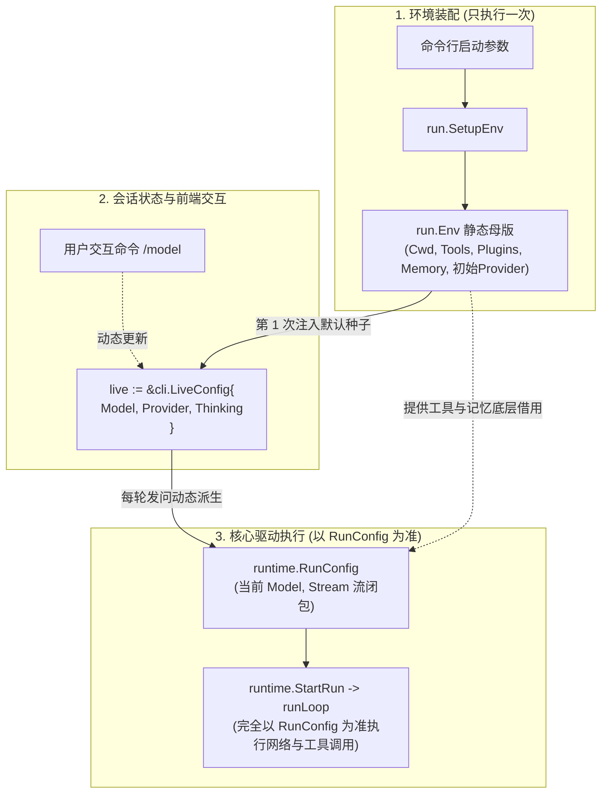

# 环境装配（Env）与运行配置（RunConfig）解耦设计

本笔记深入剖析 `pigo` 中 **环境底座（`run.Env`）** 与 **运行配置（`runtime.RunConfig`）** 的架构解耦、继承演进关系以及执行权责界定。

---

## 目录
- [一、核心问题与设计哲学](#一核心问题与设计哲学)
- [二、核心对比全景表：Env vs RunConfig](#二核心对比全景表env-vs-runconfig)
- [三、两者的深度关系：谁依赖谁？以谁为准？](#三两者的深度关系谁依赖谁以谁为准)
  - [1. 初始依赖：第 1 次 RunConfig 完全由 Env 哺育](#1-初始依赖第-1-次-runconfig-完全由-env-哺育)
  - [2. 执行准则：核心执行永远以 RunConfig 为唯一准则](#2-执行准则核心执行永远以-runconfig-为唯一准则)
  - [3. 动态演进：交互中 Model 和 Provider 都可以变](#3-动态演进交互中-model-和-provider-都可以变)
  - [4. 永恒底座：即使换了模型，重型资产依然持续依赖 Env](#4-永恒底座即使换了模型重型资产依然持续依赖-env)
- [四、深度考量 1：生命周期与变动频率（常驻 vs 即焚）](#四深度考量-1生命周期与变动频率常驻-vs-即焚)
- [五、深度考量 2：系统资源所有权与释放职责（谁来 Close）](#五深度考量-2系统资源所有权与释放职责谁来-close)
- [六、深度考量 3：架构分层与关注点分离（宿主环境 vs 纯粹内核）](#六深度考量-3架构分层与关注点分离宿主环境-vs-纯粹内核)
- [七、深度考量 4：多宿主驱动的灵活复用关系图](#七深度考量-4多宿主驱动的灵活复用关系图)
- [八、相关源码索引](#八相关源码索引)

---

## 一、核心问题与设计哲学

在 `pigo` 启动时，有两步看似重叠的装配动作：
1. `run.SetupEnv`：加载技能、发现插件、打开记忆数据库、组装工具池、解析默认 Provider，产出 [`run.Env`](file:///Users/yuqing/Documents/workspace/pigo/internal/cli/run/run.go#L30)；
2. `run.NewConfig`：构造包含流函数、凭据回调、工具注册表的 [`runtime.RunConfig`](file:///Users/yuqing/Documents/workspace/pigo/internal/runtime/loop.go#L60)。

核心设计哲学：
> **`run.Env` 是“基础设施资产的持有者（Owner）”，负责让系统具备能力；而 `runtime.RunConfig` 是“单次对话的瞬态执行者（Executor）”，负责让对话具体跑起来。**

---

## 二、核心对比全景表：Env vs RunConfig

| 维度 | `run.Env`（环境资产） | `runtime.RunConfig`（运行参数） |
| :--- | :--- | :--- |
| **所属分层** | CLI 宿主装配层（`internal/cli/run`） | 核心运行时引擎层（`internal/runtime`） |
| **生命周期** | **进程级 / 长期常驻**（启动时装配 1 次） | **Run 级 / 瞬态即焚**（每轮发问时按需构造） |
| **变动频率** | 稳定不变（全局只读母版，从不被修改） | 高频变动（随用户命令随时替换） |
| **资源所有权** | **资源持有者（Owner）**，负责退出时 `Close()` | **资源借用者（Borrower）**，只接收闭包与引用 |
| **包含要素** | 工作目录 Cwd、插件子进程、SQLite 句柄、全量工具 | 目标模型、思考等级、Stream 流闭包、API Key 解析器 |

---

## 三、两者的深度关系：谁依赖谁？以谁为准？

### 1. 初始依赖：第 1 次 RunConfig 完全由 Env 哺育
第 1 次创建的 `RunConfig`，其所有核心要素均完全依赖于 `Env`：

- **无头模式（Headless）**：
  在 [`internal/cli/headless/headless.go#L86`](file:///Users/yuqing/Documents/workspace/pigo/internal/cli/headless/headless.go#L86)，单次运行的 `runCfg` 直接由 `env` 的字段组装生成：
  ```go
  runCfg := run.NewConfig(
      p.Model,
      env.ProviderName,            // 👈 取自 env
      thinking,
      env.Provider,                // 👈 取自 env
      creds,
      run.ToolRegistry(env.Tools), // 👈 取自 env
      run.TodoReminders(env.Tools),// 👈 取自 env
      env.Schedule,                // 👈 取自 env
  )
  ```
- **交互模式（REPL / TUI）**：
  在进入终端界面时，`cmd/pigo/main.go` 将 `env.Provider`、`env.Tools` 等作为选项喂给 REPL；当用户敲下**第一句话**时，系统构造的**第 1 个 `RunConfig`**，其 Provider、模型和工具注册表完全继承自 `Env` 的初始种子。

---

### 2. 执行准则：核心执行永远以 RunConfig 为唯一准则
当进入执行阶段时，系统**永远以 `RunConfig` 为准**：
- 查看核心驱动函数 [`runLoop`](file:///Users/yuqing/Documents/workspace/pigo/internal/runtime/loop.go#L141) 的签名：
  ```go
  func runLoop(ctx context.Context, agentCtx *agentcore.AgentContext, cfg RunConfig, stream *LoopEventStream)
  ```
- `runLoop` **根本没有接收 `Env` 参数**，物理层面拿不到 `Env`。底层与 LLM 的网络通信完全经由 `cfg.Stream`（来自 `RunConfig`）发出，执行引擎只认 `RunConfig`。

---

### 3. 动态演进：交互中 Model 和 Provider 都可以变
一个常见误区是“Provider 固定死，只有 Model 能变”。**实际上，在交互过程中两者均可随时动态更换**。

查看 [`internal/cli/prompts/registry.go#L291-L299`](file:///Users/yuqing/Documents/workspace/pigo/internal/cli/prompts/registry.go#L291-L299) 中 `/model` 命令的实现：
```go
// 用户输入 /model deepseek-chat
model := provider.CanonicalizeModel(id)
// 1. 重新解析，直接推断并构造出新的 Provider 驱动实例！
prov, providerName, err := provider.ResolveProvider(model, live.BaseURL, live.Protocol, "", os.Getenv)

// 2. 同时替换实时状态 live 中的 Model、ProviderName 和 Provider 实例！
live.Model = model
live.ProviderName = providerName
live.Provider = prov // 👈 Provider 实例被原地换掉！
```
下一轮对话构造 `RunConfig` 时，就会直接提取 `live.Provider` 生成新的流式请求函数，直接将请求切往新的大模型厂商。

---

### 4. 永恒底座：即使换了模型，重型资产依然持续依赖 Env
既然模型和 Provider 都可以换掉，为什么 `Env` 仍然不可或缺？
因为即便用户切换了模型，以下这些底层重型资产**依然完全依赖最初由 `Env` 装配的底座**：
- **工具实现集（`Tools`）**：调用的依然是 `Env.Tools` 里初始化的 `read`, `write`, `bash` 等实例；
- **外部插件进程（`Plugins`）**：通信管道依然连接着 `Env.Plugins` 在启动时拉起的插件子进程；
- **持久记忆连接（`Memory`）**：底层读写的依然是 `Env.Memory` 打开的 SQLite 句柄与独占文件锁；
- **工作目录（`Cwd`）**：依然严格锁定在 `Env.Cwd`。

**一句话厘清关系**：
> **`Env` 是不可变的基础设施总底座（供电厂）；`LiveConfig` 是中间的动态调度台；而每一次派生出来的 `RunConfig` 则是送入车间真正运转的瞬时电能。**

---

## 四、深度考量 1：生命周期与变动频率（常驻 vs 即焚）

- **`run.Env` 是昂贵且稳定的**：
  扫描本地磁盘技能、启动外部插件子进程（通过 JSON-RPC 探测）、打开持久记忆库（SQLite `index.db` 建立连接与文件锁）。这些操作开销大，必须在程序启动时一次性就绪。
- **`runtime.RunConfig` 是轻量且易变的**：
  在交互式 REPL 或全屏 TUI 模式下，用户可能进行长达数十轮的对话。在会话过程中：
  - 用户可以输入 `/model claude-3-5-sonnet` 临时切换模型与 Provider；
  - 用户可以输入 `/thinking high` 调整推理深度；
  - 每一轮可能携带不同的 `SessionID` 或跟进消息（`FollowUpMessages`）。
- **解耦的收益**：
  外层的 `Env` 始终保持稳定，内部交互循环每次敲下回车发起 `StartRun` 时，只需以极低代价根据当前最新的动态参数为该轮对话派生一份专属的 `RunConfig`。

---

## 五、深度考量 2：系统资源所有权与释放职责（谁来 Close）

`run.Env` 持有着真实的外部操作系统资源：
```go
// cmd/pigo/main.go
env, err := run.SetupEnv(...)
if env.Plugins != nil {
    defer env.Plugins.Close() // 负责杀死所有插件子进程
}
if env.Memory != nil {
    defer env.Memory.Close()  // 负责断开 SQLite 数据库连接
}
```

如果将这些资源强行塞进单次运行的 `RunConfig` 里，就会引发严重的所有权混乱：
- 如果内层循环运行完一轮对话就执行清理，那么下一轮交互时，外部插件进程已死、SQLite 连接已关，系统直接崩溃；
- 如果内层循环不关，无头单次模式又极易造成子进程僵尸化或数据库锁无法释放。

**解耦后的清晰权责**：
- `Env` 充当**唯一资源持有者**，在进程生命周期终点统一释放；
- `RunConfig` 仅以引用或回调形式在执行期“借用”这些能力。

---

## 六、深度考量 3：架构分层与关注点分离（宿主环境 vs 纯粹内核）

- **CLI 装配层（`internal/cli/run`）**：
  负责感知外部操作系统细节：读取环境变量、访问文件系统、扫描插件可执行文件、解析 YAML/TOML 配置。
- **运行时核心层（`internal/runtime`）**：
  负责纯粹的 Agent 两层驱动循环（LLM 请求、事件抛送、工具派发）。
  它应该是**纯净且平台无关的**——它不需要知道插件是如何通过子进程启动的，也不需要关心 SQLite 存在哪个目录下。它只需要两个东西：
  1. 能发送模型请求的流式函数（`Stream`）；
  2. 注册好具体执行闭包的工具表（`ToolRegistry`）。

---

## 七、深度考量 4：多宿主驱动的灵活复用关系图



- **无头模式（Headless）**：`Env` 装配一次，直接通过 `run.NewConfig` 派生出唯一的 `RunConfig` 跑完即退出；
- **交互模式（REPL/TUI）**：`Env` 常驻保活，`LiveConfig` 支持动态更新模型与服务商，支撑数十轮不同配置的 `RunConfig` 独立运行；
- **子 Agent 派发（SubAgent）**：复用父级的 `Env.Provider`，但传入剔除了外部高危命令的 `ChildToolSet`，动态派生独立的子运行配置。

---

## 八、相关源码索引

- 共享环境定义与装配：[`internal/cli/run/run.go:SetupEnv`](file:///Users/yuqing/Documents/workspace/pigo/internal/cli/run/run.go#L77)
- 运行配置唯一定义点：[`internal/cli/run/run.go:NewConfig`](file:///Users/yuqing/Documents/workspace/pigo/internal/cli/run/run.go#L598)
- 动态切换模型与 Provider：[`internal/cli/prompts/registry.go:RegisterLiveCommands`](file:///Users/yuqing/Documents/workspace/pigo/internal/cli/prompts/registry.go#L291)
- 核心运行时循环入口：[`internal/runtime/loop.go:runLoop`](file:///Users/yuqing/Documents/workspace/pigo/internal/runtime/loop.go#L141)
- 无头模式组装调用点：[`internal/cli/headless/headless.go:Run`](file:///Users/yuqing/Documents/workspace/pigo/internal/cli/headless/headless.go#L86)
- 交互模式动态派生调用点：[`internal/cli/repl/repl.go:streamRun`](file:///Users/yuqing/Documents/workspace/pigo/internal/cli/repl/repl.go#L593)
