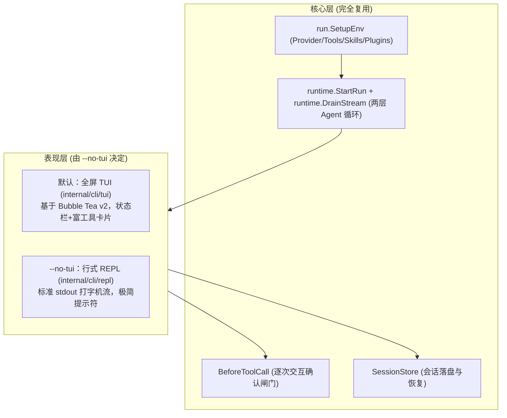

# 行式 REPL 与全屏 TUI 架构对比与设计

本笔记记录 `pigo` 交互式界面的两种呈现形态：**全屏 TUI（默认）** 与 **行式 REPL（`--no-tui`）** 的概念解析、对比差异、应用场景及底层架构复用设计。

---

## 目录
- [一、概念解析：什么是行式 REPL](#一概念解析什么是行式-repl)
- [二、核心对比全景表：全屏 TUI vs 行式 REPL](#二核心对比全景表全屏-tui-vs-行式-repl)
- [三、工程考量：为什么必须保留 --no-tui 开关](#三工程考量为什么必须保留---no-tui-开关)
- [四、架构本质：TUI 是 REPL 的全屏皮肤](#四架构本质tui-是-repl-的全屏皮肤)
- [五、相关源码索引](#五相关源码索引)

---

## 一、概念解析：什么是行式 REPL

- **REPL（Read-Eval-Print Loop，读取-求值-输出循环）**：
  编程语言交互环境的经典模式（如 Python 交互终端的 `>>>`、Node.js 终端、原生 Shell）。用户输入一行，引擎计算一轮，打印一行结果，随后输出下一个提示符等待输入。
- **行式（Line-based / 线性流式追加）**：
  输入与输出遵循终端的**标准流追加（Append-only）**。屏幕像打字机一样随着内容的产生自然向下滚动，**不接管屏幕控制权，不开辟独立视口窗口**。

---

## 二、核心对比全景表：全屏 TUI vs 行式 REPL

在 `pigo` 中，用户在终端启动且不传 `-p` 提示词时，**默认启动全屏 TUI**；若显式指定 `--no-tui`，则切换为**行式 REPL**：

| 维度 | 全屏 TUI（默认，`tui.Run`） | 行式 REPL（`--no-tui`，`repl.Run`） |
| :--- | :--- | :--- |
| **视觉呈现** | 现代化终端图形界面（类似 `vim`, `htop`, `lazygit`） | 极简线性命令行（类似 Python 交互式终端 / Claude Code） |
| **屏幕管理** | 使用终端**备用缓冲区（Alternate Screen Buffer）** | 使用终端**原生缓冲区（Primary Buffer）** |
| **界面布局** | 划分为固定区域（顶部状态栏、中间消息区、底部输入框） | 纯流式输出，提示符（`>`）与回复交替推进，向下顶屏 |
| **退出表现** | 退出时自动清屏并关闭备用屏，**恢复进入前的终端画面** | 退出后，**所有对话、工具调用与代码片段完好留在终端屏幕上** |
| **文本选择与复制** | 受限于 TUI 视口滚动组件，选中大段跨屏文本相对繁琐 | 直接利用系统终端原生滚轮向上滚动，可直接鼠标框选复制任意内容 |
| **环境依赖** | 需要完整的 TTY、ANSI 转义序列及 xterm 兼容终端 | 仅依赖标准输入输出（`os.Stdin` / `os.Stdout`），要求极低 |

---

## 三、工程考量：为什么必须保留 --no-tui 开关

虽然全屏 TUI 视觉现代且富交互组件丰富，但在真实工业开发环境中，行式 REPL 是至关重要的“兜底与效率”入口：

1. **恶劣或轻量级终端环境兼容**：
   在远程 SSH 连接（高延迟、网络抖动）、老旧串口、Docker 最小容器环境，或者某些 IDE 的简易终端中，全屏 TUI 经常会出现闪烁、光标错位、窗口重绘失效等问题；行式 REPL 纯靠标准文本流，具备几乎 100% 的兼容性与稳定性。
2. **终端原生滚屏与日志长文本复制**：
   开发者在阅读 Agent 生成的长篇代码或调试日志时，习惯使用操作系统原生终端的鼠标滚轮翻看 Scrollback 缓冲区。行式 REPL 保留了原汁原味的终端操作体验。
3. **极简极客偏好**：
   部分开发者偏爱类似 Claude Code 的紧凑打字机风格，不希望终端整个被图形框架“霸占”。
4. **非交互环境的自动降级**：
   在 [`cmd/pigo/main.go`](file:///Users/yuqing/Documents/workspace/pigo/cmd/pigo/main.go#L432) 中，系统会通过 `ui.StdoutIsTerminal()` 检测输出是否为真实终端，若不是（例如在 CI 或管道中），系统严禁进入 TUI，保证脚本不会卡死。

---

## 四、架构本质：TUI 是 REPL 的全屏皮肤

在 `pigo` 的系统架构中，全屏 TUI 与行式 REPL **不是两个割裂的系统**，而是共享核心运行时的两种不同表现层：

- **同源装配**：两者共享完全一致的环境装配（[`run.SetupEnv`](file:///Users/yuqing/Documents/workspace/pigo/internal/cli/run/run.go#L77)）；
- **同源驱动**：两者都调用同一个运行循环内核（[`runtime.StartRun`](file:///Users/yuqing/Documents/workspace/pigo/internal/runtime/loop.go#L135)），并通过 [`runtime.DrainStream`](file:///Users/yuqing/Documents/workspace/pigo/internal/runtime/render.go#L40) 消费流式事件；
- **同源功能**：斜杠命令（`/model`, `/compact`, `/rewind`）、多轮上下文、工具逐次审核确认机制在两套界面下逻辑完全对齐。

`--no-tui` 的本质，只是将事件消费端的适配器从 Bubble Tea 的 `tea.Msg` 状态机切回了直接向终端打印纯文本的 `fmt.Fprint`。

---

## 五、相关源码索引

- 入口分派判断（TTY 与 `--no-tui`）：[`cmd/pigo/main.go:dispatch`](file:///Users/yuqing/Documents/workspace/pigo/cmd/pigo/main.go#L453)
- 行式 REPL 驱动与主循环：[`internal/cli/repl/repl.go:runREPL`](file:///Users/yuqing/Documents/workspace/pigo/internal/cli/repl/repl.go#L248)
- 行式 REPL 单次运行装配：[`internal/cli/repl/repl.go:streamRun`](file:///Users/yuqing/Documents/workspace/pigo/internal/cli/repl/repl.go#L593)
- 全屏 TUI 事件桥接与驱动：[`internal/cli/tui/bridge.go`](file:///Users/yuqing/Documents/workspace/pigo/internal/cli/tui/bridge.go)
- 全屏 TUI 入口：[`internal/cli/tui/run.go:Run`](file:///Users/yuqing/Documents/workspace/pigo/internal/cli/tui/run.go#L13-L24)
- 延伸阅读：TUI 内部完整流程见 [全屏 TUI 事件桥与 MVU 生命周期设计](./全屏TUI事件桥与MVU生命周期设计.md)
